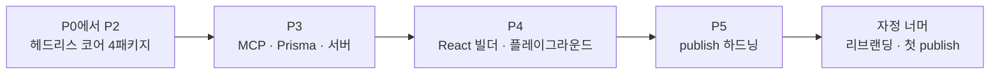

## 경계선이 그어진 아침

1편의 끝에서 GO 판정이 났다. 판정문에는 결론만 있는 게 아니라 경계선이 함께 그어져 있었다. 무엇이 코어이고 무엇이 사내 전용인지, 어디가 깨끗한 절단면이고 어디가 재작성 구간인지. 이 글은 그 경계선을 따라 실제로 칼을 댄 하루의 기록이다. 아침에 빈 레포로 시작해서 자정을 넘겨 npm 레지스트리에 여덟 개 패키지가 올라갈 때까지.

추출 순서의 논리는 하나뿐이었다. **안쪽에서 바깥쪽으로.** 타입과 인터페이스 계약(P0), 순수 실행 커널(P1), 오케스트레이터와 인메모리 스토어(P2), MCP·Prisma·HTTP 어댑터(P3), React 빌더와 플레이그라운드(P4), npm publish 하드닝(P5). 의존성 그래프의 잎부터 잡아야 각 단계의 exit 조건을 그 자리에서 검증할 수 있다. 거꾸로 UI부터 잡았다면 매 단계가 아직 없는 아래층 위에서 흔들렸을 것이다.

## P0에서 P2까지: 헤드리스 코어

첫 네 패키지는 core(타입·인터페이스 계약·순수 헬퍼), nodes(컴파일러·노드 러너·빌트인 IF/LLM), runtime(오케스트레이터), store-memory(인메모리 레퍼런스 스토어)다. 한 일은 둘로 나뉜다. 잘라낸 것과, 절대 잘라내면 안 됐던 것.

**잘라낸 것.** 멀티테넌시 전부다. 회사 FK와 스코프·권한 체계가 데이터 모델에서 빠졌고 실행 주체를 식별하던 사내 세션 객체는 `RunContext`라는 얇은 컨텍스트로, userId는 FK 없는 감사용 문자열로 바뀌었다. 셀프 스케줄링도, 사내 데이터에 붙어 이식 불가능한 전용 노드들도 뺐다. 남긴 빌트인 노드는 IF와 LLM 호출, 딱 둘이다.

**잘라내면 안 됐던 것.** "사내 공유 라이브러리와의 결합은 거의 다 타입이니까 타입만 슬라이스하면 된다"는 초기 판단은 계획 단계의 적대적 검증에서 이미 틀린 것으로 판명돼 있었다. state 경로 검증 함수, 비용 초기화 상수, 노드 결과 Zod 스키마들이 타입인 척 섞여 있는 **런타임 로직**이었고 오분류해 tree-shake했다면 빌드는 통과하고 실행에서 조용히 깨졌을 것이다. 반대로 러너 서비스는 추출을 포기했다. NestJS 라이프사이클과 설정 서비스, Prisma 저장소가 critical path에 박혀 있어, 뜯어내는 비용보다 인터페이스를 주입받는 plain class로 다시 쓰는 비용이 쌌다. 약 400줄의 재작성. 계획서에 "추출 불가, 재작성이 정답"이라 적혀 있었고 그대로 했다.

P2의 exit 조건은 명확했다. 커스텀 노드와 IF 분기와 LLM으로 이루어진 3노드 DAG가 15줄 스크립트로 돌 것. 돌았다. DB도 API 키도 없이, IF가 state binding을 읽어 분기하고 비용이 누적되고 스텝이 기록됐다. `pnpm ls --prod`로 확인한 의존성 트리는 LangChain 계열과 zod뿐. NestJS 0, Prisma 0, 사내 패키지 0.

## P3와 P4: 다섯 단계, 결정 다섯 개

오후부터 밤까지 네 패키지와 플레이그라운드가 더 붙었다. 단계마다 결정 하나씩만 남긴다.

**MCP 어댑터: 권한을 지우지 않고 역전시켰다.** 사내 제품의 MCP 권한은 최고관리자의 provider 등록, 조직 관리자의 활성화, 사용자의 개인 연동으로 이어지는 3단이다. 이걸 코어에 그대로 두면 혼자 워크플로우 하나 돌려보려는 사람이 회사와 관리자부터 세팅해야 하고, 지우면 사내 제품이 이 코어를 못 쓴다. 답은 역전이었다. 코어의 기본값은 "환경변수로 서버 등록하면 전부 허용"이라는 개인 직접 사용이고, 3단 권한은 `CatalogPolicy`라는 선택적 hook(filterProviders/filterTools/resolveToken)의 구현체로 밀려났다. 안 쓰는 사람에게 강제되지 않고, 필요한 쪽은 끼워 넣는다.

하루 중 가장 아픈 디버깅도 여기서 났다. MCP 예제가 내 코드에 진입하기도 전에 import 시점의 zod v3/v4 스키마 충돌로 죽었는데, 진짜 원인은 원본 사내 코드가 이미 LangChain 1.x 계열인데 새 레포를 내 기억 속 버전인 0.x로 시작한 것이었다. 원본과 같은 조합으로 정렬하니 그대로 풀렸다. **추출의 기준은 최신 버전도 임의 버전도 아니고, 원본이 production에서 검증한 조합이다.**

**Prisma 스토어: generated client를 import하지 않는다.** Postgres 어댑터는 5개 모델, 50줄짜리 깨끗한 스키마로 다시 그리되 generated client 타입 대신 `PrismaClientLike`라는 최소 구조적 인터페이스를 자체 선언했다. `prisma generate` 없이 패키지가 빌드되고 소비자는 자기 PrismaClient를 구조적 호환으로 주입한다. 반면 원본의 production 근성 두 가지, read-modify-write 경쟁을 없애는 atomic cost raw SQL과 병렬 fan-in의 스텝 순번 충돌을 막는 run 단위 promise-chain mutex는 그대로 포팅했다. 후자는 병렬 분기에서만 터지는 버그라 레퍼런스 구현이라고 생략하면 안 되는 부분이었다.

**서버: 서버보다 이벤트가 먼저였다.** HTTP+SSE 어댑터를 붙이려고 보니 엔진이 `invoke` 방식이라 노드 단위 라이브 이벤트가 아예 없었다. 선결 과제로 엔진을 LangGraph(저수준 오케스트레이션 런타임)의 streamEvents로 전환하고 이벤트 번역기를 포팅해 NODE_START부터 RUN_COMPLETE까지의 이벤트 모델을 세웠다. 서버 자체는 프레임워크에 묶이지 않은 plain 핸들러 묶음이라 어디에든 mount된다.

**React 빌더: 깨끗한 경계만 잘랐다.** 캔버스 안쪽은 React Flow와 Zustand와 순수 serializer뿐, 사내 import가 0인 깨끗한 영역이었다. 바깥 껍데기는 Next.js 라우터와 인증, 기능 플래그, 한국어 하드코딩 79곳이 얽혀 있었다. 그래서 안쪽만 controlled 컴포넌트 라이브러리로 추출하고 데이터 로딩·저장·인증은 전부 소비자가 주입하는 구조로 뒤집었다. React와 React Flow 같은 무거운 것들은 전부 peerDependency다.

**플레이그라운드: 빠진 껍데기는 예제가 된다.** 안 내보낸 껍데기의 빈자리는 Vite 플레이그라운드가 채웠다. 빌더와 서버 어댑터를 한 프로세스에 묶어 `pnpm dev` 한 번에 "그리고, 저장하고, 실행하는" 데모가 돌고 이 앱의 App.tsx 자체가 소비자가 복붙할 wrapper 레퍼런스다. 문서로 설명할 것을 동작하는 예제로 대신한 셈이다.

## 적대적 검증이 걸러낸 cargo-cult 4종

P5는 감사로 시작했다. 패키지별 에이전트와 cross-cutting 에이전트로 59건의 지적을 모으고 blocker급 주장들을 적대적 검증에 다시 걸었다. 흥미로웠던 건 살아남은 지적이 아니라 **죽은 지적들**이다. 넷 다 "오픈소스 패키지라면 응당 이래야 한다"는 관습, cargo-cult였다.

- **"내부 커널 의존성도 peerDependency로"**: 틀렸다. runtime이 core를 peer로 두면 설치하는 사람마다 버전 조합을 직접 맞춰야 한다. lockstep으로 릴리스되는 내부 패키지는 일반 dependency가 맞다.
- **"CJS fallback을 exports에 추가하라"**: 가짜 호환성이다. ESM으로만 빌드해 놓고 default 조건만 달아두는 건 CJS 지원이 아니라 CJS인 척이다. ESM-only를 명시하는 쪽이 정직하다.
- **"changesets를 도입하라"**: 여덟 패키지가 한 버전으로 함께 움직이는 레포에는 과한 장비다.
- **"langgraph도 peer로 빼라"**: 컴파일러가 StateGraph를 런타임 value로 import한다. 타입 의존이 아니므로 dependency 유지가 맞다.

반대로 zod와 LangChain core를 peer로 옮긴 건 근거가 있었다. 코어가 패키지 경계 너머로 ZodError를 instanceof 검사하는데, zod 사본이 두 개면 이 검사가 조용히 깨진다. 설치 용량이 아니라 **정체성(identity) 때문에 peer**인 것이다. 같은 결론이라도 이유가 다르면 다른 결정이다. 관습을 따를지는 그 관습의 전제가 내 레포에도 성립하는지로 판단해야 하고 그걸 대신 검증해 준 것이 적대적 검증이었다.

살아남은 mustFix는 견고한 쪽이었다. `workspace:*` 프로토콜을 publish 시점에 실제 버전으로 rewrite해 주는 건 pnpm publish뿐이라는 것(npm publish는 literal로 출하해 설치가 깨진다), 그래서 tarball에 `workspace:` 문자열이 남으면 CI가 실패하는 pack guard, 그리고 시크릿 없이 도는 quickstart를 CI의 e2e smoke로 넣은 것.

## 이름이 바뀐 밤

하드닝까지 끝내고 `npm publish`를 눌렀는데, 여기서부터가 하루 중 가장 이상한 구간이었다. E403, 2FA 요구. 인증 앱을 등록하려니 npm 화면에 passkey밖에 없었다. npm이 2025년 9월부터 신규 TOTP 등록을 막은 것이다. Trusted Publishing으로 우회하자니 그건 패키지가 이미 레지스트리에 존재해야 설정할 수 있다. 첫 publish는 못 탄다. 닭과 달걀이다. 토큰을 바꿔가며 시도할수록 에러는 E404로 바뀌었고 권한 문제라고 오진하기 딱 좋았다.

진짜 원인은 허무했다. **스코프에 해당하는 npm org가 존재하지 않았다.** scoped 패키지는 스코프와 같은 이름의 org가 먼저 있어야 publish가 되는데, npm의 404는 그 사실을 "권한 없음"과 구분해 주지 않는 umbrella 에러였다. 그리고 쓰려던 스코프는 이미 남이 점유하고 있었다.

그래서 자정의 결정은 리브랜딩이었다. 프로젝트는 OpenWorkflow라는 이름으로 하루를 달려왔지만 `@openpipeline` org를 새로 만들고 이름을 **OpenPipeline**으로 바꿨다. npm 스코프만 바꾸고 끝낼 수도 있었지만 심볼까지 전부 갔다. 엔진 클래스, 스토어 인터페이스, Prisma 모델과 테이블 매핑, raw SQL 안의 테이블명, 파일명까지. 모델명이 곧 Prisma delegate 이름이라 절반만 바꾸는 선택지는 애초에 없었고 이름과 코드가 따로 노는 오픈소스를 첫날부터 만들 수는 없었다.

passkey 브라우저 인증을 통과시키고 의존성 순서상 잎인 core부터 하나씩 올렸다. 여덟 패키지 전부 v0.1.0. 마지막 검증은 레포 밖에서 했다. 격리된 임시 디렉토리에서 `npm i @openpipeline/runtime`을 받아 엔진을 인스턴스화하는 외부 설치 스모크. 통과했다. 코드는 [github.com/carefreelife98/openpipeline](https://github.com/carefreelife98/openpipeline)에, 패키지는 [npmjs.com/org/openpipeline](https://www.npmjs.com/org/openpipeline)에 있다.

돌아보면 속도의 비결은 타이핑이 아니었다. 경계선이 미리 그어져 있었고(1편), 단계마다 exit 조건이 실행 가능한 검증이었고, 관습으로 뭉개고 지나갈 지점마다 적대적 검증이 브레이크를 잡았다. 하루에 여덟 패키지가 아니라, 하루짜리 실행을 가능하게 한 판정과 계획이 먼저 있었던 셈이다.

## 다음 편 예고

npm에 올라간 패키지는 시작일 뿐이었다. 한 달 뒤 다시 보니 사내 코드와 오픈소스는 서로 다른 방향으로 자라 있었다. 완결편은 그 분기의 회고다.
