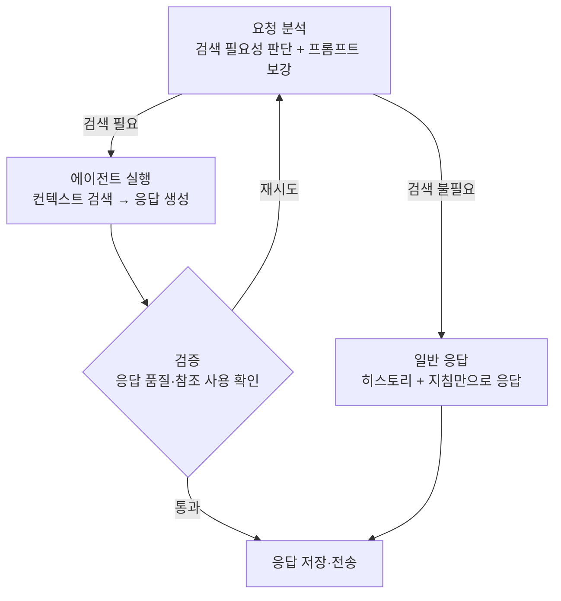

## 협업툴에 AI 비서를 만든다는 것

협업 플랫폼에는 채팅, 프로젝트, 업무, 일정, 파일 같은 데이터가 쌓인다. 한 팀이 1년만 써도 그 안에는 "우리 팀이 무엇을 어떻게 해왔는지"가 통째로 들어 있다. 문제는 그 데이터가 쌓이기만 하고 꺼내 쓰기는 어렵다는 것이었다. 지난 분기에 결정된 내용을 찾으려면 채팅방을 한참 거슬러 올라가야 했다. 프로젝트에 올라온 파일 내용은 다시 열어서 읽기 전까지는 존재하지 않는 것이나 다름없었다.

2025년 상반기, 회사는 이 지점에 AI를 붙이기로 했다. 그것도 기능 하나를 얹는 수준이 아니었다. 서비스 10주년 행사에서 회사가 공개적으로 선언한 방향은 "진짜 팀 동료처럼 일하는 AI 에이전트"였다. 쌓인 협업 데이터를 자연어로 검색하고 프로젝트를 대신 설계한다. 흩어진 요청을 업무로 등록하고 회의를 정리해 후속 업무로 잇는다. 협업의 반복 과정 전체를 대신하는 동료였다. 범용 챗봇을 하나 더 만드는 일과는 거리가 멀었다. 10년간 쌓인 업무 맥락 위에서 판단하고 실행까지 하는 에이전트가 목표였다. 그렇게 하면 제품의 활용도가 올라가고 활용도가 올라가면 고객이 떠날 이유가 줄어든다는 계산이었다.

이를 위해 AI TFT가 꾸려졌다. 대표님이 직접 Flow에 올린 사내 공지로 TFT 인원을 모집했고 백엔드 개발자였던 나는 거기에 차출되어 TFT 첫날부터 함께했다. 이 시리즈는 그날부터 지금까지의 기록이다. 이번 글은 그 프롤로그로, 기술 스택을 고르던 시절과 첫 파이프라인이 만들어지고 다시 만들어지기까지를 다룬다.


_현재의 Flow AI 메인 화면. 이 시리즈는 이 화면이 만들어지기까지의 과정을 순서대로 따라간다._

## 기술 스택 선정: TypeScript 진영에서 에이전트를 만든다면

AI 개발이라고 하면 보통 Python을 먼저 떠올리지만 우리 팀의 선택은 **TypeScript + NestJS + LangChain/LangGraph(JS)** 였다. 이유는 단순했다. 서비스 백엔드가 이미 NestJS 생태계 위에 있었고 LLM 서비스의 실체는 모델 학습이 아니라 API 오케스트레이션이었기 때문이다. 프롬프트를 조립해 도구를 호출하고 결과를 스트리밍으로 흘려보내는 일이었다. 이건 우리가 매일 하던 백엔드 개발과 다르지 않았고 그렇다면 DI·모듈 시스템·검증 파이프라인이 갖춰진 익숙한 환경에서 하는 편이 나았다.

당시 내 학습 노트(2025년 7월)를 다시 열어보면 가장 먼저 붙잡고 있던 개념이 **Tool Calling**이었다. 처음엔 이름 때문에 오해했다. 모델이 직접 뭔가를 실행해주는 줄 알았는데, 실제로는 그렇지 않다.

> LLM은 도구를 "실행"하지 않는다. 도구를 사용하기 위한 **arguments**를 생성할 뿐이고, 실제 실행은 전적으로 개발자의 코드가 한다.

이 한 줄을 이해한 순간이 에이전트 개발의 출발점이었다. 도구 실행이 내 코드의 책임이라면 에이전트란 결국 "LLM의 판단 + 내 코드의 실행"을 반복하는 루프다. 그 루프를 어떻게 설계하느냐가 곧 서비스 품질이 된다.

```typescript
const searchTool = tool(
  async ({ query, limit }) => {
    // 실행은 언제나 우리 코드의 몫. 내부 검색 API 호출
    return await searchService.search(query, limit);
  },
  {
    name: "search_workspace",
    description: "사용자의 프로젝트·파일에서 관련 내용을 검색한다.",
    schema: z.object({
      query: z.string().describe("검색 질의"),
      limit: z.number().describe("최대 결과 수"),
    }),
  },
);

const llmWithTools = llm.bindTools([searchTool]);
```

지금 돌아보면 당시엔 대수롭지 않게 넘겼지만 결정적이었던 선택이 몇 가지 있다.

- Zod 스키마의 `describe()`를 성실하게 쓴 것. 그땐 주석 정도로 생각했는데, 이 문자열이 모델에게 그대로 전달되어 도구 선택과 인자 생성의 품질을 좌우한다. 이후 수십 개의 도구를 운영하게 되면서 스키마 설명은 사실상 프롬프트 엔지니어링의 일부가 됐다.
- `withStructuredOutput`으로 구조화 출력을 일찍 익힌 것. "자연어로 답하고 끝"이 아니라 스키마에 맞는 JSON으로 판단 결과를 받아내는 패턴은 나중에 파이프라인의 분기 결정을 전부 LLM에게 맡기는 구조의 기반이 됐다.
- 스트리밍 중 tool call 처리를 미리 파본 것. 스트리밍 청크 안의 `tool_call_chunks`를 index로 이어 붙여 완전한 호출을 복원하는 구조를 학습 단계에서 확인해뒀는데, SSE 기반 채팅 서비스에서 이 지식은 두고두고 쓰였다.

LangGraph를 함께 고른 이유도 여기에 있다. 단발 호출만으로는 안 될 게 뻔했다. "분석 → 검색 → 검증 → 재시도" 같은 상태를 가진 흐름이 필요했다. 상태 그래프를 명시적으로 정의하면 그 실행(체크포인트, 스트리밍, 재개)을 맡아주는 런타임이 있으면 좋겠다고 판단했다. LangGraph는 프레임워크라기보다 저수준 실행 런타임에 가깝고 추상화를 거의 제공하지 않는 대신 흐름에 대한 통제권을 전부 개발자에게 남긴다. 우리에게 필요한 게 정확히 그것이었다. 다만 LangGraph의 상태 정의는 타입(모양)만 강제할 뿐 값의 유효성은 보장하지 않는다는 것을 곧 알게 됐고 검증은 NestJS 계층(DTO, Zod)에서 끝낸 "깨끗한 상태"만 그래프에 넣는 원칙을 세웠다. 런타임은 흐름의 실행을 맡고 신뢰는 애플리케이션 계층에서 만들기로 했다.

## 첫 파이프라인: Assistant V1에서 V2로

첫 결과물인 **Assistant V1**(2025년 8월)은 소박했다. 사용자가 파일과 프로젝트를 비서에 연동하면 그 내용을 바탕으로 비서의 시스템 프롬프트를 자동 생성했다. 채팅할 때는 벡터 검색으로 컨텍스트를 붙여 답변했다. 본질적으로는 단일 프롬프트 + RAG였다. 동작은 했지만 한계도 분명했다. 검색이 필요 없는 질문에도 매번 검색을 돌려 비용과 지연이 발생했고 응답이 검색 결과를 무시해도 손쓸 방법이 없었다.

한 달 뒤 **Assistant V2**에서 파이프라인을 LangGraph 기반으로 전면 재구성했다. 핵심은 흐름을 노드로 쪼개고 분기와 재시도를 상태로 제어하는 것이었다.



V2에서 배운 것 세 가지가 이후 방향을 정했다.

가장 크게는 판단을 작은 모델에게 맡겨도 된다는 것을 알았다. 요청 분석 노드는 경량 모델의 구조화 출력으로 검색 필요 여부와 보강된 프롬프트를 받아낸다. 규칙 기반으로는 모호한 질의를 가려낼 수 없었는데 모델의 판단 결과를 JSON으로 받으니 흐름 제어가 단순해지고 판단 근거가 로그로 남아 운영도 쉬워졌다.

둘째, 에이전트에게 순서를 맡기면 안 되는 구간이 있었다. 초기에 썼던 `createReactAgent`는 도구 호출 순서를 LLM이 지키지 않을 위험이 있었다. V2에서는 검색 → 보강 → 응답 생성 순서를 코드로 명시했다. 자율성이 필요한 곳과 결정성이 필요한 곳을 구분하는 감각은 이때 생겼다.

셋째, 검증과 재시도는 파이프라인의 일급 시민이다. 응답이 비었거나 검색 결과를 참조하지 않으면 검증 노드가 fallback 모드를 켜고 분석 단계로 되돌린다. 두 번째 루프에서는 검색 전략 자체를 보강한다. "한 번 실패하면 더 세게 다시"를 상태 머신으로 만든 셈이다.

## 초기의 벽: 시스템 프롬프트는 무한히 자라지 않는다

파이프라인은 굴러갔지만 서비스가 커지면서 다른 종류의 문제가 자라고 있었다. 어시스턴트 채팅 옆에는 일반 채팅이 있었고 웹 검색·이미지 생성·코드 생성·파일 파싱 같은 기능이 하나씩 붙을 때마다 그 규칙이 전부 하나의 시스템 프롬프트에 쌓였다.

결과는 예측 가능한 방향으로 나빠졌다. 코드가 코드블록 없이 응답되어 화면이 깨지고 이미지 생성은 "이미지 만들어줘"라고 정확히 말해야만 동작했다. 기본적인 마크다운 규칙조차 흔들렸다. 더 나쁜 건 고치는 방법이 프롬프트 수정뿐이라는 사실이었다. 디버깅 방법도 없고 수정으로 해결됐다는 보장도 없었다. 언제든 재발할 수 있는 장애를 프롬프트 문구로 틀어막는 상태였다. 여기에 더해 일반 채팅과 어시스턴트가 거의 같은 일을 하면서도 완전히 분리된 코드로 존재해 그래프 위에 에이전트가 중첩된 오버엔지니어링 구간까지 생겨 있었다.

이 벽을 넘는 과정이 다음 편의 주제다. 비대해진 프롬프트를 역할별 에이전트로 쪼개고 두 갈래로 갈라진 채팅 도메인을 하나의 에이전트 모듈로 공통화한 이야기다. 미리 말해두자면 그 과정에서 도입한 에이전트 하네스가 기대만큼 순순히 움직여주지는 않았다.

## 이 시리즈에서 다룰 것들

- 2편. 프롬프트 비대화와 채팅 도메인 공통화: 단일 프롬프트의 붕괴, 서브에이전트 도입, 일반 채팅과 어시스턴트의 통합
- 3편. 하네스와의 씨름: 에이전트 하네스 라이브러리(deepagents)를 도입한 뒤 실전에서 마주한 예상 밖의 행동들과 그 대응
- 4편 이후. 실행 가시성과 운영: 에이전트가 지금 무엇을 하는지 사용자에게 보여주는 문제, 그리고 운영하며 만난 장애들

돌아보면 이 시기의 결정 중 완벽한 것은 없었다. 하지만 "도구 실행은 코드의 책임", "검증은 애플리케이션 계층에서", "자율과 결정의 구간을 구분한다"는 원칙은 지금까지 유효하다. 다음 편에서는 그 원칙이 시험대에 오른 이야기를 쓴다.
