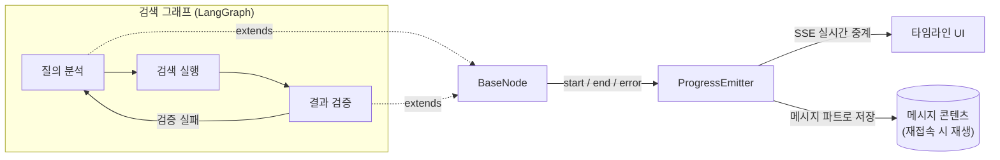

## 침묵은 장애처럼 보인다

3편의 4라운드에서, 스트리밍 붕괴를 고치다가 가시성의 첫 조각을 얻어걸렸다고 썼다. 체크포인트 네임스페이스로 부모와 서브에이전트의 스트림을 분리하고, 서브에이전트의 작업 스트림을 별도 이벤트로 프론트에 내려보낸 것. 사용자는 처음으로 "에이전트가 지금 뭔가 하고 있다"는 걸 볼 수 있게 됐다.

하지만 그건 어디까지나 텍스트 파편의 중계였다. 문제가 본격적으로 드러난 건 Flow 데이터 검색 쪽이었다. 검색 그래프는 질의 분석 → 검색 실행 → 결과 검증의 루프 구조라, 검증이 실패하면 조건을 바꿔 다시 돈다. 재시도가 두 번 겹치면 응답까지 수십 초. 그동안 사용자 화면은 비어 있다. 에이전트는 성실하게 일하는 중이지만, 밖에서 보면 멈춘 것과 구분되지 않는다. **응답이 느린 에이전트에게 침묵은 그 자체로 장애처럼 보인다.**

끝난 뒤의 문제도 있었다. 실행이 완료되면 결과만 남고 과정은 증발한다. "왜 이 결과가 나왔는지", "왜 이렇게 오래 걸렸는지"를 사용자도, 디버깅하는 우리도 다시 볼 수 없었다. 2026년 1월의 설계 노트에 목표를 두 줄로 적었다. 실행 중에는 실시간으로 중계할 것. 채팅방에 재접속하면 과거 실행을 같은 UI로 재생할 수 있을 것. 이 시스템에 Progress Chain이라는 이름을 붙였다.

## 실행 엔진이 아니라, 실행 설명 시스템

설계에서 가장 먼저 정한 것은 기능 목록이 아니라 **비목표**였다. 당시 노트의 표현을 그대로 옮기면 — "본 시스템은 Execution Engine이 아니라 Execution Explanation System이다." 실행 재현, 그래프 상태 복원, replay 같은 것은 의도적으로 만들지 않는다. Progress Chain은 실행을 "다시 하기 위한 로그"가 아니라 실행을 "이해하기 위한 서사"다. 이 한 줄이 이후의 모든 결정을 단순하게 만들었다.

핵심 결정 네 가지가 여기서 나왔다.

**첫째, 진실의 원천(Source of Truth)은 노드 이벤트 세 개뿐이다.** `node.start`, `node.end`, `node.error`. 이 노드는 실행됐다, 이 결과로 끝났다, 실패했다 — 그 이상은 없다. 중요한 건 이 이벤트를 프레임워크의 콜백이 아니라 **우리가 소유한 노드 추상화 계층에서 직접 발행**한다는 점이다. 3편에서 겪은 대로, 프레임워크의 스트림 이벤트는 모양이 우리 통제 밖에서 결정된다. 관측의 근거를 거기에 두면 프레임워크가 바뀔 때 가시성도 같이 무너진다. 프레임워크의 `updates`나 메시지 스트림은 보조 신호일 뿐, 저장하지도 재생하지도 않는다.

**둘째, `result`는 상태(state)가 아니라 설명용 데이터다.** `node.end`에 실리는 결과는 다음 노드의 입력도, 그래프 상태의 스냅샷도 아니다. 오직 사용자에게 보여주기 위해 노드가 직접 구성한 안전한 요약본이다. 이 구분 덕에 저장된 이벤트만으로 UI를 재생해도 실행 재현이라는 무거운 문제를 건드리지 않는다.

**셋째, 모델의 내부 추론은 노출하지 않는다.** 사용자에게 보여주는 설명은 `summary` 한 줄로 제한하고, 그 문장은 LLM 호출 없이 구조화된 결과에서 생성한다. "키워드는 '계약', '회의록'으로 추출했어요" 같은 문장은 추출된 키워드 배열로 만드는 것이지, 모델의 생각을 받아 적는 게 아니다.

**넷째, 재시도 횟수나 단계 구분은 저장하지 않는다.** iteration과 phase는 이벤트 시퀀스에서 렌더링 시점에 계산되는 뷰 모델이다. 저장하는 건 시간순 이벤트 목록뿐 — 해석은 전부 화면의 몫이다.

저장 위치도 이 철학을 따랐다. 별도 실행 로그 테이블을 만드는 대신, 이벤트 목록을 **메시지 콘텐츠의 한 파트로** 메시지와 함께 저장했다. 실행 기록은 그 답변의 일부라서, 메시지와 분리해 보여줄 일이 UX상 존재하지 않기 때문이다. 재접속 시 재생은 그냥 메시지를 읽는 것으로 끝난다.

## BaseNode — 가시성을 상속으로 강제하다

이 설계를 코드로 강제하는 장치가 `BaseNode` 추상 클래스다. 처음에는 각 노드가 알아서 이벤트를 발행하게 했는데, 금방 한계가 왔다. 노드마다 발행 방식이 다르고, 어떤 노드는 아예 발행하지 않고, 모든 노드에 시작-종료-에러 처리 보일러플레이트가 복붙됐다. 그래서 Template Method 패턴으로 뒤집었다. **라이프사이클은 부모가 소유하고, 구현자는 비즈니스 로직만 쓴다.**

```typescript
export abstract class BaseNode<Input extends ProgressNodeContext, Result> {
  abstract readonly graphName: GraphName;
  abstract readonly nodeName: string;

  // 라이프사이클 관리 — 오버라이드 금지
  async run(state: Input): Promise<Result> {
    const emitter = this.shouldEmit(state) ? state.progressEmitter : undefined;
    const iteration = this.getIteration(state); // 재시도 카운트에서 자동 추출

    emitter?.emitNodeStart({ graphName: this.graphName, nodeName: this.nodeName, iteration });
    try {
      const result = await this.execute(state); // 구현 클래스의 몫은 이것뿐
      emitter?.emitNodeEnd({
        graphName: this.graphName, nodeName: this.nodeName, iteration,
        result: this.buildResult?.(state, result) ?? {},   // 설명용 데이터
        summary: this.buildSummary?.(state, result),       // 사람이 읽는 한 줄
      });
      return result;
    } catch (error) {
      emitter?.emitNodeError({ graphName: this.graphName, nodeName: this.nodeName, iteration, error });
      throw error;
    }
  }

  protected abstract execute(state: Input): Promise<Result>;
  protected buildResult?(state: Input, result: Result): unknown;
  protected buildSummary?(state: Input, result: Result): string | undefined;
}
```

노드 구현자가 하는 일은 `execute()`에 로직을 쓰고, 보여줄 게 있으면 `buildResult()`와 `buildSummary()`를 채우는 것뿐이다. 시작·종료·에러 이벤트 발행, 재시도 추적, 전송과 저장은 전부 부모가 처리한다. 가시성이 "노드 개발자가 잊지 말아야 할 규칙"이 아니라 **상속하는 순간 자동으로 따라오는 계약**이 된 것이다. 2편에서 "규칙이 코드로 표현될 수 있다면 코드로 옮긴다"고 썼는데, 같은 원칙이 관측에도 적용된 셈이다.

이벤트의 출구는 단일 `ProgressEmitter`다. 단조 증가하는 `seq`를 붙여 순서를 보장하고, 직렬화 불가능한 값을 걸러낸 뒤, SSE로 프론트에 쏘면서 동시에 저장용 히스토리에 쌓는다. SSE 전송이 실패해도 저장은 실패하지 않는다 — 실시간 중계와 기록은 같은 이벤트의 두 소비자일 뿐이다.



프론트는 레지스트리 패턴으로 그래프에서 독립시켰다. 그래프 이름 → 노드 이름 → 라벨·시작 문구·결과 렌더러를 매핑하는 설정 테이블이 있고, 타임라인 컴포넌트는 레지스트리에 등록된 노드만 그린다. 새 그래프에 가시성을 입히는 일은 공유 타입에 상수를 추가하고, 노드가 BaseNode를 상속하고, 레지스트리에 항목을 등록하는 세 단계로 끝난다. 검색 그래프에 처음 입힌 이 시스템이 이후 웹 검색·이미지 생성 그래프로 확장 가능했던 이유다.

## 재시도 루프가 화면에 보이면 생기는 일

이 시스템에서 가장 공들인 부분은 재시도의 시각화다. 검증 노드가 실패를 판정하면 재시도 카운트가 올라가고, 이후 이벤트들은 다음 iteration으로 찍힌다. 프론트는 iteration별로 이벤트를 묶어 **탭 UI**로 그린다 — "초기", "재시도 1", "재시도 2 ✓". 각 탭 안에는 그 회차의 노드 타임라인이 흐르고, 검증 노드의 summary가 회차의 결말을 알려준다. "결과가 부족해 재시도할게요", 그리고 마지막 탭에서 "검증 통과했어요".

이게 사용자 경험을 바꾸는 방식이 흥미로웠다. 재시도는 원래 숨겨진 지연이었다. 사용자 입장에서는 "가끔 이상하게 느린 검색"일 뿐이고, 느림의 원인이 보이지 않으니 불신으로 쌓인다. 재시도가 탭으로 보이는 순간 같은 지연이 다르게 읽힌다. 첫 시도가 왜 부족했는지, 조건을 어떻게 바꿔 다시 시도했는지가 서사로 남는다. **느림이 설명되면 결함이 아니라 과정이 된다.** 우리 입장에서도 "왜 이 결과가 나왔는가"라는 문의에 저장된 타임라인을 여는 것으로 답할 수 있게 됐다.

반대 방향의 결정도 있었다. 모든 노드를 보여주지는 않는다. 내부 API 매핑이나 파라미터 조립 같은 노드는 사용자에게 아무 의미가 없어서, 상태 플래그로 이벤트 발행을 꺼둔다. 화면에 남는 건 의도 분석 → 결과 정리 → 검증 세 단계 정도다. 가시성의 목적은 전부 보여주는 게 아니라 **이해에 필요한 만큼만 보여주는 것**이다. 여섯 노드를 다 나열한 초기 버전보다, 세 단계로 추린 버전이 훨씬 "무슨 일이 일어나는지 알겠다"는 반응을 얻었다.

## 배운 것 — 가시성은 UI 기능이 아니라 아키텍처 결정이다

Progress Chain을 만들며 남은 결론은 세 가지다.

1. **가시성은 관측 지점의 소유권 문제다.** 프레임워크의 스트림을 파싱해 보여주는 방식(3편의 첫 조각)은 프레임워크가 바뀌면 같이 깨진다. 우리가 소유한 추상화 계층에서 이벤트를 발행하는 순간, 가시성은 그래프 구현과 프레임워크 버전으로부터 독립한다.
2. **보여줄 것과 저장할 것을 분리하면 둘 다 단순해진다.** 저장은 최소한의 사실(세 가지 노드 이벤트)만, 해석(iteration, phase, 완료 판정)은 전부 뷰에서. 저장 스키마가 UI 요구사항에 끌려다니지 않고, UI는 저장을 건드리지 않고 진화할 수 있었다.
3. **설명은 부가 기능이 아니라 신뢰의 조건이다.** 같은 속도, 같은 결과라도 과정이 보이는 에이전트와 침묵하는 에이전트는 전혀 다르게 평가받는다. 유능한데 불안한 에이전트보다, 한계까지 보여주는 에이전트가 서비스에서는 낫다.

## 시리즈를 맺으며

1편에서 파이프라인을 세웠고, 2편에서 프롬프트에 흩어진 기능을 코드와 서브에이전트로 옮겼고, 3편에서 프레임워크의 기본값에 고삐를 채웠고, 이번 편에서 그 모든 실행을 사용자가 볼 수 있게 만들었다. 돌아보면 방향은 일관됐다. **에이전트의 동작을 보이지 않는 곳(프롬프트, 프레임워크 내부, 침묵의 수십 초)에서 보이는 곳(코드, 미들웨어, 타임라인)으로 꺼내는 일.** 에이전트 본편의 기록은 여기서 한 매듭을 짓는다.

다만 이야기가 끝난 건 아니다. Progress Chain이 처음 입혀진 Flow 데이터 검색 그래프 — 질의 분석과 검증 루프가 어떻게 설계됐고 어떻게 빨라졌는지는 별도 시리즈인 [의도 기반 AI 검색 개발기](/series/flow-ai-search)에서 계속 이어진다. 에이전트가 "무엇을 하는지 보여주는" 이야기가 이 편이었다면, 저쪽은 에이전트가 "그 일을 어떻게 잘하게 됐는지"의 기록이다.
