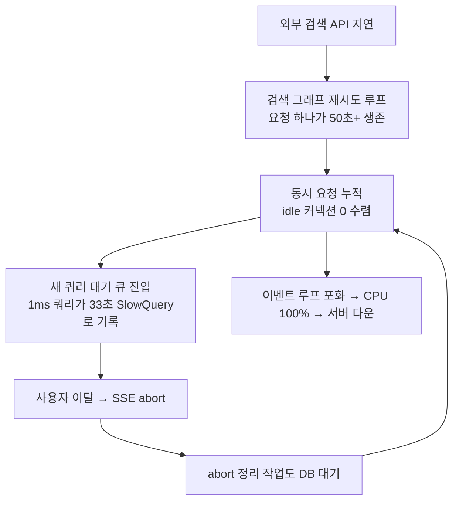

## 배포는 끝이 아니라 다른 시험의 시작이었다

4편에서 에이전트 본편의 기록이 한 매듭을 짓는다고 썼다. 파이프라인을 세웠고 프롬프트를 코드로 옮겼고 하네스에 고삐를 채웠고 실행 과정을 사용자에게 보여줬다. 만드는 이야기는 거기까지다. 하지만 서비스는 만들어진 다음부터가 본론이다. 이번 편은 그 매듭 위에 얹는 운영의 기록이자, 이 시리즈의 진짜 완결편이다.

에이전트 서비스의 장애라고 하면 모델의 환각, 프롬프트 회귀, 도구 오호출 같은 것을 먼저 떠올리게 된다. 우리도 그랬다. 그런데 정작 서버를 통째로 멈춰 세운 장애의 범인은 그중 무엇도 아니었다. 두 번 모두, 익숙하다고 믿었던 곳에서 왔다. DB 커넥션 풀이었다.

## 장애 1: 서버가 죽었는데 범인은 쿼리가 아니었다

어느 날 오전, Flow 데이터 검색이 느려진다는 신고와 함께 지표가 무너지기 시작했다. SlowQuery 로그가 폭발했고 CPU가 100%에 붙었고 결국 서버가 먹통이 되어 컨테이너를 재시작해야 했다.

첫 가설은 당연히 "느린 쿼리가 생겼다"였다. 그런데 로그를 열어보니 이상했다. 33,700ms로 기록된 쿼리는 금칙어 목록을 읽는, 평소 1ms면 끝나는 단순 SELECT였다. 쿼리 플랜이 무너질 이유가 없다. 그 순간 프레임이 바뀌었다. **33,700ms는 쿼리가 느렸던 시간이 아니라, 33,699ms 동안 커넥션을 얻지 못하고 대기한 시간이었다.** SlowQuery 로그는 대기 시간을 쿼리 시간에 합산해 기록하고 있었다. 범인은 커넥션 풀 포화였다.

그럼 누가 풀을 고갈시켰는가. 당시 우리 NestJS 프로세스는 같은 PostgreSQL을 바라보는 커넥션 풀을 세 개 운영하고 있었다. 일반 CRUD용 Prisma 풀(max 50), 협업 플랫폼 데이터를 읽는 전용 풀(max 50), 그리고 pgvector와 LangGraph 체크포인트용 풀(max 100). 두 번째 가설은 "누군가 커넥션을 오래 물고 있다"였는데, 이것도 배제됐다. 트랜잭션을 몇십 초씩 잡는 코드는 없었다. 모든 쿼리가 커넥션을 50ms 남짓 짧게 빌리고 바로 반환하고 있었다.

진범은 요청의 수명이었다. 트리거는 협업 플랫폼 쪽 외부 검색 API의 응답 지연이었다. Flow 데이터 검색 그래프는 검색 실패 시 조건을 바꿔 다시 도는 재시도 루프가 있는데(4편에서 화면에 올렸던 바로 그 루프다), 개별 API 타임아웃 10초에 재시도가 최대 5회까지 겹치면 **요청 하나가 50초 넘게 살아 있게 된다.** 그 50초 동안 요청은 체크포인트 저장과 검증 판정 같은 DB 작업을 중간중간 계속 수행한다. 하나하나는 짧지만 이런 요청이 동시에 수십 개 쌓이면 커넥션이 반환되는 즉시 다른 대기자가 낚아채 간다. idle 커넥션이 0에 수렴하고 새 요청은 대기 큐에 들어가고 5초의 커넥션 타임아웃을 넘긴 요청은 에러가 된다.

여기서 끝이 아니었다. 응답이 늦어지자 사용자들이 포기하고 떠났고 SSE 연결이 끊기며 abort 처리가 발동했다. 그런데 abort 처리에도 부분 응답 저장 같은 DB 작업이 들어 있다. **장애를 정리하는 코드가 다시 포화된 풀에 줄을 서는** 악순환. 대기 Promise와 타임아웃 타이머가 이벤트 루프에 쌓이며 CPU가 100%로 치솟았고 서버는 LLM 스트리밍 같은 정작 해야 할 일을 처리할 시간을 완전히 잃었다.



수정은 원인 사슬을 거꾸로 끊는 것이었다. 검색 그래프에 전체 타임아웃 30초를 걸어 "개별 타임아웃 × 재시도 횟수"가 무한정 자라지 못하게 했고 재시도 상한을 5회에서 2회로, 외부 API 타임아웃을 절반으로 줄였다. 과하게 잡혀 있던 체크포인트 풀도 축소하고 풀 사용률이 90%를 넘으면 알림이 오도록 붙였다. 돌아보면 이 장애의 씁쓸한 지점은, 4편에서 "성실함의 증거"로 화면에 올렸던 재시도 루프가 시스템 관점에서는 **부하 증폭기**이기도 했다는 사실이다. 한 번의 외부 지연을 다섯 배의 점유 시간으로 불려놓고 있었다.

## 장애 2: 정확히 1분 뒤에 죽는 커넥션

두 번째 장애는 더 기묘한 얼굴로 왔다. 서버를 기동하면 **정확히 1분 뒤에** PostgreSQL FATAL 에러가 터졌다. `terminating connection due to idle-session timeout`, 코드 57P05. 애플리케이션은 자동 복구 로그를 찍으며 버텼지만 에러는 주기적으로 계속 올라왔다.

이번 수사의 단서는 "정확히 1분"이라는 규칙성이었다. 부하와 무관하게, 요청이 하나도 없어도, 기동 후 1분. 이건 코드의 타이밍이 아니라 어딘가의 설정값이다. 찾아보니 개발 DB에 idle 세션 타임아웃이 1분으로 걸려 있었다. 그렇다면 질문은 하나로 좁혀진다. 누가 쓰지도 않을 커넥션을 열어두고 있는가.

범인은 편의 팩토리였다. LangGraph의 체크포인트 저장에 쓰는 `@langchain/langgraph-checkpoint-postgres`의 `PostgresSaver.fromConnString()`은 호출할 때마다 **내부에서 새 커넥션 풀을 생성한다.** 그리고 이 편리한 한 줄이 코드 곳곳에 흩어져 있었다. 체크포인터가 필요한 자리마다 풀이 하나씩 생겨났고 대부분은 놀고 있다가 1분 뒤 DB 서버가 강제로 끊어버리면서 예외를 쏟아낸 것이다.

수정은 풀의 소유권을 한곳으로 모으는 것이었다. 풀 생성을 단일 서비스로 묶고 체크포인터는 공유 풀을 주입받아 재사용하게 바꿨다(개념 코드).

```typescript
// Before: 호출마다 새 풀이 생긴다
const checkpointer = PostgresSaver.fromConnString(connString, { schema: "public" });

// After: 앱이 소유한 공유 풀을 주입받는다
const checkpointer = new PostgresSaver(this.dbPoolService.getSharedPool());
```

이 변경 이후 에러는 사라졌다. 규모는 달라도 장애 1과 뿌리가 같다는 점이 눈에 들어왔다. **커넥션 풀의 소유권이 애플리케이션에 없었다.** 하나는 라이브러리의 편의 API가 풀을 몰래 만들었고, 하나는 요청의 수명이 풀의 가정을 몰래 무너뜨렸다. 3편에서 하네스의 기본값을 상수와 미들웨어로 고정하며 배운 교훈("기본값은 무료가 아니다")이, DB 계층에서 똑같이 반복된 셈이다.

## 운영이 가르친 것: LLM 서비스의 장애는 LLM에서만 오지 않는다

두 장애를 관통하는 사실이 있다. 모델도, 프롬프트도, 그래프 로직도 범인이 아니었다. 환각 한 번 없이 서버가 죽었다. **LLM 서비스의 장애는 LLM에서만 오지 않는다. 오히려 대부분은 백엔드 기본기의 문제로 되돌아온다.** 커넥션 풀, 타임아웃 예산, 자원의 수명주기. 1편에서 "LLM 서비스의 실체는 API 오케스트레이션"이라 쓰고 익숙한 백엔드 스택을 골랐는데, 운영은 그 문장을 장애의 형태로 되돌려줬다. 오케스트레이션 서비스는 오케스트레이션이 실패하는 방식으로 죽는다.

다만 에이전트라는 워크로드가 장애의 확률 분포를 바꾼다는 것도 배웠다. 요청 하나가 수십 초를 사는 서비스, 노드마다 체크포인트를 남기는 그래프, 실패하면 스스로 다시 도는 루프. 전통적인 웹 앱의 가정("요청은 짧다", "재시도는 클라이언트의 몫이다") 위에 세운 자원 설계는 이 워크로드 앞에서 조용히 무너진다. 에이전트의 자율성을 높일수록, 그 자율이 소비할 자원의 상한은 코드가 더 단단히 쥐고 있어야 한다.

운영에서 만난 장애가 이 둘뿐이었던 건 아니다. SSE 연결의 수명주기와 abort가 일으킨 문제들은 [스트리밍 성능 개선기](/series/streaming-performance)에서, MCP 서버를 운영하며 만난 장애들은 [Flow MCP 개발기](/series/flow-mcp)에서 각각 따로 다뤘다. 이 편은 그 기록들 사이에 남아 있던 마지막 조각, 데이터베이스 계층의 이야기다.

## 시리즈를 마치며: 실행이 코드의 책임이면, 장애도 코드의 책임이다

1편은 학습 노트의 한 줄에서 출발했다. "LLM은 도구를 실행하지 않는다. arguments를 생성할 뿐이고, 실제 실행은 전적으로 개발자의 코드가 한다." 5편까지 와서 돌아보면 이 문장은 생각보다 무거운 계약이었다. 실행이 코드의 책임이라면, 그 실행이 점유하는 커넥션과 타임아웃과 재시도 예산도, 그것이 무너졌을 때의 새벽 장애도 전부 코드의 책임이다. 에이전트를 만든다는 건 모델에게 판단을 맡기는 일이 아니라, 그 판단이 소비할 실행 환경을 끝까지 책임지는 일이었다.

1편에서 세운 원칙 세 가지도 운영까지 살아남았다. **"도구 실행은 코드의 책임"은** 이번 편에서 자원 관리의 책임으로 확장됐고, **"검증은 애플리케이션 계층에서"는** 그래프에 깨끗한 상태만 넣는 원칙을 넘어 라이브러리가 만드는 풀까지 애플리케이션이 소유하는 원칙이 됐고, **"자율과 결정의 구간을 구분한다"는** 재시도의 자율에 전체 타임아웃이라는 결정적 상한을 거는 형태로 돌아왔다.

이제 시리즈를 닫는다. 파이프라인을 세웠고(1편), 프롬프트에 흩어진 규칙을 코드와 서브에이전트로 옮겼고(2편), 하네스의 기본값에 고삐를 채웠고(3편), 실행을 사용자가 볼 수 있게 만들었고(4편), 만든 것을 지키는 법을 배웠다(5편). 방향은 끝까지 하나였다. **에이전트의 동작을 보이지 않는 곳에서 보이는 곳으로, 통제되지 않는 곳에서 통제되는 곳으로 꺼내는 일.** 에이전트 위에서 검색이 어떻게 좋아졌는지는 [의도 기반 AI 검색 개발기](/series/flow-ai-search)에, 에이전트의 손이 되어준 도구들의 이야기는 [Flow MCP 개발기](/series/flow-mcp)에 이어져 있다. 이 시리즈의 기록은 여기서 마친다.
