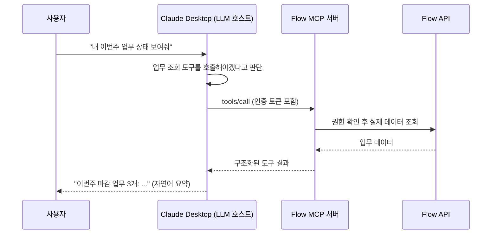

## 대화는 이미 다른 곳에서 벌어지고 있었다

에이전트 개발기 시리즈에서 썼듯, 우리는 협업 플랫폼 Flow 안에 AI 비서를 만들었다. 파이프라인을 갈아엎고, 검색을 붙이고, 스트리밍을 다듬으며 채팅 경험은 계속 나아졌다. 그런데 2026년 봄, 그 경험 바깥에서 더 큰 흐름이 보였다. **사용자들은 이미 ChatGPT와 Claude 안에서 하루를 보내고 있었다.** 개발자는 Cursor 안에서 살았다. 질문할 일이 생기면 사람들은 협업툴의 AI 채팅창이 아니라, 평소 쓰던 AI 앱부터 열었다.

당시 사내 공유용으로 썼던 문서에 이런 비유가 있다. 우리가 만든 AI 채팅은 **자판기였다.** Flow에 들어가서, 채팅창을 열어야만 AI에게 물어볼 수 있다. 자판기 앞까지 와야 음료를 뽑을 수 있는 것이다. 문제는 사용자가 이미 다른 곳에서 대화 중이라는 사실이었다.

이게 왜 문제인가. 사용자가 ChatGPT에게 "이번 주 내 마감 업무 기준으로 주간 보고 초안 써줘"라고 물으면, 두 가지 중 하나가 벌어진다. AI가 업무 데이터를 모른 채 그럴듯한 빈 껍데기를 지어내거나, 사용자가 협업툴을 열어 업무 목록을 복사해 붙여넣거나. 전자는 신뢰의 문제고 후자는 비용의 문제다. 몇 년치 업무·일정·프로젝트·문서가 쌓인 플랫폼이, 정작 사용자가 일하는 대화에서는 존재하지 않는 데이터나 마찬가지였다.

사용자를 우리 채팅창으로 다시 끌어오는 방법도 있다. 하지만 그건 자판기를 더 화려하게 만드는 일이다. 우리가 내린 결론은 반대였다. **데이터가 사용자에게 가야 한다.** 챗봇을 하나 더 만드는 대신, 사용자가 어떤 AI 앱을 쓰든 거기서 Flow 데이터에 닿게 하는 것.

## MCP: 전용 케이블 대신 표준 단자

그 수단이 **MCP(Model Context Protocol)** 였다. Anthropic이 2024년 11월 공개한 오픈 프로토콜로, LLM 호스트(Claude Desktop, ChatGPT, Cursor 같은 AI 앱)가 외부 데이터와 기능을 표준 방식으로 소비하게 한다. 이후 OpenAI 등 다른 진영도 채택하면서 사실상의 업계 표준이 됐다.

동작 원리는 단순하다. 호스트는 `tools/list`로 서버가 제공하는 도구 목록과 각 도구의 입력 스키마를 받아오고, `tools/call`로 실제 호출한다. LLM은 대화 도중 필요한 순간에 알맞은 도구를 스스로 골라 호출하고, 그 결과를 응답에 섞어 넣는다.

비유하자면 MCP 서버는 플랫폼에 붙인 **표준 단자(USB-C 포트)** 다. 기존 AI 채팅창이 전용 케이블만 꽂히는 독점 단자였다면, 표준 단자는 규격만 맞으면 어떤 기기든 꽂힌다. 그리고 이 표준의 진짜 힘은 **한 벌로 끝난다는** 데 있다. Claude용, GPT용, Cursor용 연동을 따로 세 개 만들 필요가 없다. MCP 규약을 지키는 서버 하나면 현재의 호스트뿐 아니라, 앞으로 나올 호스트까지 커버된다.

에이전트 시리즈를 읽은 분이라면 기시감이 들 것이다. 도구 정의, 스키마, LLM의 도구 선택. 우리가 내부 에이전트를 만들며 다뤄온 재료 그대로다. 달라진 건 하나뿐이다. 도구를 소비하는 LLM이 우리 서버 안이 아니라 **바깥에,** 우리가 통제하지 않는 호스트 안에 있다는 것.

## 왜 "공식" 서버인가: 권한 체계를 승계한다는 것

MCP 서버 자체는 누구나 만들 수 있다. 실제로 오픈소스 생태계에는 개인이 API 토큰을 래핑해 만든 비공식 서버가 넘친다. 그런데도 플랫폼이 직접, 공식으로 만들어야 한다고 판단한 근거는 두 가지였다.

**첫째, 데이터 진실성.** AI의 역할은 "질문을 받아 알맞은 도구를 고르고, 결과를 자연어로 풀어주는 것"까지다. 진짜 데이터는 항상 플랫폼에서 온다. 공식 서버가 플랫폼 API를 정면으로 호출하는 구조에서는 AI가 업무 현황을 지어낼 수 없다. 도구 결과에 없는 것은 답변에 실을 근거가 없기 때문이다.

**둘째, 권한 승계.** 협업 데이터는 권한 덩어리다. 내가 참여하지 않은 프로젝트, 나에게 공유되지 않은 일정은 나에게 보이면 안 되고, 따라서 **내가 연결한 AI에게도 보이면 안 된다.** 공식 서버의 원칙은 하나였다. 사용자가 원래 플랫폼에서 볼 수 있는 것만, AI도 본다. 새 권한 체계를 발명하는 게 아니라 기존 체계를 그대로 승계하는 것이다.

이 원칙은 **2-Tier 권한 모델로** 구체화됐다.

- **Tier 1(회사 허용):** 이 회사가 외부 AI를 통한 접근을 허용했는가. 회사 단위로 발급된 API 키가 있어야 MCP 서버가 그 회사의 데이터에 도달할 수 있다. 회사 차원의 게이트다.
- **Tier 2(사용자 연동):** 그 회사 안에서 이 사용자가 자신의 신원으로 연동됐는가. 사용자별 토큰으로 호출자가 확정되고, 조회 범위는 그 사용자가 볼 수 있는 데이터로 한정된다.

회사가 문을 열어야 사용자가 들어올 수 있고, 사용자가 들어와도 자기 자리만 볼 수 있다. 개인이 만든 비공식 래퍼는 Tier 2 흉내까지는 낼 수 있어도 Tier 1을 세울 수 없다. 이 모델의 구현(인증 전략과 이후의 OAuth 2.1 전환)은 이 시리즈 후반의 큰 축이 된다.

## 방향 결정: Tools만, 읽기부터

MCP는 `Tools` 외에도 `Resources`(데이터 노출), `Prompts`(사전 정의 템플릿) 같은 primitive를 제공한다. 우리는 **Tools만 도입하기로** 했다. 핵심 가치가 "자연어로 물으면 실제 데이터로 답한다"에 있고, 그건 Tools만으로 완성되기 때문이다. Prompts는 호스트마다 노출 UX가 달라 경험이 분산될 위험이 있어 후순위로 미뤘다. 표면적을 좁게 시작해야 배도 빨리 뜬다.

기능 범위도 같은 논리로 잘랐다. **첫 버전은 완전 읽기 전용.** 업무·일정·게시물·프로젝트를 키워드로 더듬는 검색(find) 계열과, "내 긴급 업무 중 이번 주 마감"처럼 조건으로 추리는 조회(query) 계열, 이렇게 조회·검색 도구만 담고, 생성·수정은 권한 정책 검토가 끝난 뒤로 미뤘다. 모든 도구에 읽기 전용 애노테이션을 달아 호스트가 안심하고 자동 승인 UX를 제공할 수 있게 했다. 데이터를 망가뜨릴 수 없는 서버라면, 도입 장벽은 그만큼 낮아진다.

지금 돌아보면 이 절제가 이 프로젝트에서 제일 잘한 결정 중 하나였다. 이후 도구는 수십 개 규모로 불어나고 쓰기 도구도 들어오지만, "읽기 전용 + Tools only"라는 좁은 첫 표면 덕에 초기 버전을 빠르게 세상에 내놓을 수 있었다.

## 결정 이후

정리하면 이렇다. 사용자는 이미 ChatGPT와 Claude 안에서 일한다. 그래서 데이터가 사용자에게 간다. 수단은 표준 프로토콜 MCP 하나로 모든 호스트를 받는 것. 자격은 플랫폼의 권한 체계를 그대로 승계한 공식 서버. 범위는 Tools only, 읽기 전용부터.

결정이 서자 손이 빨라졌다. 설계에서 첫 배포까지 나흘. 다음 편은 그 4일 스프린트의 기록이다. 미리 말하면, 빠른 만큼 빚도 쌓였다.
