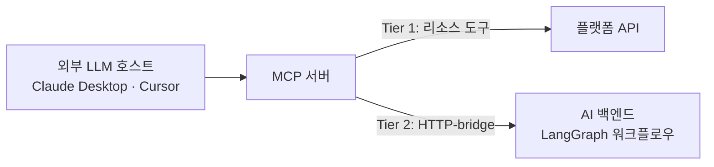

## 빠르게 세운 서버에 오래갈 뼈대를 넣는 일

2편은 이 질문으로 끝났다. **이 서버는 10년 뒤에도 서 있을 수 있는 구조인가.** 4일 만에 서버가 섰고 읽기 전용 도구들이 실제로 돌고 있었지만, 그건 속도의 증명이었지 수명의 증명은 아니었다.

그래서 구축 직후 일주일은 코드를 늘리는 대신 결정을 기록하는 데 썼다. 판단 기준은 하나로 통일했다. **"지금 편한가"가 아니라 "10년 뒤에도 이 선택을 후회하지 않을까."** 외부 LLM 호스트가 의존하게 될 공개 표면은 한번 굳으면 되돌리기 어렵기 때문에, 결정마다 후보와 근거, 지불하기로 한 비용까지 ADR로 남겼다.

처음 던진 질문은 레포·인프라·워크플로우 통합·사용자 정의 워크플로우 네 개였는데, 풀다 보니 "이 서버는 애초에 무엇인가"부터 정해야 한다는 게 드러나 결정은 여섯 개로 분화했다. 순서대로 간다.

## 결정 1. 이 서버는 무엇인가: Hybrid MCP

첫 결정은 코드가 아니라 정체성이었다. 후보는 셋이었다.

- **A. Resource MCP:** 협업 플랫폼의 리소스(업무·일정·프로젝트)를 LLM 친화적 인터페이스로 노출하는 얇은 어댑터
- **B. Hybrid MCP:** 리소스에 더해, 정제된 비즈니스 워크플로우까지 제공
- **C. AI-Internal MCP:** 사내 AI 에이전트가 쓰는 내부 전용 tool registry

선택은 **B였다.** Flow AI 백엔드에는 이미 LangGraph로 만든 워크플로우들(프로젝트 컨설팅, 회의 요약 같은)이 있었고, 이것들은 외부 LLM 호스트(Claude Desktop이나 Cursor)가 호출해도 충분히 가치가 있었다. A는 차별화가 약하고, C는 외부 호스트에 아무 가치를 주지 못한다.

지금 돌아보면 이 결정이 나머지 다섯을 전부 끌고 갔다. "리소스와 워크플로우를 모두 제공한다"고 정하는 순간, 워크플로우를 어떻게 부를지(결정 2), 도구를 어떻게 보여줄지(결정 5), 사용자 정의 워크플로우를 어디에 얹을지(결정 6)가 연쇄적으로 따라 나왔다.

## 결정 2. 워크플로우를 어떻게 부를 것인가: HTTP-bridge

Hybrid로 가기로 했으니 워크플로우를 실행하는 방법이 필요했다. 방식은 둘이었다.

- **방식 1. HTTP-bridge:** MCP tool handler가 AI 백엔드의 HTTP endpoint를 호출한다
- **방식 2. In-process:** MCP 서버가 LangChain/LangGraph를 직접 import해 그래프를 실행한다

방식 2가 성능상으로는 유리하다. 하지만 그래프를 import하는 순간 프롬프트, 그래프 정의, RAG 파이프라인, pgvector 의존성까지 LangChain 도메인 코드 전체가 딸려 들어온다. MCP 서버의 책임이 폭발하고, 애써 분리한 두 서비스가 코드 레벨에서 다시 결합한다.

선택은 **HTTP-bridge였다.** 대신 AI 백엔드 쪽에 요구사항이 생겼다. 스스로를 **"AI as a Service"** 로 정의하고, 내부 HTTP API와 OpenAPI 스펙을 공식적으로 publish할 것. 비용은 네트워크 홉 +20~50ms. LLM 응답이 초 단위로 걸리는 세계에서 점점 작아지는 비용이다.

지금 돌아보면, 이 결정의 진짜 가치는 지연 시간 계산이 아니라 **경계를 계약으로 못 박은 것이었다.** HTTP와 스펙이라는 명시적 경계 앞에서는 "이 함수 하나만 가져다 쓰자"는 유혹이 성립하지 않는다. 그 유혹이 얼마나 무서운지는 다음 결정에서 정면으로 다뤘다.

## 결정 3. 레포: 같이 살 것인가, 따로 살 것인가

MCP 서버는 이미 독립 레포였다. 질문은 "AI 백엔드 모노레포로 다시 합칠 것인가"였다. 모노레포의 장점은 명확하다. 타입 공유가 쉽고, 운영할 서비스가 줄고, in-process 호출도 가능해진다. 그럼에도 선택은 **분리 유지였다.** 근거 세 개.

**첫째, 외부 제품 표면은 lifecycle이 다르다.** MCP 서버는 외부 LLM 호스트가 의존하는 공개 API 표면이라 자체 SLA·보안·버전 정책이 필요하다. 반면 AI 백엔드는 빠른 실험이 생명이다. 프롬프트 한 줄 고칠 때마다 외부 클라이언트가 물린 서버가 같이 재배포되는 구조는 양쪽 모두를 불행하게 만든다.

**둘째, 진짜 공유할 가치가 있는 코드를 세어봤다.** 외부 계약 스키마와 인증 컨텍스트 타입 50줄 남짓. 스펙 단일 소스 + codegen으로 충분하고, 런타임 코드 공유가 필요 없다. 도메인 로직은 애초에 공유 대상이 아니다.

**셋째, 공유 코드는 자란다.** 마이크로서비스 문헌들이 일관되게 경고하듯, **지금 5줄 공유한 것이 5년 뒤 5천 줄짜리 분산 모놀리스가 된다.** 서비스는 나뉘어 있는데 공유 라이브러리 하나를 고치면 전부 재배포해야 하는, 분산의 비용과 모놀리스의 결합을 동시에 갖는 최악의 형태. 모노레포는 이 미끄럼틀을 가속한다.

흥미로운 건 폐기한 근거다. 처음엔 Conway's Law도 분리 근거였는데, MCP 서버도 같은 팀이 맡기로 하면서 성립하지 않아 지웠다. 근거 하나가 무너져도 결정이 서 있는지 확인하는 과정이었다.

결정과 함께 **공유 정책 4원칙을** 박아뒀다. 외부 계약은 스펙 단일 소스 + codegen으로(런타임 의존 금지), 횡단 관심사는 변경 빈도가 거의 0인 좁은 라이브러리만, 도메인 로직은 절대 공유하지 않는다, AI 백엔드는 HTTP와 스펙만 노출한다. 원칙이 없으면 분리는 시간이 지나며 반드시 무너진다는 걸 전제한 안전장치다.

## 결정 4. 어디서 돌릴 것인가: EC2 Docker에서 ECS Fargate로

인프라는 상대적으로 짧게 끝났다. 후보는 EC2(PM2), EC2(Docker), ECS Fargate, Lambda, EKS. Lambda는 MCP의 장기 연결과 세션 상태 때문에, EKS는 단일 서비스에 과투자라 탈락. 결론은 **Phase 1은 EC2 + Docker, Phase 2에 ECS Fargate로 이전하되** 원칙을 하나 세웠다. **컨테이너-퍼스트 + 12-Factor 엄수. 마이그레이션 시 인프라 코드만 바뀌고 앱 변경은 0이어야 한다.** 설정은 환경변수로, 로그는 stdout으로, 상태는 외부 저장소로. "ECS 가면 그때 컨테이너화하자"가 가장 피해야 할 함정이었다.

값진 발견도 하나 있었다. 다중 인스턴스 확장을 ALB sticky session으로 풀 수 있다고 가정했는데, 검증해 보니 틀렸다. **ALB sticky는 쿠키 기반인데 MCP 클라이언트는 쿠키를 쓰지 않는다.** 진짜 세션 식별자는 `Mcp-Session-Id` 헤더이고, 세션은 인스턴스 메모리에 산다. 결국 라우팅 전략은 인프라가 아니라 앱 레이어에서 진화해야 한다. 단일 인스턴스에서 Redis 세션 매핑으로, 필요하면 consistent hashing으로. 가정을 코드로 검증하지 않았다면 ECS 이전 날에야 알게 됐을 것이다.

## 결정 5. 도구를 어떻게 보여줄 것인가: 단일 endpoint + 2-Tier

사용자 요건은 명확했다. **endpoint는 하나. 한 번 설정하면 다시는 손대지 않는다.** 문제는 그 단일 카탈로그 안에서 리소스 도구와 워크플로우 도구를 어떻게 배치해야 LLM의 도구 선택 정확도가 유지되느냐였다.

검토 중 확인한 사실 하나가 방향을 정했다. **MCP 스펙에는 도구 그룹핑이 없다.** tool definition에는 name, description, 입출력 스키마 정도만 있을 뿐 category나 tier 같은 계층 필드가 없다. 프로토콜이 계층 분리를 지원하지 않으니, 구분 수단은 이름 prefix와 description뿐이다.

채택한 구조는 **Tier 1 개별 + Tier 2 dispatcher다.** 리소스 도구(Tier 1)는 도메인 prefix를 붙인 개별 도구로, 워크플로우(Tier 2)는 `flow.workflow.run(type, input)` 형태의 **dispatcher 단일 도구로** 노출한다. LLM이 보는 도구 수는 Tier 1 N개 + 1개. 워크플로우가 늘어나도 도구 목록의 토큰 비용은 안정적이고, "데이터냐 워크플로우냐 → 어떤 워크플로우냐"의 2단계 선택이 LLM의 계층적 추론과도 맞았다.

정직하게 기록해 둔 trade-off도 있다. 단일 endpoint + 단일 배포 단위는 결정 3의 lifecycle 분리 논리와 부분적으로 충돌한다. 워크플로우 시그니처가 바뀌면 dispatcher description 갱신을 위한 재배포가 필요할 수 있다. 내부 API versioning으로 완화하되, **사용자 UX를 위해 결합 일부를 명시적으로 수용한다고** 적었다. 분리 정신은 레포와 코드에서 지키고, 배포 단위에서는 일부 양보한 것이다.

또 하나. "도구 20개 넘으면 선택 정확도 급락" 같은 벤치마크 숫자로 상한선을 박으려던 초안은 폐기했다. 범용 벤치마크가 우리 환경에 그대로 적용된다는 보장이 없었다. **상한은 hard limit이 아니라 모니터링 가이드로만 두고, 실측 후 결정한다.** 대신 측정 인프라를 선행 결과물로 명시했다.

## 결정 6. 사용자 정의 워크플로우: 비전은 채택, 구현은 보류

마지막 질문은 가장 매혹적이었다. 사용자가 도구를 조합해 자기만의 워크플로우를 정의하고, 그것이 자기만의 MCP 도구가 되는 그림. 결론은 두 줄이다. **비전은 채택한다. 그러나 지금 만들지 않는다.**

이건 아키텍처 결정이 아니라 새 제품이었다. DSL 설계, 인터프리터, 권한별 노출 범위, 검수 거버넌스, 빌더 UI. 못해도 반년 이상의 엔지니어링이고, 사용 데이터도 없이 뛰어들 일이 아니었다. 대신 **미래를 막지 않는 구조만 확보해 뒀다.** 사용자 정의 워크플로우도 결정 5의 dispatcher가 type 하나로 흡수할 수 있고, 사용자별 도구 목록은 단일 endpoint 위의 가시성 필터로 처리하면 된다. 만들지는 않되, 자리는 비워둔 결정이다.

## 여섯 결정을 관통한 것

여섯 개를 나란히 놓고 보면 반복되는 원칙이 보인다.

- **경계는 계약으로.** 코드 공유 대신 HTTP와 스펙(결정 2, 3).
- **결합이 불가피하면 1점으로 응축.** AI 백엔드와의 접점은 dispatcher 하나로(결정 5).
- **숫자는 실측 후에.** 상한도 쿼터도 hard limit이 아니라 측정 인프라 위의 가이드로(결정 5, 6).
- **미래는 만들지 말고, 막지만 말 것.** 10년 관점이란 10년치를 미리 짓는 게 아니라, 10년 동안 고칠 수 있게 짓는 것이었다(결정 6).

그리고 여섯 결정은 서로 충돌하지 않고 강화했다. 정체성(1)이 통합 방식(2)을 요구하고, 통합 방식이 분리(3)를 지탱하고, 노출 전략(5)이 미래(6)를 흡수한다. 결정들이 서로를 지지하는지 교차 검증하는 표를 만든 건 이때가 처음이었고, 이후 설계 문서마다 같은 절차를 넣게 됐다.

뼈대가 서자 다음은 살이었다. 도구를 몇 개, 어떤 굵기로 깎을 것인가. 열한 개로 시작한 도구 카탈로그가 마흔여덟 개가 되기까지, 늘리고 쪼개고 다시 합친 진화가 다음 편이다.
