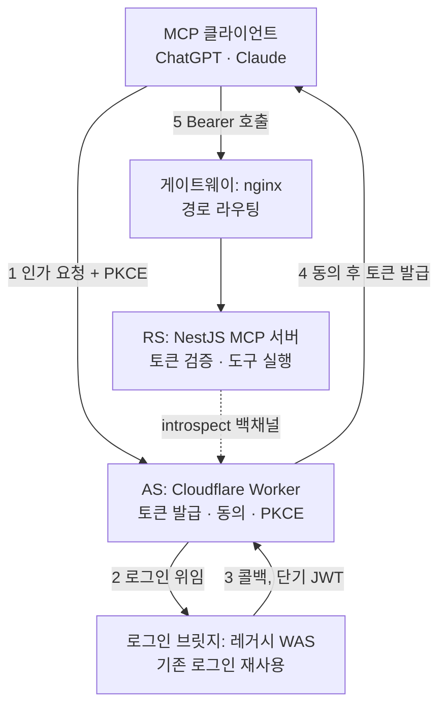

## API 키로는 들어갈 수 없는 문

4편은 도구 카탈로그가 자리를 잡는 데서 끝났다. 다음 목표는 처음부터 정해져 있었다. **ChatGPT와 Claude에 공식 커넥터로 제출하는 것.** 그런데 당시 서버의 인증은 자체 발급 API 키 단일 방식이었고, 이걸로는 제출 자체가 불가능했다. 양 플랫폼 모두 MCP authorization spec 준수를 의무화하고 있었기 때문이다. 공식 문서를 직접 검증해 추린 요건은 이랬다.

- **OAuth 2.1 + PKCE(S256) 필수.** 인가코드가 탈취돼도 코드만으로는 토큰을 못 받게 하는 장치
- **M2M grant 불가.** client_credentials 같은 기계 간 인증은 안 되고, 반드시 **사용자 동의 기반** Authorization Code 플로우여야 한다
- **RFC 8707 resource indicator.** 토큰에 대상 서버(aud)를 묶어, 다른 서버용 토큰을 들고 오는 passthrough를 차단
- **RFC 9728 Protected Resource Metadata.** 사용자가 입력하는 건 서버 URL 하나뿐이므로, 클라이언트가 그 URL만으로 인증 서버 위치를 자동 발견하게 하는 지도
- **Origin 헤더 검증.** DNS rebinding 공격 방어

목록을 나란히 놓고 보니 요구의 본질이 보였다. **"키를 아는 사람"이 아니라 "동의한 사용자"를 인증하라는 것.** API 키는 발급받은 사람이 곧 권한의 전부지만, OAuth 2.1은 사용자가 로그인하고, 동의하고, 그 동의의 범위가 토큰에 새겨지는 구조를 요구한다. 인증 방식의 교체가 아니라 인증 철학의 교체였다.

요건 정리 과정에서 배운 것도 있다. 사전에 모아둔 2차 리서치를 공식 문서로 재검증했더니 네 건이 틀려 있었다. 라이브러리 최신 버전이 수 개월 stale했고, "Bearer 토큰을 안 받는다"는 정보는 M2M 미지원과 혼동한 오독이었다. **스펙 요건은 블로그가 아니라 1차 문서로 확정해야 한다.** 이 검증이 없었다면 잘못된 전제 위에 아키텍처를 세울 뻔했다.

## 세 개의 선택지

인증 서버를 어디에 세울 것인가. 후보는 셋이었다.

- **Option A. Cloudflare Workers 게이트웨이:** 오픈소스 workers-oauth-provider 기반의 엣지 Worker를 인증 서버로 분리 신설
- **Option B. NestJS 직접 구현:** 기존 MCP 서버 안에 authorize, token, DCR, PKCE 검증, 메타데이터 엔드포인트를 전부 직접 구현
- **Option C. 외부 IdP**: Auth0, WorkOS, Stytch 같은 성숙한 상용 인증 서비스

C부터 정리했다. 엔터프라이즈급으로 검증된 구현이라는 장점은 분명하지만, 사용자 규모에 비례해 과금되고 인증 데이터가 외부로 나간다. 단일 MCP 제출이 목적인 시점에는 과투자였다.

진짜 고민은 B였다. 런타임이 하나로 유지되고, 배포가 단순하고, 우리가 완전히 통제한다. 본능적으로는 이쪽이 끌린다. 하지만 목록을 펼치는 순간 마음이 식었다. DCR, PKCE 검증, refresh 토큰 회전, AS 메타데이터, PRM을 **전부 직접 구현하고 계속 유지해야 한다.** 인증 서버는 실수의 비용이 가장 큰 코드인데 보안 표면을 통째로 떠안는 셈이고, MCP authorization spec은 한 해에만 두 번 개정될 만큼 빠르게 움직이고 있었다. 스펙 추적 비용까지 우리 몫이 된다.

A는 그 반대편에 있었다. workers-oauth-provider는 MCP 인증 스펙(PKCE, DCR, PRM, resource 바인딩)을 **정확히 그 목적으로 구현한 라이브러리였고,** 비용은 월 5달러 수준. 단점은 0.x 버전이라 버전 핀이 필수라는 것, 그리고 Workers라는 새 런타임과 배포 파이프라인이 추가된다는 것. 결정적인 제약도 하나 있었다. 이 라이브러리는 Workers 런타임 전용이라 NestJS에 import할 수 없다. 쓰려면 게이트웨이 분리가 유일한 경로였다.

## 결정: NestJS는 인증 서버가 되지 않는다

선택은 **A였다.** 역할을 이렇게 갈랐다.

| 역할 | 담당 | 책임 |
|---|---|---|
| AS (Authorization Server) | Cloudflare Worker | authorize, token, DCR, PKCE 검증, 동의, refresh 발급 |
| RS (Resource Server) | NestJS MCP 서버 | 토큰 검증 후 도구 실행. 발급은 하지 않는다 |

NestJS를 AS로 만들지 않은 이유를 세 줄로 남겼다. **첫째, 보안 표면.** 인증 서버 구현의 함정(PKCE 다운그레이드, redirect URI 검증, 토큰 회전 race)은 검증된 구현체에 위임하는 쪽이 안전하다. **둘째, 스펙 추적 비용.** 스펙 개정을 따라가는 일을 라이브러리 메인테이너가 대신해 준다. **셋째, 기존 자산 보존.** MCP 서버의 인증은 이미 strategy 패턴이라 OAuth 검증 전략 하나만 옆에 추가하면 됐다. RS 쪽 변경은 최소로 끝난다.

로그인은 또 다른 문제였다. Worker에 로그인 폼을 새로 만들면 이메일, 소셜, SSO까지 기존 인증 수단 전부를 재구현해야 한다. 답은 정해져 있었다. **로그인 화면은 만들지 않는다. 기존 플랫폼 로그인에 위임한다.** 그런데 위임 방식을 설계하려고 레거시 WAS 코드를 실측하다가 중요한 사실을 확인했다. **이 시스템은 OIDC issuer가 아니었다.** 세션과 쿠키 기반이고, JWT는 대칭키로 자체 발급할 뿐 표준 디스커버리 엔드포인트가 없다. 소셜과 SSO를 "쓴다"는 건 외부 IdP의 클라이언트라는 뜻이지 스스로 issuer라는 뜻이 아니었다. Worker가 upstream IdP를 표준으로 연동하는 30줄짜리 경로는 성립하지 않았고, 레거시 WAS에 콜백 엔드포인트를 새로 뚫고 공유 시크릿으로 서명한 단기 JWT를 주고받는 **콜백 핸드셰이크를** 직접 구현하기로 확정했다. 예상 공수는 이 추가분을 반영해 2\~2.5주.

비용은 끝까지 의사결정 변수가 아니었다. Worker는 인증 핸드셰이크 트래픽만 보고 도구 호출은 전부 NestJS로 가므로, 사용자가 열 배로 늘어도 유료 플랜 포함 한도 안이었다. 저울에 올라간 건 돈이 아니라 **보안 표면과 스펙 추적 부담을 누가 지느냐였다.**

## 아키텍처 전경: 4주체

결정을 그림으로 옮기면 네 개의 물리적 주체가 협력하는 구조가 된다.

각자의 책임은 한 줄씩이다. **AS(Worker)** 는 OAuth 2.1 표준 처리 전담. 요청마다 떴다 사라지는 무상태 함수라 인가 진행 상태와 토큰은 KV 저장소에 둔다. **로그인 브릿지(레거시 WAS)** 는 기존 로그인 자산을 재사용하기 위한 다리로, 세션을 확인하고 누가 로그인했는지 담은 단기 JWT를 콜백으로 돌려준다. **게이트웨이(nginx)** 는 외부 진입점에서 경로별로 컨테이너를 라우팅하고 디스커버리 경로를 열어준다. **RS(NestJS)** 는 토큰을 직접 풀지 않는다. AS의 introspect 백채널에 물어보고, 응답의 aud가 자기 자신인지 대조한 뒤에야 도구를 실행한다.

지금 돌아보면 이 결정의 핵심은 한 문장이었다. **인증을 잘하는 방법은 인증을 직접 만들지 않는 것.** 표준이 요구하는 무거운 부분은 그 목적으로 만들어진 구현체에 위임하고, 우리는 우리만 아는 부분(레거시 로그인과의 연결, 도구 실행의 권한 문맥)에만 코드를 썼다.

## 다음 편

설계는 섰다. 남은 건 구현, 그중에서도 가장 까다로운 조각이었다. **OAuth라는 개념 자체가 없던 레거시 WAS에 로그인 브릿지를 얹는 일.** 다음 편에서 9단계 인증 플로우가 완성된다.
