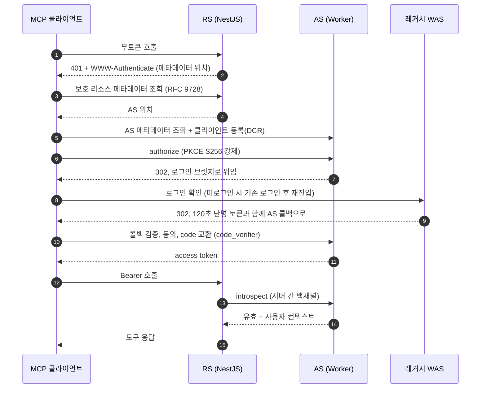

## 설계도는 나왔고 이제 짓는다

5편은 결정으로 끝났다. AS(인증 서버)는 Cloudflare Worker로, RS(리소스 서버)는 기존 NestJS MCP 서버로, 그리고 로그인 자체는 레거시 WAS에 위임한다. 세 주체의 역할 분담은 종이 위에서 명확했다. 남은 건 짓는 일이었다. 구현은 세 조각으로 쪼갰다.

- **Phase 1. 레거시 WAS 로그인 브릿지**: 로그인 여부를 확인하고 결과를 AS에 돌려주는 위임 엔드포인트
- **Phase 2. Worker AS**: authorize, 토큰 발급, 동적 클라이언트 등록(DCR), 동의 화면
- **Phase 3. NestJS RS**: Bearer 토큰 검증과 도구 실행

셋 중 가장 까다로운 조각은 명백히 첫 번째였다. Worker와 NestJS는 내가 통제하는 코드지만 레거시 WAS는 OAuth라는 개념 자체가 없는 10년 넘은 Java/JSP 시스템이다. 그래서 거기서부터 시작했다.

## OAuth를 모르는 WAS에 다리 놓기

Worker AS의 치명적 결핍은 하나였다. 로그인 UI가 없다. 사용자 계정과 비밀번호는 전부 레거시 WAS가 쥐고 있고 그걸 복제하는 순간 인증 체계가 둘이 된다. 그래서 위임한다. AS는 사용자를 레거시 WAS의 기존 로그인으로 보내고 WAS는 "이 사람이 로그인돼 있다"는 사실만 확인해 돌려준다.

여기서 원칙을 하나 박았다. **세션은 밖으로 나가지 않는다.** WAS의 세션 쿠키를 AS에 넘기는 방식은 세션 탈취 표면을 넓힐 뿐이다. 대신 브릿지는 세션으로 로그인 여부만 확인하고 누가 로그인했는지 정도만 담은 120초짜리 단명 토큰을 공유 시크릿으로 서명해 AS 콜백으로 302시킨다. AS는 이 토큰을 검증하고 즉시 소비한다. 유출돼도 2분이면 죽는 토큰이고 서명 검증과 수신자 확인을 통과해야만 쓸 수 있다.

브릿지 자체의 로직은 단순하다. 돌아갈 주소가 화이트리스트에 있는지 검증하고(open redirect 방어, 등록된 AS 주소와 정확히 일치할 때만 통과) 세션이 있으면 단명 토큰을 발급한다. 없으면 기존 로그인 페이지로 보낸 뒤 로그인 완료 시 브릿지로 재진입시키는 continue 패턴을 쓴다. 기존 로그인 API는 한 줄도 건드리지 않았다. 신규 파일 추가만으로 위임이 성립한다.

단순한 건 로직뿐이었다. 정작 막힌 건 환경이었다.

첫째, 이 WAS는 빌드리스다. 빌드 도구가 없고 컴파일된 `.class` 파일 1만 6천여 개가 저장소에 직접 커밋돼 있다. `.java`만 추가하면 JSP가 클래스를 못 찾아 죽는다. 컴파일한 `.class`를 반드시 함께 커밋해야 한다. 기존 바이트코드가 Java 8 타깃이라 로컬의 최신 JDK에서 타깃 버전을 맞춰 컴파일하고 바이트코드 버전까지 눈으로 검증했다.

둘째, 테스트 프레임워크가 없다. 자동화 테스트를 얹을 곳이 없어 화이트리스트 거부 케이스부터 미로그인 재진입, 토큰 만료까지 수동 검증 시나리오 문서를 코드와 함께 커밋했다. 우아하진 않지만 이 환경에서 낼 수 있는 최선이었다.

셋째, 재진입 패턴의 1회용 처리. 코드 리뷰에서 잡힌 실제 버그다. continue 주소를 전역 변수에 담았더니 페이지 전환 없이 재로그인하는 경로에서 이전 값이 살아남아 이후 모든 로그인이 브릿지로 샜다. 기존 유사 패턴을 참고했다고 안심했지만 정작 그 패턴의 핵심인 소비 후 초기화(읽는 즉시 비우기)는 복제하지 않았다.

## 표준은 라이브러리에 맡기고 검증은 추상화 뒤로 숨겼다

Worker AS는 authorize, 토큰 발급, DCR, 메타데이터를 검증된 라이브러리에 맡기고 우리는 세 가지만 채웠다. 로그인 위임, 동의 화면, 그리고 introspect 엔드포인트다. introspect는 RS가 토큰을 검증할 때 호출한다. Worker는 요청마다 떴다 사라지는 무상태 함수라 위임 떠나기 전의 인가 요청 상태를 KV에 짧은 TTL로 보존했다가 콜백과 동의 단계에서 복원하고 동의가 끝나면 1회용으로 지운다.

계획서에 적어둔 라이브러리 사용 의사코드는 실제 설치된 버전의 타입과 여섯 군데나 달랐다. 존재하지 않는 메서드를 호출하고 없는 옵션을 넘기고 있었다. 설치 후 타입 정의 파일을 전수 대조해 전부 정정했다. 추측은 금지고 타입이 유일한 진실이다.

NestJS RS 쪽 핵심은 검증 로직의 추상화였다. 지금의 AS는 opaque 토큰을 발급하므로 RS는 introspect로 물어봐야 하지만 언젠가 자체 인증 서버로 갈아타면 서명 검증 방식으로 바뀐다. 그래서 토큰 검증기를 인터페이스로 뽑고 introspect 구현체를 주입했다. 발급처를 갈아타는 비용은 구현체 1개와 DI 한 줄이다. 수신자(aud) 검증으로 다른 서버용 토큰의 재사용을 막았다. 검증 결과는 토큰의 해시만 키로 삼아 짧게 캐싱하고(원문은 저장하지 않는다) 판별 불가능한 값은 전부 거부하는 fail-closed로 갔다.

그리고 배포 검증 중에 구멍을 하나 발견했다. RS는 토큰을 *검증*할 줄만 알았지, 클라이언트가 AS를 *발견*하게 해주는 부분이 없었다. MCP 인증 스펙은 RFC 9728 보호 리소스 메타데이터를 MUST로 못박는다. 사용자가 입력하는 건 MCP 서버 주소 하나뿐이다. 401 응답의 `WWW-Authenticate` 헤더로 메타데이터 위치를 알리고 메타데이터가 AS 위치를 알려주는 디스커버리 체인이 있어야 클라이언트가 알아서 OAuth를 시작한다. 메타데이터 공개 엔드포인트와 401 챌린지 필터를 추가해 메웠다.

## 지원한다와 강제한다는 다르다: PKCE 이중 방어

배포 전, 규격 준수와 3주체 정합성을 따로 보는 독립 감사를 두 번 돌렸다. 여기서 가장 아픈 발견이 나왔다. 배포된 AS에 `code_challenge` 없이 authorize 요청을 보냈는데 거부되지 않고 302로 로그인 위임까지 흘러갔다.

원인은 라이브러리의 동작 방식이었다. 이 라이브러리는 PKCE를 지원하지만 `code_challenge`가 없으면 거부하는 게 아니라 PKCE를 조용히 끈다. 메타데이터에는 S256 지원이 버젓이 광고되고 있으니 겉보기엔 PKCE 기반이다. 하지만 MCP 클라이언트는 public client고 OAuth 2.1은 public client에 PKCE를 반드시 요구한다. 없이 보내도 통과된다면 그건 PKCE 기반이 아니다.

해결은 이중 방어였다. authorize 파싱 직후 `code_challenge` 존재와 S256 방식을 직접 강제하는 검증을 넣어 위반 시 400 표준 에러로 거부했다. 라이브러리 설정에서도 plain 방식 광고를 제거했다. 재배포 후 라이브로 다시 확인했다. 지원 방식 목록에서 plain이 사라졌고 PKCE 없는 authorize는 302가 아니라 400을 받는다.

**라이브러리가 지원한다는 것과 강제한다는 것은 다르다.** 메타데이터에 뭐가 광고되는지보다 빼고 보내면 실제로 거부되는지를 라이브로 확인해야 한다. 감사 없이 배포했다면 PKCE 없는 토큰 발급이 그대로 통과됐을 것이다.

## 아홉 단계, 전경

세 조각을 이어 붙이면 무토큰 호출부터 도구 응답까지 아홉 단계가 된다.

클라이언트가 아는 건 처음부터 끝까지 MCP 서버 주소 하나다. 나머지는 401 챌린지에서 시작하는 디스커버리 체인이 알아서 이어준다.

## 표준 경로는 협상이 안 된다

코드가 완성이면 좋겠지만 staging에 배포하자마자 남은 함정이 줄줄이 나왔다. 두 개만 기록한다.

함정 1. well-known 경로는 도메인 루트 고정이다. RFC 9728의 메타데이터 경로는 클라이언트가 리소스 주소로부터 자동 생성하며 항상 도메인 루트의 `/.well-known/`에서 시작한다. 그런데 우리 MCP 서버는 서브패스 아래에 사는 앱이고 ALB는 그 prefix로 시작하는 요청만 우리 쪽으로 보내고 있었다. 루트의 well-known 요청은 prefix에 안 걸려 엉뚱하게 레거시 WAS의 톰캣으로 흘러갔고 모르는 경로라며 에러 페이지 302가 돌아왔다. ALB에 전용 포워딩 규칙을 추가해야 했다. 한 겹 아래의 nginx에도 같은 덫이 있었다. 점(.)으로 시작하는 경로를 전부 차단하는 보안 규칙(`.git`, `.env` 보호용)에 well-known이 같이 걸려 403이 났다. location 우선순위로 deny보다 먼저 매칭되는 예외를 뚫었다. 표준이 경로를 고정해 두면 그 경로 위의 모든 라우팅 계층이 따라와야 한다. 코드에 엔드포인트가 있어도 요청이 도달하지 못하면 없는 셈이다.

함정 2. 레거시의 프레임워크는 레거시의 규칙으로 움직인다. staging의 로그인 브릿지가 계속 에러 페이지로 떨어졌다. 서비스 등록 XML 누락부터 도메인 객체 등록까지, WAS의 자체 MVC 프레임워크가 요구하는 관례를 하나씩 찾아 다섯 개의 별개 문제를 연달아 뚫었다. 그리고 여섯 번째 문제는 구조적이었다. **이 프레임워크는 액션 JSP 안에서 동적으로 redirect하는 것을 금지한다.** 액션 실행 후 응답 상태를 검사해 정상 결과 흐름이 아니면 400을 던진다. OAuth 브릿지의 본질이 redirect라 액션 모델과 정면 충돌했다. 답은 프레임워크 안에 있었다. 기존 코드의 redirect 선례들은 모두 view 패턴(액션 로직을 끄고 결과 view JSP가 redirect를 수행하는 구조)을 쓰고 있었고, 브릿지를 view 방식으로 재작성하고 나서야 플로우가 뚫렸다. 레거시 위에 무언가를 얹을 때는 내 설계를 밀어붙이기 전에 그 시스템의 정석 패턴부터 찾는 게 빠르다.

이 밖에도 introspect를 라이브러리의 Bearer 보호 라우트에 뒀다가 서버 간 백채널 호출이 401로 막히는 문제(RFC 7662상 introspect는 Bearer 보호 대상이 아니다), 브라우저 기반 클라이언트의 CORS 누락 같은 함정들을 하나씩 영구화 커밋으로 눌러 담았다. 최종적으로 MCP Inspector로 OAuth 발급부터 도구 실행까지 e2e가 완전히 통과했고 운영 도메인의 디스커버리 체인도 외부 probe로 전 구간 정상임을 확인했다.

## 문이 열리자, 손님이 들어왔다

무토큰 401에서 시작해 도구 응답으로 끝나는 아홉 단계가 완성됐다. 이제 ChatGPT와 Claude가 표준 절차만으로 이 서버에 들어올 수 있다.

그런데 문을 열고 보니 질문이 하나 더 생겼다. 이 서버의 진짜 소비자는 사람이 아니라 LLM이다. 도구 48개를 늘어놓았을 때 LLM이 맞는 도구를 골라 제대로 쓰는지는 사람의 QA로 확인할 방법이 없다. 사람이 못 하는 평가라면 평가도 LLM에게 시켜야 하지 않을까. 다음 편은 평가 하니스와 배포 게이트다.
