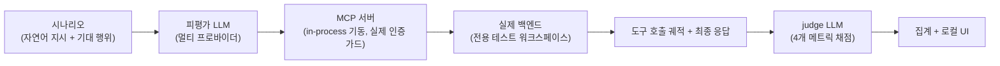
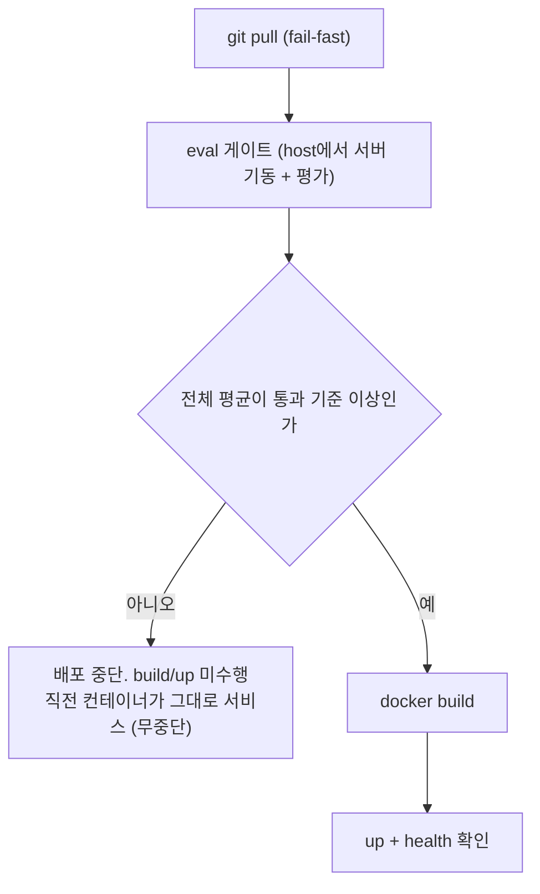

## 문은 열렸는데, 손님을 검증할 방법이 없다

6편에서 OAuth 아홉 단계가 완성됐고 ChatGPT와 Claude가 표준 절차만으로 서버에 들어올 수 있게 됐다. 그런데 문을 열고 나니 더 근본적인 질문이 남아 있었다. 이 서버의 진짜 소비자는 사람이 아니라 LLM이다. 수십 개의 도구를 늘어놓았을 때, LLM이 자연어 지시를 받고 맞는 도구를 고르는지, 인자를 제대로 채우는지, 앞 도구의 결과를 뒤 도구에 이어 과업을 끝까지 완수하는지. 이걸 검증하는 테스트가 없었다.

단위 테스트는 이 질문에 답하지 못한다. 기존 테스트가 보는 건 URL 매핑과 스키마 검증, 즉 "도구를 호출하면 올바르게 동작하는가"다. 하지만 진짜 병목은 그 앞 단계에 있다. **"LLM이 이 도구를 호출할 생각을 하는가"**는 도구의 description과 inputSchema 품질이 좌우하는데, 이건 코드가 아니라 문장의 품질이라 어떤 단위 테스트로도 잡히지 않는다. 사람의 QA도 마찬가지다. LLM은 비결정적이고, fuzzy한 지시의 조합은 무한하다. 사람이 못 하는 평가라면 평가도 LLM에게 시켜야 한다. LLM-as-Judge다.

## 평가 설계: 실제 서버, 실제 데이터, 네 개의 잣대

하니스의 구조는 한 줄로 요약된다. **피평가 LLM에게 자연어 시나리오를 주고 실제 서버를 상대로 도구를 쓰게 한 뒤, 그 궤적(trajectory)을 별도의 judge LLM이 채점한다.**



메트릭은 넷으로 잡았다. 모두 judge가 0에서 1 사이로 채점한다.

1. **도구 선택**: 모호한 지시에서 수십 개 중 올바른 도구를 고르는가. description 품질과 직결된다.
2. **인자 정확성**: 고른 도구에 인자를 제대로 채우는가.
3. **과업 완수**: 멀티턴 시나리오에서 앞 도구의 *실제 결과*를 뒤 도구와 최종 응답에 연결하는가.
4. **응답 안전성**: 포맷과 에러 전달이 명확한가. 단, 개인정보(전화번호 등)는 judge에게 묻지 않고 **결정적 정규식 가드가 먼저 자른다.** 확률적 판사에게 맡기면 안 되는 항목이 있다.

설계에서 가장 고민한 지점은 **mock이냐 실제 백엔드냐**였다. mock을 쓰면 안전하지만 "실제 데이터를 읽고 다음 호출에 연결하는가"라는 멀티턴 측정이 반쪽이 된다. 그래서 실제 스테이징 백엔드를 쓰되 전용 테스트 워크스페이스로 부작용을 격리했다.

그런데 실제 백엔드를 쓰는 순간 새로운 트레이드오프가 생긴다. LLM에게 자율성을 줄수록(어떤 ID를 넘길지 스스로 정하게 할수록) 평가는 정확해지지만 잘못된 ID로 남의 데이터를 건드릴 위험도 커진다. 이 둘을 동시에 잡는 장치가 **id-guard**다. LLM이 만든 원본 인자는 **채점용으로 그대로 보존**하고 실제 호출 직전에 워크스페이스 ID들을 화이트리스트의 고정값으로 **치환**한다. judge는 원본 인자로 자율성을 평가하고 백엔드에는 격리된 ID만 도달한다. 측정과 안전이 서로를 깎아 먹지 않는다.

id-guard에는 후일담이 하나 있다. 초기 구현은 프로젝트와 캘린더 ID만 치환했는데, 최종 리뷰에서 일정 ID 스코프의 수정 도구가 격리 밖에 있다는 걸 발견했다. 치환 목록에 추가하고 "새 스코프의 ID를 도구에 추가하면 id-guard부터 갱신하라"는 규칙을 문서에 박았다. 가드는 커버리지가 전부다. 하나만 새면 없는 것과 같다.

나머지 결정 둘. 피평가 LLM은 교체 가능한 멀티 프로바이더로 두되 **judge는 고급 모델 하나로 고정**했다. 같은 모델이 답하고 같은 모델이 채점하면 자기 편향이 생긴다. 그리고 실제 데이터라 응답이 매번 다르므로 judge에게는 "값이 일치하는가"가 아니라 **"행위가 올바른가"**를 묻고 시나리오마다 여러 번 돌려 평균을 낸다. 최종적으로 비-deprecated 도구 전체를 33개 시나리오로 덮었고 프로덕션 소스는 한 줄도 바꾸지 않았다. 하니스는 서버를 바깥에서 기동해 호출할 뿐이다.

## 왜 Python 평가 프레임워크를 두고 TypeScript 스택으로 갔나

성숙한 MCP 평가 프레임워크는 대부분 Python이다. DeepEval에는 MCP 도구 사용 메트릭까지 이미 있다. 서버는 TypeScript(NestJS)인데 평가만 Python으로 가야 하나. 리서치 끝에 결론을 뒤집었다.

핵심 근거는 하나다. **tool-calling 평가의 알맹이는 어느 스택이든 결국 직접 쓰는 judge 프롬프트다.** DeepEval의 MCP 메트릭조차 LLM-as-Judge 프롬프트 위의 얇은 래퍼였다. 그러니 Python을 도입해서 절약되는 핵심 작업은 생각보다 적다. 반면 비용은 영구적이다. 별도 의존성과 CI, MCP 클라이언트 인증의 재구현, 서버 타입과의 단절. TS 생태계도 이미 충분했다. Vitest 기반 러너와 UI를 제공하는 **Evalite**, Python과 기능 동등한 채점 라이브러리 **autoevals**. 프레임워크가 주는 것이 프롬프트 래퍼 수준이라면, 이종 언어의 유지비를 평생 낼 이유가 없다. TS로 갔다.

## eval이 통째로 죽었다

하니스가 자리 잡을 즈음, 잘 돌던 eval이 갑자기 죽기 시작했다. 일부 카테고리가 평가 0건으로 끝나고 Vitest worker가 네이티브 크래시로 사라졌다. 스택트레이스조차 없는 죽음이라 처음엔 eval 코드를 의심했다. 환경변수, 캐시 파일, 워커 풀 설정. 전부 헛다리였다. "원래 잘 됐는데 이번 수정부터 그렇다"는 증언이 있었으니 처음부터 회귀로 보고 이등분 탐색을 했어야 했다.

내 변경을 전부 stash해도 크래시가 재현되면서 eval 코드의 무죄가 입증됐고 용의선상은 직전에 머지된 OAuth 코드로 좁혀졌다. 범인은 가드 클래스 하나였다.

```ts
// (개념 코드) useFactory로만 생성하는 가드에 붙어 있던 데코레이터
@Injectable()
export class OriginGuard implements CanActivate {
  constructor(private readonly allowedOrigins: string[]) {}
}
```

이 가드는 팩토리로 직접 생성될 뿐 NestJS의 생성자 주입을 받지 않는다. 그런데 `@Injectable()`과 `string[]` 생성자의 조합이 SWC의 decoratorMetadata 버그(nestjs/nest#14426)를 건드려 파라미터 타입 메타데이터가 잘못 emit되고 NestFactory가 팩토리를 무시한 채 `string[]`이라는 해석 불가능한 토큰을 주입하려다 죽는 것이었다. 짓궂은 건 재현 조건이다. tsc로 빌드하는 프로덕션에는 이 버그가 없다. eval 하니스만 Vitest와 SWC로 서버를 변환해 띄우므로, **오직 평가 경로에서만 터지는 크래시**였다. 수정은 데코레이터 한 줄 제거. 교훈은 둘이다. 팩토리 전용 클래스에 주입 데코레이터를 붙이지 말 것, 그리고 회귀 증언이 있으면 가설 대신 이등분 탐색부터 할 것.

## eval이 build 앞에 서는 배포 게이트

하니스를 손으로만 돌리면 결국 안 돌리게 된다. 그래서 배포 스크립트에 게이트로 박았다. 어디에 끼울지는 세 가지 안이 있었다. 배포 **후** 실행은 품질 미달 코드가 이미 운영에 나간 뒤라 게이트가 아니고 별도 스크립트 분리는 자동 차단이 안 된다. 답은 배포 **전**, 그것도 build 앞이다.



판정은 단순하다. Evalite에 임계값 옵션을 주면 전체 평균이 기준 미달일 때 0이 아닌 종료 코드로 끝난다. 결과 DB를 파싱할 필요 없이 종료 코드만 보면 게이트가 성립한다. 통과 기준은 전체 평균 점수에 대한 임계값 하나로 두었다.

게이트가 build 앞에 서는 것의 의미는 두 겹이다. 첫째, 미달이면 build와 up 자체가 실행되지 않으므로 **직전 컨테이너가 그대로 살아 있다.** 게이트 실패가 곧 무중단이다. 둘째, git pull 직후에 평가하므로 **"평가한 소스와 배포될 소스가 같다"**가 보장된다. 배포 후 평가로는 얻을 수 없는 성질이다.

물론 공짜가 아니다. 멀티턴 시나리오에 judge까지 붙으니 게이트 한 번에 수 분이 걸리고 실제 LLM이라 멀쩡한 코드가 운 나쁘게 한 번 기준을 못 넘을 수도 있다. 그래서 강행 우회 플래그와 반복 횟수 상향을 함께 뒀다. 비결정성은 없앨 수 없으니 완충 장치를 마련하는 쪽이다. 그 비용을 내고 얻는 건, 기존 CI의 lint와 test와 build가 잡지 못하던 마지막 회귀다. **LLM이 사용자의 의도를 엉뚱한 도구로 변환하게 만드는 변경**, 즉 description 한 줄을 다듬다가 도구 선택률을 무너뜨리는 종류의 회귀가 이제 배포 전에 걸린다.

## 다음 편: 행동 이전에 계약이 있다

이렇게 서버는 자신의 소비자인 LLM에게 스스로를 평가받고 그 점수가 배포를 결정하는 구조가 됐다. 그런데 평가가 잡아내는 건 어디까지나 **행동**이다. 행동 이전에 **계약**이 있다. 도구가 광고하는 스키마가 실제 API와 어긋나 있다면, LLM이 아무리 도구를 잘 골라도 호출은 실패한다. 그리고 그 어긋남은 대개 조용히, 한두 도구에서만, 특정 인자 조합에서만 드러난다. 다음 편은 48개 도구의 계약을 전수 감사한 이야기다.
