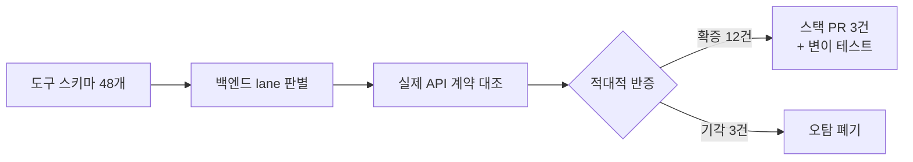

## 행동 다음은 계약

7편은 평가 하니스로 끝났다. 평가는 행동을 검증한다. 모델이 올바른 도구를 고르고 올바른 인자를 채우는가. 하지만 그 앞에 더 근본적인 층이 있다. **도구 스키마가 실제 API와 일치하는가.** LLM은 백엔드 코드를 못 본다. 모델이 아는 세계는 우리가 건네준 도구 스키마가 전부고 실제 검증은 그 스키마가 아니라 백엔드의 계약이 한다. 둘이 어긋나면 모델은 스키마를 완벽하게 따르고도 실패한다. 아니, 완벽하게 따를수록 정확하게 실패한다.

이번 편은 그 어긋남을 잡으러 간 이야기다. 두 번의 전수 감사, 백엔드 함정 4종, 그리고 손으로 쓴 스키마를 버리기로 한 결정까지.

## null과 optional은 다르다

시작은 관제 대시보드의 알람이었다. 합성 탐침(운영 환경에서 도구를 주기적으로 실호출하는 프로브)이 `flow_get_project`와 `flow_list_alarms` 두 도구의 호출 단계 실패를 보고했다. 이상한 건 같은 계정으로 같은 엔드포인트를 Postman에서 직접 때리면 200 정상이라는 점이었다.

가설을 네 개쯤 기각한 끝에, 실제 응답 JSON을 스키마와 필드 단위로 대조해 원인을 확정했다. 정식 API 서버가 `null`로 보내는 필드를, MCP 서버의 응답 Zod 스키마가 `z.string().optional()`로 선언하고 있었다. Zod의 `.optional()`은 `string | undefined`만 허용한다. JSON의 명시적 `null`은 `undefined`와 별개 타입이라 파싱 즉시 거부된다. 수정은 `.optional()`을 `.nullish()`로 바꾸는 것. 우회가 아니라 실제 API 동작에 스키마를 맞추는 정정이다.

이게 사소한 오탈자가 아닌 이유가 있다. 알림 목록의 타입 필드는 현재 데이터 체계에서 **항상 null이었다.** 이 도구는 간헐 장애가 아니라 상시 100% 실패 상태였다. 수동 미러 스키마는 "필드가 없을 수 있다"는 반영했지만 "필드가 null로 올 수 있다"는 놓쳤다. 그리고 그 차이를 알려줄 관측이 없었다. Zod 파싱이 왜 실패했는지는 audit 로그에도 CloudWatch에도 안 남아서 실측 응답을 손에 넣기 전까지는 진단 자체가 막혀 있었다. 스키마 불일치는 조용히 발생하고, 관측 공백은 그 침묵을 연장한다.

## 전수 감사 1: 존재하지 않는 경로를 호출하던 활성 도구

같은 시기에 더 당혹스러운 걸 발견했다. "이 전략이 호출하는 경로, 정말 존재하는 거 맞아?"라는 질문 하나에서 출발했는데, 참여 프로젝트 목록 도구가 호출하는 경로가 정식 API 서버 라우터에 **아예 정의돼 있지 않았다.** 도구는 사용자 ID를 경로 세그먼트로 붙여 보내는데, 실제 라우트는 ID 세그먼트 없이 인증 헤더에서 본인 ID를 강제 주입하는 형태였다. 매칭되는 라우트가 없으니 404 확정. 비활성 잔재도 아니고 카탈로그에 등록된 활성 도구였다.

원인은 이식 흔적이었다. 인증 모델을 마스터키 위임 방식으로 전환하면서 구세대 라우터의 경로 모양을 prefix만 바꿔 그대로 옮긴 것. 스키마 파일 주석에 남은 "미러 대상" 표기가 구세대 스펙을 가리키고 있어서 유입 경위까지 추적됐다.

한 건이 나왔으면 전수 조사다. OpenAPI 백엔드 도구 40개의 경로 리터럴을 전부 추출해 정식 API 서버 라우터 파일 7개의 라우트 선언과 1:1 대조했다. 결과는 39개 일치, 불일치는 그 1건뿐. 숫자만 보면 다행이지만 뒤집어 말하면 존재하지 않는 경로를 호출하는 도구가 테스트를 전부 통과하며 운영에 나가 있었다는 뜻이다.

어떻게 그게 가능했나. **테스트가 전부 mock이었기 때문이다.** mock은 우리가 믿는 형태로 응답한다. 실은 전에도 같은 계열의 사고가 있었다. 프로젝트 목록 도구가 운영에서 스키마 검증 실패로 터졌는데, 정식 API 서버 컨트롤러가 응답을 한 겹 더 감싸는 걸 미러 스키마가 놓친 게 원인이었다. 그때도 테스트는 평평한 가짜 응답을 쓰고 있어서 버그를 6주간 가리고 통과 중이었다. mock 기반 테스트는 우리 코드의 논리를 검증할 뿐, 계약을 검증하지 못한다. 우리의 믿음을 재생산할 뿐이다.

## 전수 감사 2: 계약 정합 감사와 백엔드 함정 4종

경로 감사가 "주소가 맞는가"였다면, 다음 감사는 "내용이 맞는가"였다. 발단은 일정 생성 도구. 참석자 필드가 `z.array(z.record(...))`로 뭉개져 있고 필드 설명은 **계약에 존재하지도 않는 키**를 예시로 안내했다. 백엔드 계약은 strict 모드로 필수 키를 요구하니 설명을 충실히 따른 호출일수록 전량 실패한다. 여기서 층위 구분이 중요했다. 계약이 느슨했던 게 아니다. 계약은 strict라서 에러를 낸 것이고 느슨했던 건 그 앞단의 수기 미러였다.

같은 계열이 몇 개나 더 있는지 48개 도구의 입출력 스키마를 각 도구의 백엔드 정본 계약과 필드 단위로 대조했다. 감사 설계에서 두 가지를 강제했다. 첫째, 도구마다 백엔드 lane이 달라 정본의 위치가 다르므로 **lane 판별을 1순위 확인 항목으로** 박았다. 정본을 잘못 짚으면 지적 전체가 무효가 된다. 둘째, 6분할 병렬 감사에 **발견마다 적대적 반증을 붙였다.** 기본 입장은 "이 지적은 틀렸다"로 두고 반박에 실패한 것만 확증으로 올린다. 실제로 3건이 기각됐다. 잘못된 계약을 인용한 지적, 실제 피해 메커니즘이 성립 안 하는 지적, 코드도 안 보고 "기존 데이터가 조용히 삭제된다"고 단정한 과장. 오탐을 걸러내지 못한 감사는 수정 비용만 키운다.

확증은 12건. 그중 백엔드 소스까지 파고 들어가 확정한 함정 4종이 이 감사의 최대 수확이다.

1. **담당자 수정은 replace-all이다.** 레거시 WAS 소스를 직접 확인하니 기존 담당자를 전원 삭제하고 받은 목록만 삽입한다. 부분 목록을 보내면 나머지가 사라진다. 도구는 "파괴적이지 않음"이라고 선언하고 있었다. 틀린 선언이었다.
2. **상태 카테고리는 enum의 대문자 키만 통한다.** 내부 중계 서비스가 enum을 키로 조회하는데, 소문자를 보내면 `undefined`가 그대로 하류로 나간다. 더 미묘한 건, SSOT 문자열 값을 직접 보내도 안 된다는 것. TypeScript 문자열 값 enum은 역매핑이 없다. 키만 통하고 그 결과로 wire에 값이 실린다.
3. **받기만 하고 안 쓰는 필드가 있다.** 뷰 생성의 공개 범위 필드는 body에 선언돼 있지만 서비스 호출로 전달되지 않는다. 값이 반영 안 되는데 도구는 성공을 반환하니 LLM이 "공용 뷰를 만들었습니다"라고 거짓 보고했다. 에러보다 나쁜 게 그럴듯한 성공이다.
4. **빌더가 도구 스키마를 재포장한다.** 메모리 절감을 위해 스키마 shape만 뽑아 새 객체로 싸는데, 그 과정에서 원본의 strict 속성과 교차 제약이 wire로 나가는 JSON Schema에서 탈락한다. 스키마에 적은 것과 모델이 받는 것이 같다는 보장이 빌더 한 줄에서 깨질 수 있다.

교정은 성격별로 3개의 스택 PR로 나눴다. 도구 스키마를 계약에서 파생시키는 PR, 크기 범위와 날짜 교차 제약을 이식하는 PR, 함정 4종 안내문을 바로잡는 PR. 각 PR에 회귀 가드를 붙이고 변이 테스트로 실효성을 확인했다. 스키마를 옛 형태로 되돌리면 해당 테스트만 정확히 죽는다. 그리고 **옛 동작을 정답으로 고정하던 테스트 3건도 함께 고쳤다.** 소문자 통과, 무시되는 필드의 전달, 틀린 파괴성 선언. 테스트가 버그를 사양으로 박아뒀다.

전수 감사의 절차를 그림으로 남기면 이렇다.

## 손 미러를 버리고 계약을 단일 소스로

여기까지가 교정이라면, 남은 질문은 재발 방지다. 근본 원인은 명확했다. **손으로 쓴 미러 스키마는 원본과 독립적으로 진화한다.** null 누락도, 유령 경로도, 뭉개진 필드도 전부 같은 뿌리다. 미러를 아무리 열심히 고쳐도 미러인 이상 다시 어긋난다.

그래서 구조를 바꿨다. 마침 사내에 정식 API의 계약을 코드로 정의하고 클라이언트를 제공하는 공식 SDK가 만들어져 있었다(이 SDK를 만든 이야기는 그 자체로 별도 시리즈감이라 여기선 소비자 관점만 적는다). 손 fetch 기반 도구 29개를 이 SDK로 전면 이관했다. 핵심은 역할 분리다. **wire의 단일 소스는 계약, LLM 문서의 단일 소스는 도구 스키마.** 요청과 응답의 형태는 계약이 정의하고 검증한다. 도구 쪽 Zod는 한국어 설명과 계약보다 좁힌 enum, 즉 모델에게 보여줄 문서로서만 존재한다. 이 이중 구조는 귀책 분리의 근거이기도 하다. 잘못된 입력은 계약이 fetch 전에 잡아 호출자 오류로 분류되고 업스트림 장애와 섞이지 않는다.

이관은 순수 리팩터가 아니었다. SDK는 API 버전 헤더를 항상 보내고 손 fetch는 안 보냈으니 응답 형태 자체가 달라질 수 있었고, 계약이 손 미러보다 엄격해서 nullable 폭이 도구 표면까지 번졌다. 그리고 이관 중에 배운 게 하나 있다. 계약과 운영 응답이 다를 때 "계약이 틀렸다"고 단정했다가 틀렸다. 이 생태계는 contract-first라 계약이 서버 배포보다 앞서 있는 상태가 정상이고 실측이 증명하는 건 "지금 배포된 서버가 계약과 다르다"까지다. 계약을 고치기 전에 대응하는 서버 쪽 PR이 대기 중인지 먼저 확인해야 한다.

덧붙이면 스키마는 아래로만 계약이 아니다. 모델에게 보여주는 JSON Schema, 즉 위로도 계약이다. 공유 Zod 인스턴스가 변환 과정에서 `$ref` 참조를 만들어 일부 호스트가 스키마를 못 읽던 문제가 있었는데, Zod v4의 인라인 기본 동작으로 전 도구에서 근본 제거했다. 아래가 어긋나면 실행이 실패하고, 위가 어긋나면 선택부터 실패한다. 양쪽 다 계약이다.

## 다음 편: 운영은 코드 리뷰가 못 잡는 방식으로 무너진다

계약을 다듬는 동안에도 서버는 돌고 있었다. 그리고 운영은 코드 리뷰가 잡을 수 없는 방식으로 무너진다. 한도, 누수, 드리프트. 다음 편은 운영에서 만난 장애들과 그걸 지켜보는 관제의 이야기다.
