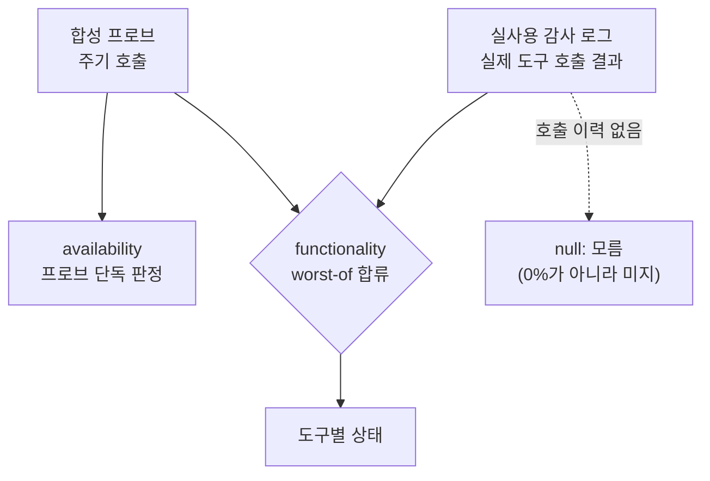

## 코드 리뷰가 끝난 자리에서

8편은 계약 전수 감사로 끝났다. 계약은 코드 안의 문제고 코드 안의 문제는 리뷰와 테스트로 잡을 수 있다. 그런데 운영에서 만난 장애들은 하나같이 diff에 나타나지 않는 곳에서 터졌다. 요금제의 한도, 인메모리의 누수, 배포와 스키마의 드리프트. 이번 편은 그 장애 셋을 시간순으로 기록하고 마지막에 그걸 지켜봤어야 할 관제가 왜 침묵했는지, 그래서 어떻게 다시 설계했는지를 쓴다.

## 장애 1: 아무도 코드를 바꾸지 않았는데 로그인이 죽었다

어느 밤, MCP 커넥터 연결이 전면 실패하기 시작했다. 토큰을 실은 요청은 전부 401, 신규 클라이언트 등록은 Worker 예외로 500. 마지막 배포는 일주일 전이었고 그동안 멀쩡했다. 코드는 그대로인데 시스템이 죽었다.

원인을 찾는 과정은 오진 세 건을 배제하는 과정이었다.

**오진 1. 최초 보고의 경로는 미끼였다.** 사용자가 에러 화면에서 건진 경로는 MCP와 무관한 별개 앱의 엔드포인트였다. `wrangler tail`로 실측하니 그 경로의 요청은 인증 Worker에 단 한 건도 도달하지 않았다.

**오진 2. 최근 인프라 변경이 의심받았다.** 장애 이틀 전 nginx 설정 변경이 있었으니 자연스러운 의심이다. 그런데 로그상 MCP 경로는 전부 정상 프록시였고 502는 한 건도 없었다. 시점이 겹친다는 것과 원인이라는 것은 다르다.

**오진 3. 동료는 KV 바인딩 누락으로 진단했다.** 재배포로 바인딩을 다시 붙였다는 fix까지 나왔다. 그런데 바인딩이 정말 없다면 예외는 undefined의 속성을 읽을 수 없다는 형태여야 한다. `wrangler tail`이 잡은 실제 예외는 달랐다.

```
"outcome": "exception",
"message": "KV put() limit exceeded for the day."
```

바인딩은 정상이고, 쓰기 쿼터가 죽은 것이다. Cloudflare KV의 Free 플랜은 하루 1,000 writes가 한도다. 대시보드 실측으로 지난 24시간 write가 한도를 20% 넘긴 게 확인됐고 write 곡선은 오전과 오후 업무시간에 두 봉우리를 그렸다. 폭주하는 루프가 아니라 실사용 부하였다. OAuth는 로그인마다 클라이언트 등록, 인가 상태, 토큰을 전부 KV에 쓰는 구조라 쓰기 한도가 죽으면 인증 전체가 죽는다. 하나의 원인이 두 얼굴로 갈라진 것도 설명된다. 등록 경로는 KV 쓰기 실패가 예외로 터져 500, 토큰 검증 경로는 KV 오류를 catch해 "유효하지 않은 토큰"으로 응답했기에 401이었다.

해결은 코드 수정이 아니라 유료 플랜 전환이었다. 월 5달러로 일일 캡이 사라지고 즉시 복구됐다. 이 장애의 정체는 버그가 아니라 실사용량이 무료 티어를 넘어선 것이었다. 교훈은 하나다. 그럴듯한 가설을 수용하기 전에 실제 예외 메시지부터 확보한다. 오진 세 건은 전부 그럴듯했고 전부 실측 한 번에 무너졌다.

## 장애 2: 관제가 관측 대상을 죽였다

몇 주 뒤, MCP 서버가 약 44분 주기로 힙 메모리 고갈로 죽고 재시작하기를 반복했다. 로그 패턴이 특이했다. 2초마다 세션이 initialize되고 한두 초 뒤 세션 종료 DELETE가 401로 거부되는 쌍이 무한히 반복되고 있었다.

추적해 보니 요청의 출처는 외부가 아니라 우리 자신, 관제 시스템의 프로버였다. 결함은 세 겹이었다. 프로버의 cleanup이 DELETE에 인증 헤더를 빼먹은 채 실패를 조용히 삼켰고(세션 정리가 몇 주간 전부 실패했는데 로그가 없었다), 헬스 체크 티어가 도구마다 세션을 하나씩 만들어 도구 40여 개면 한 사이클이 체크 주기를 넘겼고(사실상 쉬지 않고 세션을 찍어냈다), 서버에는 idle TTL도 상한도 없어 세션 제거 경로가 클라이언트의 DELETE뿐이었다.

산수가 정확히 맞아떨어졌다. 초당 0.5개꼴 세션에 세션당 수백 KB(세션마다 도구 전체가 재등록되는 구조다), 44분이면 1GB 힙이 소진된다. 수정도 세 겹으로 갔다. 서버에 idle TTL 스위퍼와 세션 상한을 넣고, 프로버 DELETE에 인증을 붙이고 실패를 드러내고, 헬스 티어를 서비스당 세션 1개로 배치화했다.

교훈은 두 가지다. 상태를 가진 인메모리 자원의 회수는 생성자의 선의가 아니라 소유자가 보장해야 한다. 클라이언트가 DELETE를 보내줄 거라는 기대에 기댄 설계는 반드시 누수를 낳는다. 그리고 best-effort 정리라도 실패를 무음으로 삼키면 안 된다. warn 한 줄만 있었어도 몇 주 전에 잡았을 문제였다.

## 그리고 한 달 뒤, 내 결론을 내가 반증했다

이 이야기에는 2부가 있다. 특정 에이전트 클라이언트에서만 MCP 연결이 자주 끊긴다는 리포트에, 당시 나는 코드를 훑고 "서버는 정상, 클라이언트가 재연결 복구를 못 하는 것"이라고 결론 냈다. 2주 뒤 증상이 계속되자 재감사를 열었다. 이번에는 코드가 아니라 프로덕션 로그와 감사 로그 테이블을 실측했다. 결론부터 쓰면, 이전의 내 결론은 성립하지 않았다.

**첫 번째 사실. 가장 큰 원인은 코드가 아니라 배포였다.** 운영 컨테이너가 19일 전 이미지로 떠 있었다. 그 사이 main에 머지된 수정들, 특히 도구 3종이 호출마다 실패하던 버그의 수정이 운영에 반영되지 않은 채였다. 실측된 도구 호출 error율 50%는 미스터리가 아니라, 이미 고쳐놓은 버그가 그대로 돌고 있던 것이다. 머지와 배포가 19일 벌어졌는데 아무것도 그걸 감지하지 못했다.

**두 번째 사실. 세션 캡이 스스로를 배반하고 있었다.** OOM 때 넣은 세션 상한 500이 상시 포화였고 초당 1회꼴로 가장 오래 안 쓴 세션을 강제 회수하고 있었다. 회수 대상에 idle 하한이 없어서 상한이 꽉 찬 상태에서는 방금 전까지 쓰던 세션도 "가장 덜 최근"이면 죽는다. 500칸 풀이 초당 1개씩 도는 산수를 하면, 설계 의도 30분이던 세션 수명이 실질 8분으로 붕괴해 있었다. 8분만 쉬면 세션이 죽고 다음 요청은 404다.

그럼 왜 특정 클라이언트에서만 끊겼나. MCP 스펙에서 404는 재초기화 신호고 Claude 계열 호스트는 이를 투명하게 처리해 사용자 모르게 세션을 다시 연다. 문제의 클라이언트는 그걸 "연결 끊김"으로 노출했을 뿐이다. **클라이언트 차이는 원인이 아니라 은폐의 차이였다. 서버가 살아있는 세션을 죽이고 있었고 어떤 클라이언트는 그걸 가려주고 있었다.**

한 달 전 결론이 틀린 이유도 명확했다. 그때의 "로그에 이상 없음"은 사실 "로그를 남기지 않는다"였다. 세션 생성 로그는 운영 로그 레벨에서 빠지는 debug였다. 활성 세션 수를 세는 함수는 어디서도 호출되지 않는 죽은 코드였다. 캡 도달 warn은 찍히고 있었지만 아무도 보지 않았다. 관측이 없는 계층에 대한 무죄 추정은 근거가 아니다. 로그를 남기는 것과 관측하는 것은 완전히 다른 일이다.

수정은 evict에 idle 하한을 도입하고(하한 미만의 활동 세션은 죽이는 대신 신규를 거절한다), 헬스 엔드포인트에 세션 지표를 노출하고, 세션 로그를 승격하는 것이었다. 배포 후 실측으로 세션 수명이 설계값 30분대로 회복된 것까지 확인했다. 이 재감사는 시리즈를 통틀어 가장 아픈 기록이다. 남의 코드가 아니라 한 달 전의 내 결론을 반증하는 수사였기 때문이다.

## 장애 3: 이미지는 최신인데 스키마가 낡았다

세 번째 장애는 방향이 반대인 드리프트다. 관제 대시보드를 새 버전으로 배포한 직후, 관제 API가 전부 500을 뱉기 시작했다. 에러 메시지가 원인을 정확히 가리켰다. 테이블이 없다가 아니라 **컬럼이 없다**는 에러, 즉 접속한 DB는 맞는데 DDL만 코드를 못 따라온 것이다.

새 버전은 인시던트 테이블에 신호원 컬럼 하나를 추가했다. 마이그레이션 파일도 커밋됐고 CI도 초록불이었다. 그런데 배포 파이프라인에는 스키마를 운영 DB에 적용하는 단계가 아예 없었다. 이미지는 교체되고 DDL은 사람이 따로 돌려야 하는 구조인데 그 사람이 이번엔 없었다.

증상이 전면적이었던 이유는 ORM의 동작 방식이다. Prisma는 모델의 모든 컬럼을 SELECT하므로 컬럼 하나가 없으면 그 테이블을 만지는 모든 쿼리가 죽는다. 더 고약한 건 장애가 조용했다는 점이다. 헬스체크는 DB를 건드리지 않아 컨테이너는 healthy였고 프로브 실행은 정상이라 "프로브 52건, 실패 0" 로그와 관제 전면 마비가 한 화면에 공존했다. 프로브는 도는데 판정만 죽은 상태다.

조사 중에 더 큰 사실도 드러났다. 운영의 DB 접속 문자열에는 데이터베이스 이름도 스키마 지정도 없었고 드라이버가 유저명을 DB 이름으로, 기본 스키마를 대상으로 **조용히 폴백**하고 있었다. 문서가 전제하던 전용 스키마는 운영에 존재하지도 않았다. 조용한 폴백은 장애를 만들지 않는 대신, 모든 진단이 잘못된 전제에서 출발하게 만든다.

한 달 사이에 같은 계열의 드리프트를 반대 방향으로 두 번 맞은 셈이다. 재감사 때는 코드가 낡았고(이미지 미배포), 이번엔 스키마가 낡았다(DDL 미적용). 재발 방지도 같은 원리로 수렴한다. 부팅 시 기대 컬럼을 확인해 fail-fast하고, 폴백을 제거해 접속 대상을 명시하고, 배포 파이프라인에 스키마 적용을 포함시킨다. 드리프트는 감시하지 않으면 방향만 바꿔 돌아온다.

## 에러가 나는데 가동률은 100%

이 장애들을 지켜봤어야 할 관제 이야기를 할 차례다. 관제 대시보드는 실제 MCP 프로토콜로 6단계 프로브를 돌리고 결과를 raw 이벤트로 적재하는 물건으로 시작했다. 뼈대는 표준과 정합했지만 초기 정합성 평가에서 스스로 인정해야 했다. "현 상태로는 자동 관제가 아니라 수동 조회 대시보드다."

인시던트 상태머신과 가동률을 붙이고 나서 더 근본적인 문제가 드러났다. **운영에서 도구 호출 에러가 나고 있는데 개요 화면의 가동률은 100%였다.** 계산 버그가 아니었다. 신호원이 하나뿐이었다. 가동률은 합성 프로브가 연 인시던트만 적분한다. 실사용 호출 결과는 감사 로그 테이블에 쌓이기만 할 뿐 그걸 인시던트로 바꾸는 경로가 코드에 존재하지 않았다. 프로브는 봇 계정 하나가 고정 인자로 도구를 두드릴 뿐이라 실제 사용자의 권한과 데이터에서 나오는 실패는 구조적 사각지대였다.

그렇다고 실사용 신호를 가동률에 그냥 섞으면 안 된다. 업계 권고도 합성 모니터링과 실사용 모니터링을 한 지표로 병합하지 말라는 쪽이다. 두 요구를 축을 나눠 양립시켰다.

- **availability는 프로브 전용으로 남긴다.** 서버가 죽으면 호출이 인증 게이트 앞에서 끊겨 감사 로그에 도달조차 못 한다. 분모가 확정적인 신호는 프로브뿐이다.
- **functionality에서만 두 신호를 OR로 합류시킨다.** "도구가 실제로 동작하는가"라는 질문에는 두 신호가 같은 답을 주므로 둘 중 하나라도 실패를 판정하면 인시던트를 연다. AND로 묶으면 프로브가 못 보는 실장애를 통째로 놓친다.

실사용 에러의 승격 기준은 에러코드의 성격으로 갈랐다. 계약 불일치처럼 한 번 나면 구조적으로 계속 나는 결정론적 에러는 1건 즉시 인시던트, 업스트림 순단이나 타임아웃 같은 확률적 에러는 윈도우 내 N건 임계로. 두 평가기가 서로의 인시던트를 닫아버리는 사고를 막으려고 인시던트에 신호원 소유권 컬럼을 넣었는데 그 컬럼이 바로 장애 3의 주인공이다. 관제를 고치는 배포가 관제를 죽였으니 이 글의 구조 자체가 하나의 순환이다.

이 설계에서 가장 오래 싸운 상대는 산식이 아니라 **"없음"과 "모름"의 구분**이었다. 기존 코드는 인시던트가 0건이면 무조건 100%를 보여줬다. 하지만 관측이 없었던 구간의 100%는 무장애가 아니라 무지다. 가동률을 nullable로 바꿔 관측 없음은 회색 "관측 없음"으로 표시하고 낙관적 100% 폴백을 걷어냈다. 그런데 이 구분은 데이터 계층에서 한 번 정하고 끝나지 않았다. 조회 실패를 0건(실패 없음)으로 돌려주는 API, null을 그대로 "null건"으로 렌더하는 화면, 문구는 고쳤는데 접근성 이름에 "0건"이 남는 컴포넌트까지, 표현 계층으로 내려가는 경계마다 같은 원칙이 다시 뭉개졌다. 결국 상태를 한 번 계산해 화면 문구와 접근성 이름이 같은 분기를 타게 강제하는 것만이 구조적인 해법이었다.

이제 개요의 100%는 "무장애"만을 뜻한다. 관측하지 않은 것은 모른다고 말하고 실사용자가 겪는 실패는 프로브가 못 봐도 화면에 올라온다. 세 장애를 겪고 나서야 관제가 관제다워졌다.



## 살아있는 스펙, 살아있는 스토어

장애는 고치면 끝난다. 한도는 올렸고, 누수는 막았고, 드리프트는 감시한다. 그런데 고칠 수 없는 변화도 있다. 프로토콜 스펙이 개정되고 커넥터를 올려둔 스토어의 정책이 바뀐다. 공식 서버로 산다는 건 그 변화를 계속 따라간다는 뜻이다. 마지막 편은 살아있는 스펙과 살아있는 스토어의 이야기다.
