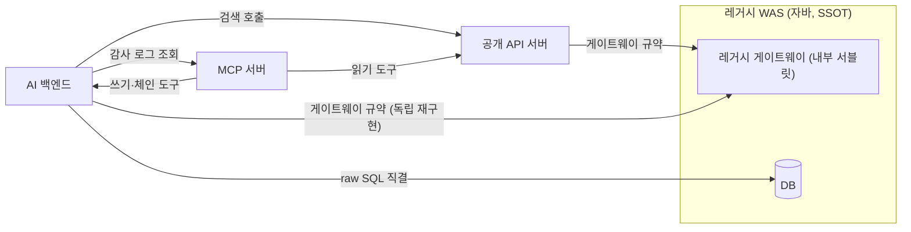

## 지도를 그리다 이상한 것을 봤다

[공식 MCP 서버 개발기](/series/flow-mcp)의 8편에서 "이 SDK를 만든 이야기는 그 자체로 별도 시리즈감"이라고 적었다. 그 별도 시리즈가 이것이다. 협업 플랫폼 Flow의 사내 공식 SDK, repattern을 만든 기록.

출발점은 MCP 서버였다. 도구를 늘리고 계약을 감사하는 동안 나는 계속 백엔드 지도를 들여다봐야 했다. 이 도구는 어느 서버를 거쳐 데이터에 닿는가. 그 서버는 또 어디를 호출하는가. 그러다 어느 날, 지도에서 이상한 광경이 보였다.

**같은 레거시 백엔드를, 서비스 네 개가 제각각의 방식으로 두드리고 있었다.**

진짜 데이터는 한 곳에 있다. 자바로 짜인 레거시 WAS. DB를 소유하고 모든 도메인 로직의 최종 권위를 가진, 이 생태계의 단일 진실 공급원(SSOT)이다. 그런데 그 앞에 선 TypeScript 서비스들, 그러니까 공개 API 서버와 MCP 서버와 AI 백엔드는 각자 자기만의 클라이언트, 자기만의 타입, 자기만의 에러 처리로 이 레거시에 접근하고 있었다. "중복이 있는 것 같다"는 느낌만으로 설계를 시작할 수도 있었다. 대신 소스를 전부 열어 실측하기로 했다. 의심은 검증되기 전까지는 그냥 의심이다.

## 실측: 가설은 절반만 맞았다

네 개 레포를 정적분석했다. 모든 주장에 코드 근거를 달았고 이 분석 문서는 이후의 전수 감사에서 틀린 주장 0건으로 살아남았다(이 감사 이야기는 시리즈 중반의 큰 소재다). 착수 전 머릿속 가설은 깔끔한 층 구조였다. MCP 서버는 공개 API를 부르고, 공개 API는 게이트웨이를 거쳐 레거시로 간다. 실측 결과, 절반만 맞았다.

**첫째, "레거시 게이트웨이"는 별도 서비스가 아니었다.** 레거시 WAS 안에 들어 있는 서블릿 하나였다. 정해진 봉투 형식의 JSON을 POST 하면 액션 코드 문자열로 내부 기능에 라우팅해 주는, 레거시로 들어가는 기계용 규약. 다시 말해 이 규약으로 호출하는 서비스는 전부, 중간 계층 없이 레거시 WAS에 직접 들어가고 있었다.

**둘째, 그 규약의 클라이언트가 두 벌 있었다.** 공개 API 서버와 AI 백엔드가 같은 프로토콜, 같은 액션 코드 문자열들을 각자 독립 구현하고 있었다. 한쪽은 60줄짜리 초기 구현이라 타임아웃도, 결과 코드 검사도, 로깅도 없었다. 다른 쪽은 382줄짜리 프로덕션급이었다. 같은 백엔드를 향한 두 개의 진실. 레거시의 계약이 바뀌면 두 곳을 동시에 고쳐야 하고 한쪽만 고치면 조용히 어긋난다. 더 아픈 지점은 따로 있었다. AI 백엔드가 공개 API 서버를 우회해 레거시에 직결한다는 사실이다. 공개 API가 세워 둔 인증·스코프·감사·레이트리밋이라는 단일 통제점이, 그 경로에서는 전부 무력화된다.

**셋째, DB 직결과 소스 복제.** AI 백엔드에는 레거시에 닿는 경로가 세 개나 있었다. 게이트웨이 규약, 공개 API, 그리고 DB에 raw SQL 직결. 마지막 경로가 제일 아프다. 레거시의 물리 스키마를 아는 SQL이 레거시 바깥에 상주한다는 뜻이고 스키마 마이그레이션 한 번이 남의 서비스를 깰 수 있다는 뜻이다. 그 SQL과 조회 로직의 출처를 추적하니 파일 주석이 스스로 고백하고 있었다. MCP 서버의 코드를 포팅했다고. 공유 패키지가 아니라 복사였다. 같은 로직이 두 레포에 두 벌 상주 중이었다.

**넷째, 순환 의존.** MCP 서버는 쓰기·체인 도구를 위해 AI 백엔드의 내부 API를 부르고, AI 백엔드는 감사 로그를 읽기 위해 MCP 서버를 부른다. 서로가 서로를 호출하는 고리. 배포 순서가 얽히고 장애가 양방향으로 전파된다.

지도를 다 그리고 나니 이건 코드 취향의 문제가 아니었다. 단일 진실 공급원이라는 말이 무색하게, 진실에 도달하는 길이 저마다 달랐다.

## 문제를 여섯 개로 자르다

실측을 근거로 ADR을 썼다. 뭉뚱그려 "중복이 많다"고 쓰는 대신 문제를 여섯 개로 잘랐다.

- **P1 클라이언트 이중 구현**: 같은 게이트웨이 규약을 두 서비스가 따로 구현. 품질 격차도 계약 drift도 이중.
- **P2 액션 코드 카탈로그 분산**: 같은 의미의 문자열 상수가 레포마다 흩어져 있고 오타는 컴파일이 아니라 런타임에야 드러난다.
- **P3 타입 부재**: 응답 타입이 사실상 any. 필드 이름과 형태는 각 레포의 부족 지식이다.
- **P4 DB 스키마 결합과 로직 복제**: 물리 스키마를 아는 코드가 레거시 밖에 산다. 그것도 복사본으로.
- **P5 순환 의존**: MCP 서버와 AI 백엔드가 서로를 호출한다.
- **P6 횡단 관심사 분열**: 인증 스킴, 감사 로그 저장소, 에러 분류가 서비스마다 제각각. 극단적인 사례로, 한국어 에러 메시지 문자열을 매칭해 403의 종류를 구분하던 코드까지 있었다.

그리고 움직일 수 없는 현실 두 가지를 못 박았다. 하나, 레거시 WAS는 자바다. TypeScript 패키지를 import 할 수 없고 오직 HTTP로만 소비된다. 그래서 무엇을 만들든 레거시는 단 1바이트도 건드리지 않는다는 것이 전제다. 둘, 세 TypeScript 레포는 패키지 매니저 버전과 워크스페이스 구성이 전부 다르다. 모노레포로 합치는 길은 그 비대칭과 싸우는 일이라 사설 레지스트리에 npm 패키지로 발행하는 것이 유일하게 깔끔한 공유 경로였다.

## 네 개의 안, 적대적 채점

안 하나를 골라 놓고 정당화를 쓰는 대신, 독립된 아키텍처 안 네 개를 먼저 만들었다. 그리고 실현 가능성, SSOT 확장성, 리스크와 운영이라는 세 렌즈로 서로를 적대적으로 채점하게 했다. 안끼리 서로의 약점을 공격하게 만드는 방식이다.

1. **library-first**: 검증된 프로덕션급 클라이언트를 프레임워크 무관 코어로 승격해 사설 레지스트리에 발행하는 npm 패키지 세트로 만든다. 세 레포가 각자 소비.
2. **contract-first**: 스키마를 단일 진실로 두고 클라이언트를 코드 생성한다.
3. **게이트웨이 서비스**: 레거시로 가는 모든 호출을 새 서비스 하나로 모은다.
4. **기존 공개 API 서버 승격**: 이미 있는 서버를 표준 관문으로 격상한다.

채점은 각 안의 급소를 정확히 드러냈다. 3안의 강제력은 진짜다. 라이브러리는 규율이지만 네트워크 관문은 물리라서 우회 자체가 불가능해진다. 하지만 지금 프로세스 안에서 도는 수십 개의 호출이 전부 네트워크 홉으로 바뀌고 폴백 없는 단일 장애점이 생긴다. 4안은 이미 있는 자산을 재활용한다는 매력이 있지만, 낡은 스택의 단일 프로세스를 생태계 전체의 SPOF로 승격시키는 일이었다. 2안은 방향 자체는 옳다. 다만 응답 타입의 원천이 어디에도 없어서 코드 생성이라 부르는 작업의 실체는 수십 개 연산을 손으로 역설계하는 고고학이 된다. 자신만만한 거짓 타입을 만들어낼 위험이 있었다.

**결론은 library-first.** 단, 두 가지를 접붙였다. 2안에게서는 계약 발상을 가져와 액션 코드 카탈로그와 타입 정의를 계약의 원천으로 삼기로 했고 3안에게서는 관문 발상을 가져와 DB 결합만큼은 후속의 작은 서비스로 외과적으로 격리하기로 했다. 그리고 라이브러리의 한계를 ADR에 정직하게 적었다. P4 DB 결합과 P5 순환은 라이브러리로 못 푼다. 라이브러리는 import를 강제할 수 없고 raw SQL 직결을 막지도 못한다. 못 푸는 문제를 조용히 우회하는 대신, 못 푼다고 적고 명시적 후속으로 등록했다.

이 결정이 이 시리즈의 주인공, 사내 공식 SDK repattern의 출발점이 됐다. 이름에 얽힌 사연은 시리즈 후반에 따로 나온다.

## 다음 편 예고

지도가 그려지자 다음 질문이 왔다. 이 SDK는 무엇을 위해 존재하는가. 코드를 줄이려고? 실측해 보니 답은 "아니오"였다. 다음 편은 공유 라이브러리의 정당화를 통념 대신 실측으로 교체한 이야기다.
