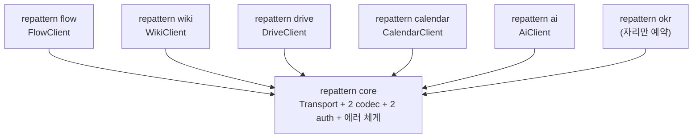

## 왜 하필 AWS SDK였나

4편은 참조 모델을 찾는 데서 끝났다. 197개 주장을 전수 재검증하고 나니 남은 것은 검증된 사실 더미였고, 이제 그 위에 설계를 다시 세워야 했다. 이번에는 전제부터 틀리고 싶지 않았다. 그래서 백지에서 발명하는 대신, 우리와 같은 문제를 이미 풀어본 구조를 해부하기로 했다.

조건을 적어보니 답이 좁혀졌다. 서로 다른 봉투 규약, 서로 다른 인증 방식, 서비스마다 다른 연산 집합, 그런데 하나의 조직이 하나의 일관된 표면으로 제공해야 한다. 이걸 수백 개 서비스 규모로 십 년 넘게 감당해 온 물건이 손닿는 곳에 있었다. 매일 쓰는 AWS SDK다. `@aws-sdk/client-s3`를 설치하고 `new S3Client()`를 만들 때마다 지나쳤던 그 구조를, 이번에는 뜯어서 읽었다.

## 해부: client와 core를 가른 선

AWS SDK v3의 뼈대는 2층이다. 위층에는 서비스당 하나씩 독립 패키지로 발행되는 `@aws-sdk/client-*`가 있고 아래층에는 모든 클라이언트가 공유하는 `@smithy/core`가 있다. 위층은 각 서비스의 연산과 타입, 아래층은 transport와 직렬화, 인증, 에러 같은 서비스와 무관한 공통 장치다.

해부에서 가장 크게 배운 건 경계를 가르는 기준이었다. AWS의 SNS와 SQS 클라이언트는 같은 wire 프로토콜과 같은 서명 방식을 `@smithy/core`에서 공유한다. 그런데도 별도 패키지다. 이유는 하나, **연산 집합이 다르기 때문이다.** 즉 패키지 경계는 통신 방식이 아니라 연산 집합이 긋는다. **공유 transport는 패키지 경계를 무너뜨리지 않는다.** 이 한 문장이 우리 설계의 축이 됐다. 반대편 선례도 있었다. Stripe는 단일 패키지 안에 리소스 네임스페이스를 두는 방식인데, 그건 우리가 이미 거부한 단일 패키지 구조와 같은 모양이었다.

이 기준을 우리 지형에 대면 그림이 저절로 그려진다. 협업 도구 본체, 위키, 드라이브, 캘린더, AI, 그리고 자리만 예약한 OKR. 여섯 개의 서비스는 연산 집합이 전부 다르다. 캘린더가 위키와 같은 transport를 쓰더라도, SNS와 SQS가 그랬듯 별도 패키지가 맞다. 그래서 정본 구조는 이렇게 확정됐다. **여섯 개의 독립 형제 클라이언트, 그리고 모두가 공유하는 단 하나의 base인 core.**



AWS와의 매핑은 1:1이다. core는 `@smithy/core`에, 형제 클라이언트 각각은 `@aws-sdk/client-*`에 대응한다. 형제끼리의 런타임 의존은 0이다. 교차 참조는 불투명한 id 참조가 기본이고, 진짜로 다른 서비스의 데이터를 불러와야 할 때만 그 형제의 SDK를 설치해서 호출한다. 여섯 중 그런 소비자 방향의 형제는 AI 클라이언트 하나뿐이다. 협업 도구 본체는 부모가 아니다. **형제 중 하나일 뿐이다.** 이 문장이 왜 중요한지는 네이밍 절에서 다시 나온다.

## core: 추출이 아니라 fresh-design

core를 만드는 방법은 둘이었다. 기존 코드에서 공통부를 추출하거나, 실측을 근거로 새로 쓰거나. 처음에는 당연히 추출이라고 생각했다. MCP 서버와 AI 백엔드에 이미 동작하는 전송 코드가 있었으니까. 그런데 백엔드 레포 일곱 개를 직접 열어 실측하자, 설계의 밑에 깔려 있던 가정 네 개가 연달아 무너졌다.

- 위키, 드라이브, 채팅이 플랫폼 API 안의 코드인 줄 알았는데 실측하니 각자 별도 백엔드 레포였다. 플랫폼 API는 앞단 게이트웨이였다.
- 위키와 드라이브의 독자 봉투 방언을 core가 codec으로 떠안아야 한다고 믿었는데, 그 방언은 게이트웨이 안쪽에서만 흐르고 소비자에게 닿기 전에 표준 봉투로 재포장되고 있었다. 소비자는 표준 봉투 하나만 본다.
- 레거시 게이트웨이의 인증이 헤더 방식인 줄 알았는데 시크릿이 요청 body 안에 들어가는 방식이었다. 위임 사용자도 헤더가 아니라 body 필드였다.
- dispatch가 하나의 공유 메커니즘인 줄 알았는데, 레거시 경로는 body 안의 액션 식별자로, 표준 경로는 URL 경로로 연산을 골랐다. 양립 불가능한 2종이었다.

3편에서 단일 코어라는 전제가 무너졌던 것과 같은 종류의 사건이 core 내부에서 한 번 더 일어난 것이다. 봉투 codec은 세 개가 아니라 두 개였고, 통합 dispatch 레이어는 만들면 안 되는 물건이었다. 기존 코드는 이 사실들을 모른 채 각자의 호스트에 맞춰 자란 코드였다. 그래서 결론을 바꿨다. **기존 코드는 동작이 검증된 참고 자료일 뿐, 추출원이 아니다.** core는 실측 결과만을 계약으로 삼아 처음부터 새로 쓴다.

새로 쓴 core의 전부는 다섯 조각이다. 요청 검증부터 deadline 병합, fetch, 봉투 해석, 응답 검증까지를 오케스트레이션하는 Transport 하나. 측정된 wire 하나당 codec 하나, 그래서 정확히 두 개. 헤더 방식과 body-secret 방식의 auth strategy 두 개. 어느 봉투에서 왔든 같은 모양으로 정규화되는 통합 에러 타입 하나. 그리고 위임 주체와 자격증명만 담은 최소 context. 이게 끝이다. 위임 사용자 처리를 독립 레이어로 빼자는 안도 있었지만 기각했다. 인코딩 위치가 auth 방식마다 다르므로 그것은 각 auth strategy 안의 필드이지 공유 primitive가 아니다. 공유처럼 보이는 것과 측정된 공유는 다르다. 3편에서 치른 수업료를 여기서 회수했다.

런타임 의존성은 Zod 하나만 허용했다. 웹 프레임워크도, MCP SDK도, DB 클라이언트도 core에는 못 들어온다. 이건 결벽이 아니라 생존 조건이다. core는 성격이 다른 소비자 여럿이 공유하는 바닥인데, 특정 호스트의 프레임워크가 한 번 스며들면 나머지 전원이 그 호스트에 결합된다. 의존 0은 "core가 어떤 호스트에서든 같은 물건"이라는 보증서다. 대신 codec 계약은 Zod 스키마로 양단 검증을 강제해서 가벼움이 느슨함이 되지 않게 했다.

## 이름이 구조를 지킨다

3편의 부검 소견은 단어가 비약을 가린다는 것이었다. 그래서 이번에는 이름을 설계의 마지막 단계가 아니라 구조를 고정하는 장치로 다뤘다. 원칙은 세 개다.

**첫째, 테넌트는 ctx, 별개 서비스는 네임스페이스.** 우리 지형에는 "서비스처럼 보이는 것"이 두 종류 있었다. 같은 연산 집합에 라우팅과 자격증명만 다른 것은 테넌트다. 이건 네임스페이스로 가르면 같은 타입 정의가 두 벌 생기는 중복 지옥이 열리므로 런타임 context 파라미터 한 줄로 처리한다. 반대로 연산 집합 자체가 다른 것은 별개 서비스고, 이건 반드시 네임스페이스로 갈라야 한다. 평평하게 두면 위키에도 태스크 생성이 있을 것 같은 잘못된 인상을 주기 때문이다.

**둘째, 접미사 제거와 Client 접미사.** 패키지 스코프가 이미 SDK임을 말하고 있으므로 패키지명에 sdk를 또 붙이면 단어 중복이다. 클라이언트 클래스는 `FlowClient`, `WikiClient`처럼 도메인 더하기 Client로 통일하고 `new`로 생성한다. AWS도 Stripe도 클래스에 `new`다. Client 접미사는 장식이 아니라 구분자다. 덕분에 transport를 담당하는 `WikiClient`와 도메인 타입 `WikiDocument`가 별칭 없이 한 import 문에 공존한다.

**셋째, 서비스명은 인스턴스 변수에서 딱 한 번.** 재설계 전 구조의 호출부는 `flow.wiki.search` 꼴이었다. 위키가 협업 도구 본체 밑에 매달린 모양새다. 그런데 위키는 본체의 하위 도메인이 아니라 자기 백엔드를 가진 독립 서비스다. 구조가 여섯 형제라면 호출부도 형제여야 한다.

```ts
const wiki = new WikiClient(ctx);
const flow = new FlowClient(ctx);

await wiki.documents.search({ searchWord }, obo);   // "wiki"는 여기 한 번
await flow.projects.get({ projectId }, obo);        // "flow"도 여기 한 번
```

패키지 경계가 첫 네임스페이스를 대신하므로 점 뒤에는 리소스와 연산만 남는다. `flow.wiki.search`가 사라진 것은 취향 교정이 아니다. 호출부의 모양이 곧 소유권의 선언이기 때문이다. 이름이 구조와 어긋나 있으면 언젠가 코드가 이름 쪽으로 미끄러진다. 3편이 그 증거였다.

## 다음 편 예고

구조는 섰다. 여섯 형제와 core, 두 개의 codec, zod 하나만 남긴 바닥. 그런데 구조가 좋다는 것과 쓰고 싶다는 것은 전혀 다른 문제다. 아무리 바른 구조라도 설치가 번거롭고 첫 호출까지가 멀면 개발자는 어제 쓰던 복붙 코드로 돌아간다. 다음 편은 개발자 경험이다. install에서 configure를 지나 call까지, 세 단계의 동선이 거꾸로 설계를 이끈 이야기다.
