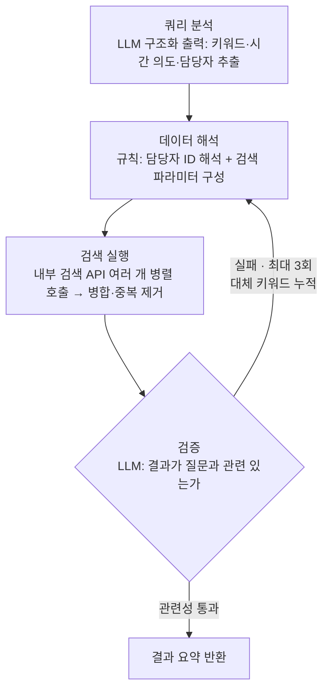

## "어제 나한테 온 알림 보여줘"는 검색어가 아니다

협업툴의 검색창에 사람들이 실제로 입력하는 문장은 검색 엔진이 기대하는 형태가 아니다. "어제 나한테 온 알림 보여줘", "최근 계약 관련해서 오간 채팅 찾아줘", "지난달에 내가 올린 회의록 어디 있지". 이 질의들에는 키워드 매칭으로는 처리할 수 없는 것이 세 종류나 들어 있다. 시간 표현("어제", "최근", "지난달"), 사람("나", "OO님이 담당하는"), 그리고 대화 맥락에 기대는 모호한 지시("저번에 얘기한 그 파일").

검색 대상도 이질적이다. Flow에는 프로젝트, 게시물(글·업무·일정·할일), 댓글, 채팅, 파일이 쌓이고, 각각을 담당하는 내부 검색 API가 서로 다른 서버와 스펙으로 존재한다. 그러니까 "한 번의 사용자 질문"을 처리한다는 것은 사실 이런 결정 문제다. 어떤 API를, 어떤 파라미터로, 몇 개나 호출하고, 결과를 어떻게 합칠 것인가.

[에이전트 개발기 시리즈](/series/flow-ai-agent)에서 다루고 있는 AI 비서에게 이 능력 — Flow 내부 데이터를 의도 기반으로 검색하는 능력 — 을 붙이는 과정이 이 시리즈의 주제다. 1편은 초기 설계 결정, 그중에서도 가장 오래 고민했던 갈림길에서 시작한다.

## 설계의 갈림길 — Tool로 감쌀 것인가, SubAgent로 세울 것인가

검색 로직 자체는 LangGraph 그래프로 만들기로 일찍 정해져 있었다. 쿼리를 분석하고, 검색하고, 검증하고, 필요하면 재시도하는 상태 기반 흐름이니까. 문제는 이 그래프를 **메인 에이전트에 어떻게 연결하느냐**였다. 당시 노트(2025년 12월)에는 두 가지 방식이 나란히 적혀 있다.

- **방식 A — Tool 래핑**: 컴파일된 그래프를 `DynamicStructuredTool`로 감싸 메인 에이전트에 도구로 등록한다. 메인 에이전트가 일반 tool_call로 호출한다.
- **방식 B — CompiledSubAgent**: deepagents의 `createSubAgentMiddleware`에 컴파일된 그래프를 서브에이전트로 등록한다. 메인 에이전트가 `task()` 도구로 위임한다.

처음에는 "어느 쪽이 검색 정확도가 높은가"를 기준으로 판단하려 했다. 코드베이스를 뜯어보고 웹 리서치까지 하고 나서 내린 결론은 김이 빠질 만큼 단순했다. **내부 그래프가 같다면 정확도도, 속도도 사실상 같다.** 미들웨어 레이어 하나의 오버헤드는 미미하고, 실제 병목은 언제나 LLM 호출 횟수다.

두 방식의 진짜 차이는 성능이 아니라 **통합 방식**에 있었다.

| 기준 | Tool 래핑 | CompiledSubAgent |
| --- | --- | --- |
| 입력 스키마 | Zod로 명시적 제어 | description 기반 LLM 추론 |
| 실행 컨텍스트 | 메인과 동일 (히스토리 공유) | 격리 (컨텍스트 오염 방지) |
| 스트리밍 | 직접 구현 | 미들웨어가 처리 |
| 어울리는 상황 | 단일 도구의 단순 통합 | 여러 서브에이전트 병렬 오케스트레이션 |

그래서 결론은 "하나를 고른다"가 아니었다. 여러 서브에이전트가 병렬로 움직이는 심층 추론 모드에서는 기존 스트리밍·병렬 인프라를 그대로 타는 SubAgent로, 일반 채팅에서는 스키마를 명시적으로 제어할 수 있는 Tool 직접 등록으로 — **같은 그래프를 두 경로로 노출**하기로 했다. 갈림길인 줄 알았던 것이 사실은 포장 방식의 문제였던 셈이다.

이 고민에는 부록 같은 질문이 하나 붙어 있었다. 검색이 대화 맥락을 이어받아야 한다면, 메인 에이전트의 히스토리를 통째로 넘겨야 할까? 답은 아니었다. 메인 에이전트는 이미 전체 대화를 알고 있으므로, "아까 말한 프로젝트"를 실제 프로젝트 이름으로 해석하는 것은 메인의 역할이고, 검색기는 **구체화된 쿼리**만 받으면 된다. 다만 이 원칙은 곧 다른 원칙과 긴장을 일으켰는데, 그 이야기는 아래에서 이어진다.

## v1 파이프라인 — LLM은 양 끝에만

v1 검색 그래프는 네 개의 노드로 구성했다. LLM이 개입하는 곳은 양 끝, 즉 쿼리 분석과 결과 검증뿐이다. 가운데의 매핑·실행은 규칙 기반과 병렬 호출로 처리한다.



**쿼리 분석**은 경량 모델의 구조화 출력 한 번으로 끝낸다. 일반화하면 이런 스키마다.

```typescript
const QueryAnalysisSchema = z.object({
  keywords: z.array(z.string())
    .describe("핵심 명사만. '프로젝트' '게시물' 같은 시스템 용어는 제외"),
  relatedKeywords: z.array(z.string())
    .describe("동의어·유사어 5-10개 — 재시도 때 검색 범위를 넓히는 데 쓴다"),
  mentionedWorkerName: z.string().nullable()
    .describe("담당자 역할이 명확할 때만 추출"),
  isSelfTarget: z.boolean().describe("'나', '내가' 등 본인 지칭 여부"),
  timeIntent: z.enum(["current", "recent", "past", "none"]),
  specifiedDateRange: z
    .object({ startDate: z.string(), endDate: z.string() })
    .nullable(),
});
```

**데이터 해석**은 LLM 없이 규칙으로 처리한다. "내 업무"면 세션의 사용자 ID를, "OO님이 담당하는"이면 임직원 조회로 담당자 ID를 해석하고, `timeIntent`에 따라 날짜 범위와 정렬을 정한다. current면 최근 1주일 최신순, recent면 최근 1개월, past면 전체 기간 오래된순, 시간 무관이면 전체 기간 관련성순 — 이런 매핑은 고정 규칙이면 충분하고, 여기에 LLM을 넣으면 지연과 비용만 는다.

**검색 실행**은 성격이 다른 내부 검색 API 여러 개를 함께 호출한 뒤 ID 기준으로 중복을 제거하며 병합한다. 단일 API로는 커버리지가 안 나오기 때문인데, 제약도 있었다. 담당자 필터를 지원하는 API가 하나뿐이어서, 담당자 검색일 때는 그 API 단독 경로로 분기해야 했다.

**검증**은 다시 LLM의 몫이다. 결과가 질문에 실제로 도움이 되는지를 관련성과 확신도로 판단하고, 실패하면 대체 키워드를 제안한 뒤 데이터 해석 단계로 되돌린다. 재시도마다 완화 강도를 높인다. 1차에서는 유사 키워드를 합치고 날짜 범위를 넓히고, 2차에서는 범위를 더 넓히면서 결과가 너무 적으면 담당자 필터를 풀고, 3차에 도달하면 강제 종료한다. 상태에 `relatedKeywords`를 누적시키는 리듀서를 둬서, 재시도할수록 그물이 넓어지게 했다.

## 이 시기에 세운 원칙들

**LLM 호출은 최소한으로.** 검색 한 라운드의 필수 LLM 호출은 분석 1회 + 검증 1회, 딱 두 번이다. "어떤 API를 쓸지", "파라미터를 어떻게 조립할지"까지 매번 모델에게 물어보면 지연과 비용이 통제 불능이 된다. 판단이 필요한 양 끝에만 LLM을 두고, 가운데는 규칙과 병렬로 채운다.

**결과 개수가 아니라 관련성을 검증한다.** "0건이 아니다"와 "쓸모 있다"는 다르다. 개수만 세면 노이즈로 가득 찬 50건이 통과되고, 그 결과로 답변한 에이전트는 자신 있게 엉뚱한 소리를 한다. 검증이 실패를 선언할 수 있어야 재시도가 의미를 갖고, 재시도에는 반드시 상한이 있어야 파이프라인이 끝난다는 보장이 생긴다.

**원본 쿼리를 보존한다.** 앞서 "메인 에이전트가 쿼리를 구체화해서 넘긴다"고 했는데, 운영해 보니 메인 에이전트는 구체화를 하다가 **시간 표현을 지워버리는** 버릇이 있었다. "최근 회의록"이 "회의록"이 되는 순간 timeIntent 분석은 무력화된다. 그래서 모호한 지시어 해석은 메인에게 맡기되, 사용자의 원본 질문을 별도 채널로 함께 전달해 분석 단계가 원문을 우선하도록 했다. 구체화와 보존, 둘 다 필요했던 것이다.

## v1의 남은 숙제

v1은 돌아갔고, "어제 나한테 온 알림"류의 질의에 그럴듯한 답을 내기 시작했다. 하지만 곧 다른 종류의 피드백이 쌓였다. **느리다는 것이다.** 재시도가 겹치면 LLM 호출이 늘고, 담당자 ID 해석이 길어지면 전체가 묶이고, 검증 전에 결과를 요약하는 비용도 무시할 수 없었다. 단계 구성 자체도 다시 볼 필요가 있었다. 의도에서 API 선택으로 가는 매핑이 실행 노드 안에 뭉쳐 있어 단계별 측정과 최적화가 어려웠고, 메인 에이전트가 Tool 스키마를 채우느라 호출 전부터 시간을 쓰는 문제도 보였다.

속도와 품질을 함께 잡기 위해 파이프라인을 다시 쪼개고, 재시도 전략을 다듬고, Tool 스키마를 의도적으로 비우기까지 한 성능 개선 여정이 다음 편의 주제다. 초기 설계에서 세운 원칙 — LLM은 양 끝에만, 개수가 아닌 관련성, 원본 보존 — 이 그 과정에서 어떻게 살아남고 어떻게 수정됐는지도 함께 쓴다.
