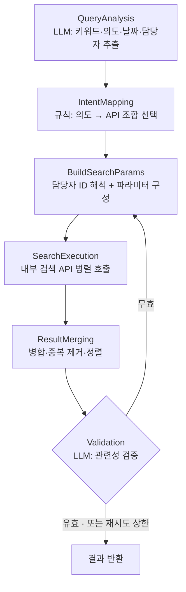

## "느리다"는 피드백이 도착했다

[1편](/posts/flow-ai/search-dev-01-design)의 끝에서 예고한 대로, v1이 돌아가기 시작하자 쌓인 피드백은 정확도가 아니라 속도였다. 사용자와 내부 고객 모두에게서 "검색이 너무 느리다"는 말이 반복해서 들어왔다. 그런데 이 피드백은 뭉툭했다. "느리다"는 어디가 느리다는 뜻인가. LLM 호출인가, 내부 검색 API의 응답인가, 재시도 루프인가, 아니면 메인 에이전트가 Tool을 부르기까지 걸리는 시간인가.

v1의 구조를 다시 보니 이 질문에 답할 수 없다는 것 자체가 첫 번째 병목이었다. 의도에서 API 선택으로 가는 매핑과 파라미터 구성이 노드 안에 뭉쳐 있어서 "어느 단계가 몇 ms를 먹는지"를 잴 단위가 없었다. 잴 수 없으면 줄일 수도 없다. 거기에 이미 알고 있던 용의자들이 겹쳤다. 재시도가 반복되면 LLM 호출이 배로 늘고, 담당자 ID 해석이 길어지면 그 뒤 전체가 묶이고, 검증 전에 결과를 요약하는 비용도 결과가 많을수록 커졌다.

그래서 이번 라운드의 목표를 세 줄로 정리했다. 체감 응답 시간을 줄일 것, 빠르기만 하고 관련 없는 결과가 쏟아지는 퇴행은 막을 것, 그리고 검색이 오래 걸리는 동안 사용자가 "멈췄나?" 하고 오해하지 않게 할 것.

## 병목을 재려면 단계가 쪼개져 있어야 한다

v1의 4노드(분석→해석→실행→검증)를 6단계로 다시 잘랐다. 노드가 늘었는데 빨라졌다는 게 역설처럼 들린다. 하지만 중요한 건 노드 수가 아니라 어디에 책임의 경계를 그었느냐다. 경계가 생겨야 단계별 소요 시간을 로그로 남길 수 있고 재시도할 때 어디부터 다시 돌릴지를 정밀하게 정할 수 있다.

v1과 비교하면 두 군데가 달라졌다. 먼저 실행 노드 안에 숨어 있던 "의도 → API 조합" 매핑을 IntentMapping이라는 독립 노드로 꺼냈다. 검색 의도를 8가지로 분류하고 의도별로 어떤 API를 primary로, 어떤 API를 secondary로 부를지를 설정 파일의 고정 규칙으로 매핑한다. LLM은 없다. "채팅 찾기면 채팅 계열 API" 같은 매핑에 모델을 쓰면 지연과 비용만 는다는 v1의 원칙이 여기서도 그대로 산다.

재시도의 재진입 지점도 정밀해졌다. v1은 검증이 실패하면 데이터 해석부터 다시 돌았는데 이제는 Validation → BuildSearchParams로만 되돌린다. 쿼리 분석과 의도 매핑은 건너뛴다. 검색 의도와 담당자 해석 결과는 이미 상태에 확정돼 있으니 재시도에서 바뀌어야 하는 건 키워드와 날짜 범위뿐이기 때문이다. Validation이 제안한 대체 키워드를 반영하고 재시도 횟수에 따라 날짜 범위를 계단식으로 넓힌다. "요즘"이면 1주 → 1개월 → 3개월, "최근"이면 1개월 → 3개월 → 6개월. 재시도가 거듭돼도 LLM 추가 호출은 검증 한 번씩뿐이다.

상태 설계도 이 구조를 받친다. 확장 키워드에는 Set 기반 리듀서를 둬서 재시도마다 그물이 넓어지게 하고 각 노드는 자기 몫의 필드만 반환하면 그래프가 병합한다. 그래프는 한 번 컴파일해 재사용하고 요청별 컨텍스트는 Tool 생성 시 클로저로 주입한다.

## 지킨 결정과 뒤집은 결정

LLM은 여전히 양 끝에만 둔다. 6단계 중 LLM이 개입하는 곳은 QueryAnalysis와 Validation 둘뿐이다. 검색 한 라운드의 필수 LLM 호출은 분석 1회 + 검증 0\~1회. v1에서 세운 원칙이 재설계에서도 살아남았는데 나머지 네 단계가 규칙과 병렬로만 돌게 되면서 오히려 더 선명해졌다.

**병렬 호출에 실패 허용과 타임아웃을 더했다.** primary API들을 한꺼번에 호출하고 이어서 secondary도 한꺼번에 호출한다. 순차 호출 대비 네트워크 대기가 이론상 (소스 수 − 1)회분 줄어든다. 여기에 개별 API 10초 타임아웃을 걸어 한 소스의 지연이 전체를 묶지 못하게 했고 개별 API가 실패해도 나머지 결과로 응답하도록 실패를 격리했다. 커버리지를 위해 여러 소스를 부르기로 한 이상 가장 느린 소스와 가장 불안정한 소스가 전체의 하한이 되면 곤란했다.

**조기 종료는 넣었다가 뺐다.** 한때 "통합 검색 결과가 충분히 많으면 secondary 호출을 건너뛴다"는 조기 종료를 뒀었다. 호출을 아끼니 빨라 보였지만 이건 v1에서 세운 다른 원칙(개수가 아니라 관련성)과 정면으로 충돌하는 결정이었다. 많이 나왔다는 것과 쓸모 있다는 것은 다르다. 개수 기준의 판단은 전부 걷어내고 품질 판단은 Validation 한 곳으로 모은 뒤 부족하면 재시도로 보완하는 쪽을 택했다.

이번 라운드에서 가장 반직관적인 결정은 Tool 스키마를 의도적으로 비운 것이다. 메인 에이전트에 등록되는 검색 Tool의 입력 스키마를 빈 객체로 두어 에이전트가 keyword를 넘기지 않게 했다. 스키마가 있으면 에이전트는 그걸 채우느라 호출 전부터 시간을 쓴다. 채우는 동안 1편에서 봤던, 시간 표현을 지워버리는 버릇도 또 발동한다. QueryAnalysis는 검색 도메인에 특화된 프롬프트를 따로 쓴다. 키워드 추출은 여기서 원본 쿼리를 받아 직접 하는 편이 속도와 품질 모두에서 유리했다. "원본 쿼리를 보존한다"는 원칙이 별도 채널 전달을 넘어 스키마 삭제까지 밀고 간 셈이다. 다만 서브에이전트가 "이번 턴엔 이 키워드로"를 지정해야 할 때를 대비해 옵션을 켰을 때만 keyword를 받는 탈출구는 남겼다.

느림은 숨기지 않고 보여주기로 했다. 각 노드 진입 시점마다 SSE로 "쿼리를 분석하고 있습니다", "검색하고 있습니다", "결과를 정리하고 있습니다" 같은 상태를 흘리고 노드별 진행 기록을 상위 에이전트로 모아 UI에서 접었다 펼 수 있는 단계 블록으로 노출했다. 같은 5초라도 무슨 일이 일어나는지 보이는 5초는 체감이 다르다. 성능 개선의 절반은 엔지니어링이었지만 나머지 절반은 이 투명성이었다고 생각한다.

## 트러블슈팅: 파이프라인은 늘 예상 밖에서 무너진다

### 예시가 규칙을 이길 때 생기는 Demonstration Bias

**증상.** "최근 5년 신년사 요약해줘"처럼 사용자가 기간을 명시했는데도 검색 기간이 최근 3개월로 잡히는 사례가 나왔다. 5년이라고 말했는데 3개월을 뒤지니 결과가 빈약할 수밖에 없고 재시도만 늘었다.

**원인.** 화근은 쿼리 분석 프롬프트에 넣어둔 예시였다. "월간 보고 → 최근 3개월", "주간 회의 → 최근 1개월" 같은 구체적 매핑을 적어뒀다. LLM이 "신년사 = 정기 행사 ≈ 월간 보고"로 일반화해 사용자가 명시한 기간보다 예시의 패턴을 우선해버린 것이다. 예시는 이해를 돕는 장치인 동시에 규칙보다 강하게 작동해버리는 편향의 원천이기도 했다.

**해결.** 프롬프트의 우선순위를 뒤집었다. "사용자가 기간을 명시하면 반드시 그대로 사용한다. 검색어 특성을 이유로 임의 축소·변경 금지"라는 추상 원칙을 맨 앞에 두고 행사별 기간 예시류는 그 뒤로 내려 보조 규칙임을 분명히 했다. 그리고 품질 체크리스트 문서에 "5년 명시 → 5년 그대로" 같은 반례를 박아 이후 프롬프트를 수정하는 사람이 같은 함정을 다시 파지 않게 했다.

### 한 글자짜리 노이즈 키워드가 검색을 무너뜨린다

**증상.** 최신순·오래된순 정렬에서 한 글자 키워드("복", "한")나 띄어쓰기 포함 구문이 검색어에 섞이면 결과가 폭증하며 품질이 무너졌다. 흥미롭게도 관련도순 정렬에서는 같은 키워드가 큰 문제를 일으키지 않았다.

**원인.** 정렬 방식의 차이였다. 관련도순은 가중치 덕분에 상위엔 그래도 맞는 결과가 오지만 시간순은 "매칭된 모든 문서를 시간 축으로 나열"한다. 한 글자짜리 범용 키워드는 거의 모든 문서에 매칭되므로 시간순에서는 필터 역할을 전혀 못 하고 최신 글이면 뭐든 쏟아진다.

**해결.** BuildSearchParams에 필터를 하나 넣었다. 정렬 방식이 시간순일 때만 한 글자 한글 키워드와 공백 포함 키워드를 걸러낸다. 관련도순일 때는 필터 없이 그대로 쓴다. 같은 키워드가 정렬 맥락에 따라 노이즈도 되고 신호도 된다는 걸 여기서 배웠다.

### 한 사람의 이름이 전체를 묶을 때: 담당자 해석 타임아웃

**증상.** "OO 과장이 올린 글"류 쿼리에서 담당자 이름을 사용자 ID로 해석하는 조회가 길어지면 그 뒤 검색 실행 전체가 함께 기다렸다. v1 때부터 알고 있던 병목이 재설계 후에도 남아 있었다.

**해결.** 담당자 해석에 5초 타임아웃을 걸고 초과하거나 실패하면 담당자 필터 없이 검색을 진행하도록 했다. 결과가 조금 넓어지는 대가는 있지만 조금 넓은 결과가 무한 대기보다는 낫다고 판단했다. 검증 단계의 요약 비용도 성능 테스트로 병목 함수를 측정해 HTML 태그가 없는 일반 텍스트는 정규식을 아예 건너뛰는 fast path를 두는 식으로 깎았다.

## 결과, 그리고 검색 다음의 문제

구조부터 보면 6단계 분리로 단계별 측정이 가능해졌고 재시도가 BuildSearchParams부터만 재진입해 낭비가 사라졌다. 호출 쪽에서는 라운드당 필수 LLM을 분석 1회 + 검증 0\~1회로 묶었고 API는 병렬·타임아웃·실패 격리로 최악 지연의 상한을 끌어내렸다. 체감은 단계별 상태 노출로 기다림이 침묵이 아니게 된 것이 컸다. "몇 초가 몇 초로 줄었다"는 단일 수치는 환경(API 지연, LLM 지연, 동시 사용자)에 따라 흔들려서 여기 적지 않는다. 대신 노드별 소요 시간 로그를 심어놨으니 이후의 개선은 감으로 하지 않고 구간별 백분위를 보고 하게 될 것이다.

물론 숙제도 남았다. 재시도 상한과 날짜 확장 계단은 여전히 손으로 정한 값이고 대체 키워드의 품질은 프롬프트 규칙으로 버티고 있다. 그리고 더 근본적인 질문이 기다리고 있었다. "마케팅 관련 글 찾아줘"는 검색이지만 "내 프로젝트 목록 보여줘"나 "이번 주 내 일정 알려줘"는 검색이 아니라 조회다. 키워드도 관련성 검증도 필요 없고 정확한 API를 정확한 파라미터로 한 번 부르면 끝나는 요청. 이걸 검색 파이프라인에 욱여넣을 것인가, 별도의 길을 낼 것인가. 검색을 넘어 조회로 가는 길, 그게 다음 편의 주제다.
