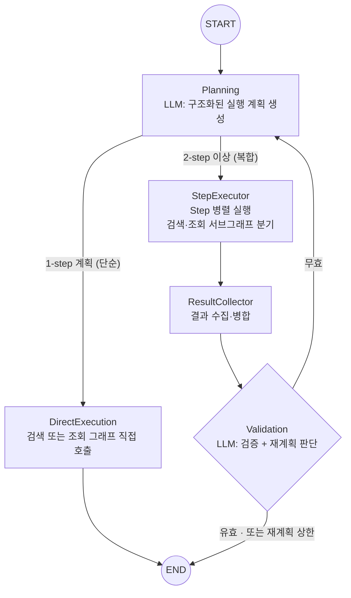

## "내 업무 20개"에는 키워드가 없다

[2편](/posts/flow-ai/search-dev-02-performance)의 끝에서 던진 질문으로 돌아가자. "마케팅 관련 글 찾아줘"는 검색이다. 키워드가 있고, 여러 소스를 그물처럼 훑고, 관련성을 검증한다. 그런데 "최근 내 업무 중 중요한 것 20개 보여줘"는 어떤가. 여기서 키워드를 추출하면 "업무", "중요한" 같은 무의미한 단어만 남는다. 이 질의가 실제로 요구하는 건 필터(담당자=나, 우선순위=높음), 정렬(우선순위순·마감일순), 개수 제한(20개)이다. 검색이 아니라 **조회다.**

문제는 당시 파이프라인이 부르는 API가 전부 키워드 기반 검색이었다는 것이다. 키워드가 없는 질의를 키워드 검색에 욱여넣으면, 파이프라인은 성실하게 무의미한 키워드로 성실하게 무관한 결과를 가져온다. 그래서 갈림길이 명확했다. 검색 파이프라인을 확장해서 조회까지 흡수시킬 것인가, 조회 전용의 별도 길을 낼 것인가.

별도 길을 택했다. 검색과 조회는 노드 이름이 비슷해 보여도 목적이 다르다. 검색은 "그물을 넓게 던지고 건진 것의 관련성을 검증"하는 확률의 문제고, 조회는 "정확한 API를 정확한 파라미터로 부르는" 정합의 문제다. 기존 검색 그래프는 손대지 않고, 조회 전용 그래프(질의 분석 → 파라미터 구성 → 실행 → 결과 변환 → 검증)를 새로 세웠다. 도메인 확장은 Strategy 패턴으로 풀었다. 도메인마다 필터 스키마(Zod), 파라미터 변환, API 호출, 결과 변환을 하나의 전략 클래스로 묶고, 전략이 제공하는 도메인 설명이 계획 프롬프트에 자동 주입되게 했다. 업무 도메인으로 시작해 일정, 알림으로 늘려가는 구조다.

## 계획하는 LLM, 실행하는 규칙

그런데 길이 두 갈래가 되는 순간 새 질문이 생긴다. 누가 어느 길로 보낼 것인가. 게다가 실제 질의는 얌전히 한 갈래만 타지 않는다. "마케팅 프로젝트에서 진행 중인 업무 보여줘"는 프로젝트를 검색한 뒤 그 결과로 업무를 조회해야 하는 **복합 질의다.** 그래서 두 그래프 위에 오케스트레이터를 하나 얹었다. 이름은 FlowData.

Planning 노드의 LLM이 질의를 구조화된 JSON 계획으로 바꾼다. 각 Step은 타입(검색/조회), 대상 도메인, 키워드 또는 필터, 그리고 의존하는 Step 목록(dependsOn)을 갖는다. 의존이 없는 Step들은 병렬로 흩어져 각자의 서브그래프를 타고, 결과가 수집·병합된 뒤 검증을 거친다. 검증이 실패하면 파라미터 수준의 재시도가 아니라 **재계획으로** 돌아간다. 전략 자체를 바꿔 다시 계획하는 것이다. 물론 상한이 있다.

1편부터 지켜온 원칙이 여기서도 산다. LLM은 양 끝에만. 계획(의미 해석)과 검증(품질 판단)에만 서고, 가운데의 분기·병렬·병합은 전부 규칙과 코드다.

한 가지 최적화가 실사용 데이터에서 나왔다. 운영에서 관찰하니 대부분의 질의는 "내 알림 보여줘"처럼 **1-step 계획으로** 끝났다. 이 경우 StepExecutor → 수집 → 검증 풀코스는 낭비다. 그래서 계획이 1-step이면 conditional edge로 해당 서브그래프를 직접 호출하고 나머지 노드를 전부 건너뛰게 했다. UI도 함께 갈랐다. 복합 질의는 Step 파이프라인 차트로, 단순 질의는 "의도 분석 → 조회 → 결과 확인" 타임라인으로 보여준다. 단순한 질의에 거창한 오케스트레이션 시각화를 보여주는 건 정보가 아니라 소음이기 때문이다.

## "LLM에게 시간을 맡기지 마라": 어제 알림 버그

조회 도메인을 알림으로 넓히자마자 일관된 환각이 보고됐다. 사용자가 "어제 알림 정리해줘"라고 물으면, 시스템이 **오늘** 알림 30건을 가져와 "어제 받은 알림"이라고 요약하는 것이다.

파고 보니 단일 원인이 아니라 결함의 복합이었다. 알림 필터 스키마에 날짜 필드 자체가 없어서 LLM이 "어제"라는 시간 의도를 출력할 통로가 없었고, 알림 API는 날짜 범위 파라미터 없이 최신순 페이지네이션만 지원했으며, 최종 응답 LLM은 적용된 필터 메타를 참조하지 못하게 프롬프트되어 있었다. 그러니 LLM은 조회 조건도 모른 채, 사용자 발화의 "어제"를 그대로 결과에 라벨링한 것이다. 스키마 하나만 고쳐서는 환각이 재발한다는 뜻이다.

유혹적인 선택지는 "LLM 안전장치"였다. 검증 단계에서 시간 불일치를 감지하게 하거나, 넉넉히 조회한 뒤 LLM이 알아서 걸러내게 하는 것. 전부 기각했다. 시간 판정을 LLM 품질에 의존하는 순간 환각의 여지는 그대로 남는다. 대신 이렇게 갈랐다. **LLM은 의미 해석에만 쓰고, 시간은 결정론으로 처리한다.**

- LLM #1은 "어제"를 구조화된 날짜 필터로 바꾸는 것까지만 한다.
- 결정론 루프가 페이지를 넘기며 요청 기간에 도달할 때까지 데이터를 확보한다.
- 서버 코드가 범위 필터를 적용하고, 기간을 다 훑었는지를 `coverageStatus`(COVERED/PARTIAL/OUT_OF_RANGE/NO_DATA) 신호로 판정한다.
- LLM #2는 그 신호를 보고 "어제 알림 20건입니다" 또는 "어제까지 도달하지 못했습니다"를 명확히 답한다.

루프 종료 조건에는 배운 것이 하나 있다. "페이지 마지막 항목의 시각이 시작일보다 **엄격히** 이전일 때"만 종료해야 한다. `<=`로 걸면, 오늘 데이터 99건 + 어제 데이터 1건으로 한 페이지가 차는 경계 케이스에서 어제 데이터의 대량 구간이 다음 페이지에 있는데도 루프가 끊긴다. 그리고 LLM이 날짜 필터에 `"yesterday"`나 빈 문자열 같은 지저분한 값을 내면 필터를 버리고 1페이지만 조회하는 fail-open 방어도 넣었다. 이전에 다른 도메인에서 지저분한 구조화 출력이 0건 조회를 만든 선례가 있었다.

실측에서 초안의 구멍이 바로 드러났다. 페이지 상한 5로는 오늘 알림만 500건이 넘는 사용자에게서 어제에 도달하지 못했고, 설상가상 검증 노드가 "0건이니 필터를 완화해 재시도"를 반복하며 타임아웃까지 갔다. 페이지 상한으로 기간에 못 미친 것은 필터를 완화해도 소용없는 실패다. 상한을 10으로 올리고, `OUT_OF_RANGE`면 재시도를 건너뛰고 즉시 그 사실을 답하게 했다. 같은 질의가 10페이지째에 어제 구간에 진입해 20건을 정확히 골라냈다.

## ".max()는 LLM에게 강제되지 않는다": Step 예산 초과 파싱 실패

운영 몇 달 뒤, 트레이스에 이런 실패가 찍혔다. 팀원 다섯 명의 활동을 게시물·댓글·채팅 3종으로 정리해 달라는 질의에 Planning LLM이 5×3, **15개 Step 계획을** 생성했고, 계획 스키마의 `steps: z.array(...).max(6)`이 parse에서 `too_big`으로 throw했다. Planning이 throw하면 재계획 루프에는 닿지도 못한다. 재계획은 "실행 후 검증 실패" 경로에만 걸려 있으니까. 결과는 도구 전체의 실행 실패. 사용자는 아무것도 받지 못했다.

처음 든 가설은 "상한이 모델에 전달되지 않았나"였다. 아니었다. JSON Schema 변환 결과에 maxItems는 정상 포함돼 있었다. 모델은 봤고, 무시한 것이다. 그리고 이건 모델 탓이 아니다. **maxItems는 강제되는 제약이 아니다.** 우리가 쓰던 tool-calling은 이를 생성 시점에 강제하지 않고, 심지어 constrained decoding으로 스키마 위반을 봉쇄하는 strict 모드조차 minItems/maxItems는 지원하지 않는 키워드다. 즉 이 축에는 "생성 시점 봉쇄"라는 처방 자체가 없다.

근본 원인은 스키마의 두 역할을 혼동한 것이다. type이나 enum 같은 **생성 문법은** 위반이 생성 시점에 차단되지만, maxItems 같은 **사후 검증** 제약은 zod parse가 뒤늦게 검사하다 런타임 throw가 된다. 게다가 Step 상한 6은 애초에 문법이 아니라 실행 지연 **예산이었다(병렬** 폭 × Step당 타임아웃으로 역산한 값). 예산 초과라는 운영상 흔한 사건을 `.max()`로 걸어 도구 전체 실패로 승격시킨 셈이다.

고치는 방향은 "제약을 코드로 내리는 것"이었다. 스키마에서 `.min()/.max()`를 제거하고 예산은 describe 설명으로만 남긴다. 프롬프트에는 병합 전략을 명시한다. 같은 대상의 여러 데이터 타입은 한 Step으로 합칠 것(검색은 어차피 전 도메인을 함께 조회하므로 타입별 분해는 같은 API를 세 번 부르는 낭비다), 대상이 여럿이면 대상당 1 Step. 그리고 parse **이후에** 코드가 예산을 강제한다. 초과하면 병합을 요구하는 1회 교정 재요청, 그래도 초과면 앞에서부터 절단하되 절단된 Step을 참조하는 dependsOn을 복구하고, 일부만 조회했다는 사실을 요약에 명시적으로 실어 전체인 것처럼 답하지 못하게 한다. 프롬프트는 확률적이므로, 마지막 줄은 반드시 결정적 코드여야 한다.

뼈아픈 건 선례가 이미 있었다는 점이다. 검색 그래프의 키워드 개수 상한이 정확히 같은 이유로 `.max()` 대신 describe + 코드 절단을 쓰고 있었고, 그 사유가 주석으로 남아 있었다. 조회 쪽만 그 규약을 물려받지 못했다. 교훈이 코드에 있어도 규약으로 승격되지 않으면 옆 모듈에서 같은 함정을 다시 판다.

## 검색과 조회를 관통하는 것

시리즈 세 편을 돌아보면, 검색과 조회라는 다른 문제를 풀면서 같은 원칙에 반복해서 도달했다.

**LLM은 의미의 양 끝에만 세운다.** 자연어를 구조로 바꾸는 입구(분석·계획)와 결과를 판단하고 요약하는 출구(검증·응답)만 LLM의 자리다. 가운데의 매핑, 분기, 루프, 필터, 병합은 전부 결정론. 시간 필터도, Step 예산도, 페이지네이션도.

**LLM의 정상 변동을 장애로 승격시키지 않는다.** 15개 Step은 규칙 위반이 아니라 확률 모델의 정상 범위 변동이다. 강제되지 않는 제약을 사후 검증에 걸면 그 변동이 그대로 장애가 된다. 스키마가 막아주지 못하는 것은 코드가 교정하고, 폴백을 남긴다.

**시스템이 아는 것을 침묵시키지 않는다.** 기간을 다 못 훑었으면 `coverageStatus`로, 계획을 잘랐으면 축소 고지로, 시스템이 아는 한계를 명시적 신호로 LLM과 사용자에게 전달해야, 부분 결과가 전체 행세를 하는 환각을 구조적으로 막을 수 있다.

물론 끝난 이야기는 아니다. LLM이 스스로 대상을 줄여 예산에 맞춘 경우는 아직 감지하지 못하고, 같은 안티패턴이 남아 있는 스키마도 몇 곳 더 있다. 그리고 이 파이프라인을 운영하며 만난 더 잘게 부서진 이야기들(모델 교체 결정, 구조화 출력의 스키마 호환성 같은)이 쌓여 있다. 운영의 단편들을 모아 다음 편에서 정리해볼 생각이다.
