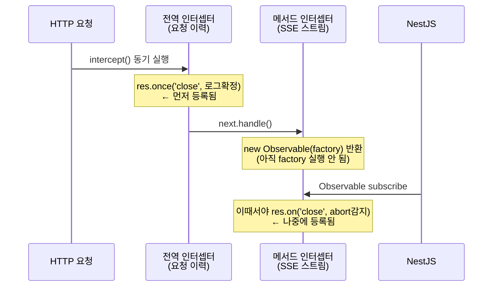

## 프론트를 잡고 나니 백엔드가 보였다

1편과 2편에서 SSE 스트리밍이 브라우저 CPU를 태우던 문제를 잡았다. 렌더링을 스로틀링하고 하이브리드 렌더러를 만들고 나니, 이번엔 파이프의 반대쪽 끝이 눈에 들어왔다. 사용자가 응답을 기다리다 탭을 닫으면, 서버는 무슨 일이 일어나는지 알까?

답은 "모른다"에 가까웠다. LLM은 계속 토큰을 생성하고, 서버는 아무도 받지 않는 스트림에 계속 데이터를 흘려보냈다. 더 곤란한 건 기록이었다. 당시 요청 로그의 상태값은 `REQUEST` / `COMPLETE` / `ERROR` 세 가지뿐이라, 중간에 이탈한 요청도 정상 완료로 남았다. "사용자가 응답을 얼마나 기다리다 이탈하는가", "어떤 채팅 타입에서 이탈이 많은가" 같은 운영 질문에 답할 수 없었다.

그래서 두 가지를 만들기로 했다. 클라이언트가 끊었음을 나타내는 `ABORTED` 상태, 그리고 채팅 타입별로 SSE 연결을 관찰할 수 있는 Prometheus 메트릭 레이블. 스키마에 컬럼을 더하고 enum에 값을 하나 추가하는, 겉보기엔 단순한 작업이었다. 실제로는 이 글 한 편이 나올 만큼의 일이 기다리고 있었다.

## Abort 감지가 작동하지 않았다

구조는 이랬다. 요청 이력을 기록하는 전역 인터셉터가 요청 시작 시 로그를 남기고, 응답이 끝나면 상태를 확정한다. SSE 스트림을 관리하는 메서드 레벨 인터셉터는 클라이언트가 끊으면 abort 플래그를 세우고 스트림을 정리한다. 둘 다 Node.js의 response `'close'` 이벤트를 구독하면 될 것 같았다.

구현 후 테스트하니 abort를 해도 계속 `COMPLETE`로 저장됐다. 로그를 보니 이상한 점이 있었다.

```
18:27:35.306 INFO  [정상 응답] ::: { responseTime: ... }
18:27:35.306 INFO  Client disconnected, aborting
18:27:35.648 WARN  요청 aborted
```

`[정상 응답]`과 `Client disconnected`가 **같은 밀리초에** 찍혔다. 즉 'close' 이벤트가 발생했을 때 로그 기록 핸들러가 abort 감지 핸들러보다 먼저 실행되어, abort 플래그가 서기도 전에 상태를 `COMPLETE`로 확정해버린 것이다.

### 근본 원인: 인터셉터 실행 순서가 리스너 등록 순서를 결정한다

원인은 NestJS 인터셉터의 실행 구조에 있었다.



전역(`APP_INTERCEPTOR`) 인터셉터는 `intercept()`가 동기적으로 먼저 실행되며 그 안에서 'close' 리스너를 즉시 등록한다. 반면 SSE 인터셉터의 close 핸들러는 `new Observable(factory)` 내부에 있으므로, NestJS가 Observable을 subscribe하는 시점(즉 핸들러 실행 직전)에야 등록된다. Node.js의 EventEmitter는 등록 순서대로 리스너를 호출하니, 'close'가 발생하면 **항상** 로그 확정이 abort 감지보다 먼저 달린다.

우회책을 여럿 시도했지만 전부 실패했다.

| 시도 | 실패 이유 |
| --- | --- |
| 스트리밍 catch 블록에서 abort 플래그 설정 | abort 신호가 비동기 비즈니스 로직까지 전파되는 데 수백 ms, 로그는 이미 확정된 뒤 |
| `setImmediate`로 확정 지연 | 스트림 teardown도 같은 큐에서 돌아 순서 보장 불가 |
| `process.nextTick`으로 close 지연 | EventEmitter 내부 순회 방식상 보장 불가 |
| `prependListener`로 등록 역전 | `once()`가 원본을 래퍼로 감싸 등록하는 구현과 상호작용해 삽입 순서가 무효화될 수 있음 |

특히 `prependListener`는 이론상 배열 맨 앞에 들어가야 하지만, 실제 로그로 확인해보면 여전히 로그 확정이 먼저 실행됐다. 이벤트 리스너의 실행 순서를 애플리케이션 코드에서 제어하려는 시도 자체가 프레임워크와 런타임 두 층의 구현 디테일에 기대는 일이었다.

### 해결: 이벤트 경쟁을 콜백 위임으로 대체

발상을 바꿨다. 두 레이어가 같은 이벤트를 두고 경쟁하게 두지 말고, **상태를 가장 먼저 아는 레이어가 상태를 확정한 뒤 다른 레이어를 직접 호출하게** 했다.

전역 인터셉터는 SSE 요청에서 'close'를 구독하지 않는다. 대신 response 객체에 콜백만 걸어둔다.

```typescript
// 전역 인터셉터: SSE 요청에는 리스너 대신 콜백만 걸어둔다 (개념 코드)
if (isSseRequest) {
  response.onStreamFinished = finalizeRequestLog;
} else {
  response.once('close', finalizeRequestLog);
  response.once('finish', finalizeRequestLog);
}
```

SSE 인터셉터는 abort 플래그를 완전히 확정한 직후 그 콜백을 호출한다.

```typescript
res.on('close', () => {
  if (!clientClosed) {
    clientClosed = true;
    requestLog.markAborted();  // ① 상태 확정
    endMetrics('closed');
    res.onStreamFinished?.();  // ② 그 다음에야 로그 확정
  }
  subscription?.unsubscribe(); // ③ teardown → abortController.abort()
});
```

정상 완료 시에는 RxJS subscribe의 `complete` 콜백에서 같은 콜백을 호출한다. 순서가 코드로 명시되니 경쟁 자체가 사라졌다. 정리하면 이렇다. **동일한 이벤트를 여러 레이어가 구독해야 할 때, 상태를 먼저 아는 레이어가 확정 후 콜백으로 위임하라.** 그리고 로깅 상태는 인프라 레이어에서 관리하고, 비즈니스 로직의 catch 블록에 타이밍을 의존하지 말 것.

## 속편: ABORTED는 한 단어에 두 가지 뜻을 담고 있었다

두 달쯤 뒤, QA에서 제보가 왔다. "채팅방 A에서 프롬프트를 입력하고 B로 전환했다가 A에 재진입하면, 응답은 받았는데 사용 횟수가 차감되지 않는다."

추적해보니 흐름은 이랬다. 채팅방을 전환하면 SSE 연결이 끊기고, 위에서 만든 abort 감지가 정확히 동작해 상태를 `ABORTED`로 기록한다. 그런데 서버의 에이전트는 백그라운드에서 **끝까지 응답을 생성한다.** abort 신호를 보내긴 하지만 LangChain 내부가 signal을 즉시 반영하지 않아 작업이 완료되고, 메시지도 저장된다. 사용자는 재진입해서 완성된 응답을 받는다. 한편 사용량 집계 쿼리는 `COMPLETE`와 `REQUEST`만 세고 있었다. `ABORTED`는 "비정상 종료니까 제외"라는 직관적인 판단이었을 것이다. 결과: **백그라운드로 완료된 요청은 100% 차감 누락.**

범인은 특정 코드 한 줄이 아니라 상태의 **의미 오버로딩이었다.**

| 사용자 행동 | 기록된 상태 | LLM 비용 |
| --- | --- | --- |
| 중단 버튼 클릭 | `ABORTED` | 일부 소비 |
| 채팅방 전환 (백그라운드 계속 생성) | `ABORTED` | **전부 소비** |
| 새로고침·네트워크 끊김 | `ABORTED` | **전부 소비** |
| 끝까지 시청 | `COMPLETE` | 전부 소비 |

`ABORTED`가 "사용자가 의도적으로 중단했다"와 "연결만 끊겼을 뿐 서버는 전부 생성했다"를 동시에 의미하고 있었다. 처음 이 상태를 도입할 때의 목표는 abort **감지** 자체였고, 이 값이 나중에 과금 판단의 근거로 쓰일 거라는 건 설계에 명시되지 않았다. 이후 다른 누군가가 집계 쿼리를 만들며 자연스러운 해석을 했고, 두 해석이 충돌한 지점에서 돈이 새어나갔다.

결정적 단서는 약관에 있었다. "재생성 요청이나 생성 중 중단 시에도 사용량이 차감됩니다." 즉 정책상 차감하지 않는 경우는 LLM 호출이 실패한 `ERROR`뿐이다. 핫픽스는 최소 변경으로, 사용량 집계 조건에 `ABORTED`를 포함하는 것으로 끝냈다.

```diff
- status IN ('COMPLETE', 'REQUEST')
+ status IN ('COMPLETE', 'ABORTED', 'REQUEST')
```

다만 이건 대증요법이라는 걸 기록해뒀다. 본질적으로는 "클라이언트가 끝까지 받았는가"(SSE close 여부)를 차감 기준의 대리 지표로 쓰고 있는 게 문제다. 진짜 기준은 "서버가 LLM 토큰을 소비했는가"이고, 그렇다면 비용 발생 여부는 별도 플래그여야 한다. 상태 enum에는 각 값의 의미를 docstring으로 박제하기로 했다. 코드만 봐서는 `ABORTED`가 두 가지 의미인지 알 수 없었으니까.

## 같은 사건의 프론트 측: "생성 중" 마커가 안 보인다

이 백그라운드 생성 인프라에는 프론트 짝꿍 기능이 있었다. 채팅방을 나갔다 돌아왔을 때 "응답을 생성하고 있어요..." 마커를 보여주는 것. 그런데 재진입해도 마커가 안 보이는 버그가 있었고, 원인은 백엔드와 묘하게 닮아 있었다. 역시 **신호의 의미를 오해한 것이다.**

프론트 store에는 "이 탭이 시작한 스트리밍" 목록이 있는데, 마커 훅은 이를 "현재 페이지에서 라이브 SSE 중"이라는 뜻으로 가정하고 가드를 걸었다. 실제 의미는 "이 탭이 시작했고 아직 서버의 완료 통지를 못 받음"이라, 페이지를 이동해도 클리어되지 않는 게 의도된 설계였다. 재진입 시 가드가 항상 참이 되어 마커가 영원히 차단됐다. 해결은 가드 제거. 렌더링 컨텍스트의 "마지막 메시지가 사용자 메시지일 때만 표시" 조건이 라이브 스트리밍 케이스를 자연스럽게 배제해줬다.

백엔드의 `ABORTED`와 프론트의 스트리밍 목록, 둘 다 같은 교훈이었다. **하나의 신호에는 하나의 의미만 담고, 그 의미를 이름과 문서로 못박아라.** 신호를 만든 사람의 의도와 쓰는 사람의 해석이 갈라지는 순간, 한쪽에서는 과금이 누락되고 다른 쪽에서는 UI가 침묵한다.

## 시리즈를 닫으며: SSE 파이프 양 끝에서 배운 것

세 편에 걸쳐 같은 SSE 파이프를 양쪽 끝에서 다뤘다. 정리하면 이렇다.

1. **스트리밍의 비용은 전송이 아니라 반응에서 나온다.** 프론트에서는 토큰마다 다시 그리는 렌더링이 CPU를 태웠고, 백엔드에서는 끊긴 연결에 반응하지 못하는 서버가 토큰을 태웠다. 양쪽 다 "이벤트가 올 때마다 전부 처리"가 문제였고, 해법은 처리의 시점과 순서를 명시적으로 제어하는 것이었다.
2. **프레임워크의 편의 뒤에는 제어할 수 없는 순서가 있다.** NestJS 인터셉터 체인은 우아하지만, 그 실행 순서가 이벤트 리스너 등록 순서를 결정한다는 건 문서 어디에도 크게 쓰여 있지 않다. 순서에 의존해야 한다면 이벤트 경쟁이 아니라 명시적 콜백으로 만들어라.
3. **상태값은 만든 날의 의미로 머물지 않는다.** `ABORTED`는 관측을 위해 태어나 과금 판단에 쓰였다. 상태를 도입할 때는 "이 값을 누가 어떤 판단에 쓸 수 있는가"까지가 설계 범위다.

연결이 끊긴 걸 서버는 언제 아는가. 이제는 답할 수 있다. 'close' 이벤트가 발생한 순간 안다. 다만 그걸 **누가 먼저 알고, 무엇으로 기록하고, 그 기록을 누가 어떻게 해석하는가는** 전부 별개의 설계 문제였다. 스트리밍 성능 개발기는 여기서 완결이지만, 이 파이프 위에서의 삽질은 다른 시리즈에서 계속된다.
