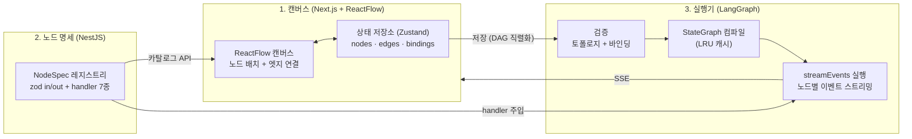

## 채팅 다음은 조립이었다

[에이전트 개발기](/series/flow-ai-agent)에서 만든 AI 비서는 자율적이었다. 사용자가 자연어로 물으면 LLM이 알아서 도구를 고르고 호출 순서도 스스로 정한다. 이 자율성은 일회성 질문에는 강력했지만 반복 자동화에는 오히려 약점이 됐다. "매일 아침 내 업무를 조회해서, 요약하고, 조건에 따라 다른 보고서를 만들어줘" 같은 요구는 매번 같은 순서로, 같은 방식으로 돌아야 한다. 에이전트는 같은 질문에도 오늘과 내일 다른 경로를 탈 수 있다.

그래서 Flow AI에 워크플로우 빌더를 만들기로 했다. 사용자가 화면에서 노드를 놓고 선으로 이어 자동화 파이프라인을 직접 조립하는 기능이다. 에이전트가 도구를 자율적으로 고르는 것과 반대로, 빌더는 **사용자가 사전에 배치한 노드 순서, 입력 바인딩, 분기 그대로** 실행한다. 재료는 같다. 에이전트가 쓰던 도구 자산을 그대로 노드로 노출한다. 달라지는 건 결정 주체다. 실행 경로의 결정권이 LLM에서 사용자에게로 넘어온다.

핵심 문제는 하나로 좁혀졌다. **사용자가 캔버스에 그린 그림과 서버가 실제로 실행하는 그래프 사이의 간격을 어떻게 없앨 것인가.** 그림은 그림대로 예쁘고 실행은 실행대로 따로 노는 순간, 빌더는 장난감이 된다. 이 간격을 없애기 위해 시스템을 세 계층으로 잘랐다.

## 3계층: 캔버스, 명세, 실행기



**첫째 계층은 캔버스다.** ReactFlow 위에 노드 팔레트, 인스펙터 패널, 실행 결과 드로어를 얹었다. 여기서 지킨 원칙은 화면 상태와 도메인 상태의 분리다. Zustand 스토어가 노드·엣지·바인딩의 단일 진실이고 ReactFlow에 그려지는 노드 목록은 매 렌더마다 스토어에서 파생해 만든다. START·END 마커 같은 표시 전용 요소는 파생 단계에서만 존재하고 서버로 전송되지 않는다. 서버는 마커 없이도 그래프의 위상만 보고 진입점과 종료점을 스스로 판정한다.

**둘째 계층은 노드 명세, NodeSpec 레지스트리다.** 노드 한 종류는 코드 한 덩어리가 아니라 명세 하나로 정의된다(개념 코드).

```typescript
// 노드 한 종류의 명세 (개념 코드)
interface NodeSpec<TInput, TOutput> {
  key: string;                    // 'tool.web_search', 'control.if', ...
  displayName: string;
  inputSchema: z.ZodType<TInput>;   // 입력 계약
  outputSchema: z.ZodType<TOutput>; // 출력 계약
  handler: (input: TInput, ctx: RunContext) => Promise<TOutput>;
}
```

zod 스키마 두 개가 입출력 계약이고 handler가 실제 동작이다. 초기 카탈로그는 7종이었다. 웹 검색, 이미지 생성, 협업 데이터 조회, 통합 검색, 문서 검색, LLM 호출, 그리고 IF 분기. 캔버스의 팔레트는 이 레지스트리를 API로 받아 그대로 그린다. 즉 프론트는 노드가 몇 종류인지, 각 노드에 어떤 입력 슬롯이 있는지 하드코딩하지 않는다. 백엔드에 NodeSpec 하나를 등록하면 팔레트에 노드가 하나 늘어난다.

**셋째 계층은 실행기다.** 저장된 그래프를 검증하고 LangGraph의 StateGraph로 컴파일한 뒤 실행한다. 여기서 LangGraph를 고른 이유를 분명히 해두고 싶다. LangGraph는 에이전트 프레임워크가 아니라 **저수준 오케스트레이션 런타임**이다. 노드와 엣지로 정의된 그래프를 super-step 단위로 실행하고 상태 병합과 병렬 분기와 스트리밍 이벤트를 런타임 차원에서 처리해 준다. 사용자가 그린 DAG를 실행 가능한 그래프로 옮기는 문제에는 추상화가 높은 프레임워크보다 이런 런타임이 딱 맞는 도구였다. 일반 엣지는 addEdge로, IF 분기는 addConditionalEdges로 옮긴다. 컴파일 결과는 워크플로우 id와 수정 시각을 키로 LRU 캐시에 태워 저장 전까지 재사용한다.

세 계층의 경계가 곧 계약이다. 캔버스는 카탈로그 API만 알고 실행기는 저장된 그래프만 안다. 둘을 잇는 것은 NodeSpec이라는 명세뿐이다.

## 노드 하나가 실행되기까지: 5단계와 바인딩 3종

노드의 입력 슬롯 하나하나에는 값이 어디서 오는지를 나타내는 바인딩이 붙는다. 종류는 세 가지다(개념 코드).

```typescript
// 입력 슬롯의 값 출처 (개념 코드)
type ValueBinding =
  | { kind: 'literal'; value: unknown }  // 사용자가 직접 입력한 값
  | { kind: 'state'; path: string }      // 이전 노드 출력 등 상태 참조
  | { kind: 'auto' };                    // LLM이 문맥을 보고 채움
```

**literal**은 사용자가 인스펙터에서 직접 써넣은 값이다. **state**는 경로 참조다. 실행 시작 시 받은 질의(query)나, 앞서 실행된 노드의 출력(outputs.노드id.필드)을 가리킨다. 이때 참조 대상 노드는 반드시 현재 노드의 위상적 조상이어야 한다. 아니면 저장 시점 검증에서 막힌다. 조상이 아닌 노드를 참조하면 실행 시점에 그 출력이 아직 상태에 없어서 undefined가 흘러들기 때문이다. **auto**는 빈칸을 LLM에게 맡기는 바인딩이다. 앞 노드들의 출력과 명시된 값들을 문맥으로 주고 남은 슬롯을 구조화 출력으로 채우게 한다.

이 바인딩 모델 위에서 노드 하나는 다섯 단계를 거쳐 실행된다.

1. **명시 바인딩 해석**: literal 값을 꺼내고 state 경로를 현재 실행 상태에서 조회한다.
2. **auto 슬롯 채움**: auto로 지정된 슬롯이 있을 때만 LLM을 호출한다. 이때 사용자가 아예 건드리지 않은 슬롯은 스키마에서 제외(omit)하고 넘긴다. "미입력은 기본값을 쓰겠다는 뜻"이라는 사용자 의도를 LLM이 멋대로 덮어쓰지 않게 하기 위해서다.
3. **입력 검증**: 합쳐진 입력을 inputSchema.parse로 검증한다. 여기서 실패하면 handler는 시작도 하지 않는다.
4. **handler 실행**: 검증된 입력으로 실제 도구 로직을 수행한다.
5. **출력 검증**: 결과를 outputSchema.parse로 다시 검증하고 실행 상태의 outputs에 기록한다.

입구와 출구 양쪽에 zod가 서 있는 구조다. 잘못된 입력은 노드에 들어가지 못하고 계약을 어긴 출력은 다음 노드로 흘러가지 못한다. 각 단계의 시작과 끝은 스텝 기록으로 남아 실행 화면의 노드별 진행 표시와 사후 디버깅의 재료가 된다.

## 분기: IF 노드가 DAG에서 동작하는 방식

정적인 DAG만으로는 "결과가 있으면 보고서를 만들고, 없으면 알림만 보내라" 같은 자동화를 못 그린다. 그래서 유일한 동적 요소로 IF 노드를 넣었다.

IF 노드 자체는 단순하다. condition 입력을 받아 truthy/falsy로 평가하고 출력에 branch 값('true' 또는 'false')을 기록하는 것이 전부다. 재미있는 건 이 노드가 그래프에 결합되는 방식이다. 컴파일러는 IF 노드의 나가는 엣지를 일반 엣지로 잇지 않고 조건부 엣지로 등록한다. 라우터 함수가 실행 상태에서 방금 기록된 branch 값을 읽어 true 타깃 또는 false 타깃 중 한쪽으로만 진행시킨다. 선택받지 못한 가지는 그 실행에서 아예 스케줄되지 않는다.

이 동작이 성립하려면 그래프가 형태 조건을 지켜야 한다. IF 노드의 나가는 엣지는 정확히 2개여야 하고 라벨은 true와 false가 각각 하나씩이어야 한다. 이 검증은 실행 시점이 아니라 **저장 시점**에 한다. 한쪽 가지가 없는 IF는 저장 자체가 거부된다. 같은 원리로 그래프 전체에도 규칙을 깔았다. 순환은 금지(위상 정렬로 검출), 모든 노드는 진입점에서 도달 가능해야 하고 어떤 종료점으로든 이어져야 한다. 대신 그 규칙 안에서는 관대하다. 진입점 여러 개, 종료점 여러 개, fan-out과 fan-in, 노드 하나짜리 워크플로우까지 전부 유효한 그래프다. 사용자가 그릴 수 있는 그림의 자유도는 넓게, 실행이 보장 못 하는 그림은 그려지기 전에 차단. 이것이 토폴로지 정책의 전부다.

## 이 구조가 지켜준 것

돌아보면 3계층 분리가 지켜준 것은 결국 하나, **명세와 실행의 분리**다.

노드를 추가할 때 캔버스 코드를 고치지 않는다. NodeSpec 하나를 등록하면 팔레트, 입력 슬롯 UI, 실행, 검증이 전부 따라온다. 도구 로직도 중복되지 않았다. 에이전트와 빌더는 같은 도구 구현의 단일 진입 함수를 공유하게 하고, 각자의 호출 형태로 감싸는 책임만 바깥으로 분리했다. 같은 웹 검색이 에이전트에서는 자율 호출 도구로, 빌더에서는 사용자가 배치한 노드로 도는 것이다. 그리고 zod 계약이 양끝을 지키는 덕에, 실행 중 문제가 생기면 원인이 입력인지 로직인지 출력인지가 단계 단위로 갈라진다.

물론 이 글의 구조도는 완성형처럼 보이지만 실제로는 수십 커밋의 고민과 수정 위에 서 있다. 이 시리즈는 그 고민들을 하나씩 따라간다.

구조는 그렸고 노드는 돌았다. 그런데 빌더에서 처음으로 깊이 고민한 설계 결정은 노드도 그래프도 아니었다. **실행 이벤트를 누구에게 어떻게 전달할 것인가.** RxJS를 버리고 콜백으로 돌아간 이야기가 다음 편이다.
