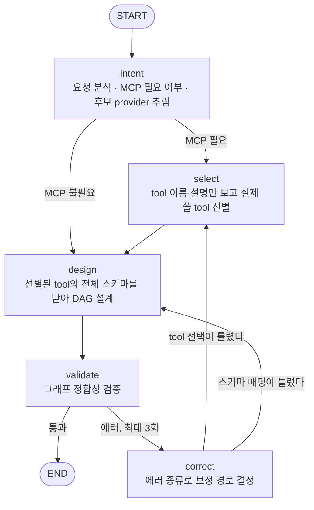

## 빈 캔버스는 아무도 채우지 않는다

권한 모델이 정리되고 화면이 정리되자 마지막 진입 장벽이 선명해졌다. **빈 캔버스.** 노드를 끌어다 놓고 엣지를 잇는 빌더는 만든 사람에게나 직관적이지, 처음 온 사용자에게는 백지 앞의 막막함이다. 트리거는 뭘 고르고, 조회 노드의 슬롯에는 뭘 넣고, LLM 노드와 메시지 노드는 어떻게 잇는가. 이 장벽을 넘는 답은 하나뿐이었다. 사용자는 문장을 말하고, 그래프는 기계가 그린다.

"매주 월요일 아침 팀 일정 요약해서 보내줘." 이 한 줄이 입력이라면 출력은 이런 그래프여야 한다. 매주 월요일 9시라는 cron 스케줄, 일정을 조회하는 노드, 조회 결과를 요약하는 LLM 노드, 요약문을 채팅에 올리는 노드. 노드 사이에는 "앞 노드의 출력이 뒷 노드의 입력"이라는 데이터 바인딩까지 걸려 있어야 한다. 자연어를 DAG로 컴파일하는 이 물건을 우리는 Planner라고 불렀다.

## 1세대: for-루프 하나로 만든 Planner

첫 구현은 소박했다. LLM 한 번 호출로 그래프 초안을 받고 검증기에 통과시키고, 에러가 나오면 에러 메시지를 프롬프트에 다시 끼워 재호출하는 for-재시도 루프. 시스템 프롬프트에는 사용 가능한 노드 카탈로그를 실어 보냈다. 이 구조로도 데모는 돌았고 단순한 시나리오는 곧잘 그려냈다.

균열은 실행 로그에서 발견됐다. Planner가 만든 워크플로우의 HubSpot 조회 노드가 이런 입력으로 실행되고 있었다.

```json
{
  "filterGroups": [{
    "filters": [{
      "propertyName": "createdate",
      "operator": "GTE",
      "value": "{{7_days_ago}}"
    }]
  }]
}
```

HubSpot은 당연히 `VALIDATION_ERROR`로 거부했다. `{{7_days_ago}}`는 우리 런타임에도 HubSpot에도 존재하지 않는 보간 문법이다. Planner가 지어낸 것이다. 값 바인딩 해석기의 literal 타입은 값을 글자 그대로 통과시키는 게 계약이므로 환각으로 생긴 placeholder는 아무 검문 없이 외부 API까지 도달했다. 코드는 계약대로 움직였고 문제는 입력을 만든 쪽에 있었다.

근본 원인을 따라가니 프롬프트 설계가 나왔다. 정적 노드 다섯 종은 전체 JSON 스키마를 프롬프트에 실어 보냈지만 **MCP tool은 슬롯 이름과 필수 여부만 노출하고 있었다.** provider가 늘수록 전체 tool 스키마 직렬화는 프롬프트 폭증으로 직결되니 의도적으로 줄인 것인데, 그 대가로 LLM은 `filterGroups`가 필수라는 사실만 알고 그 형식은 모르는 채 채워 넣어야 했다. 모르는 칸을 채우라고 하면 LLM은 비워두지 않는다. **그럴듯하게 지어낸다.** 환각은 모델의 변덕이 아니라 정보를 주지 않은 설계의 청구서였다.

그렇다고 "MCP도 전체 스키마 노출"로 돌아갈 수는 없었다. 프롬프트 비용과 도구 선택 정확도가 같이 무너진다. 스키마에 전처리를 끼워 문자열을 배열로 강제 변환하는 우회도 검토했지만 스키마가 진실을 담지 않게 되는 순간 모든 소비처가 오염된다. 남은 답은 구조를 바꾸는 것이었다. **필요한 tool을 먼저 고르고, 고른 소수에게만 전체 스키마를 준다.** 그리고 이 "먼저 고르고 나중에 설계한다"는 다단계는 for-루프 한 바퀴에 욱여넣을 수 있는 모양이 아니었다.

## 재설계: 다섯 노드 StateGraph

Planner를 LangGraph 위의 StateGraph로 다시 지었다. LangGraph는 프레임워크라기보다 상태 채널과 조건부 엣지를 제공하는 저수준 오케스트레이션 런타임이라 "LLM 호출 여러 번을 상태를 공유하며 분기시키는" 이번 문제에 정확히 맞는 도구였다.



각 노드의 책임은 이렇게 나뉜다.

- **intent**: 요청을 분석해 MCP 연동이 필요한지, 필요하다면 후보 provider가 무엇인지 판단한다. 이 단계가 보는 것은 provider 경량 목록뿐이다.
- **select**: 후보 provider의 tool 이름과 한 줄 설명만 보고 실제로 쓸 tool을 추린다. 아직 스키마는 없다.
- **design**: 정적 노드 전체 스키마에 더해, **선별된 소수 MCP tool의 전체 입력·출력 스키마**를 받아 DAG를 그린다. 노드, 엣지, 슬롯 바인딩까지 여기서 결정된다.
- **validate**: 그래프 정합성을 검증한다. 존재하지 않는 노드 참조, 깨진 바인딩, 스키마 위반이 여기서 잡힌다.
- **correct**: 검증 에러의 종류를 보고 보정 경로를 고른다. tool 자체를 잘못 골랐으면 select로, 슬롯 매핑이 틀렸으면 design으로 되돌린다. 최대 3회.

쪼갠 기준은 노드 수가 아니라 **각 단계가 알아야 하는 정보의 양**이었다. 선별은 경량 메타데이터만 보면 되고 설계는 소수 tool의 전체 스키마를 봐야 한다. 이 둘을 한 프롬프트에 합치면 전체 카탈로그의 전체 스키마를 실어야 하고 그게 바로 1세대가 피하려다 환각을 낳은 그 트레이드오프다. 선별과 매핑을 분리하면 design 프롬프트는 오히려 1세대보다 작아질 수 있다. 전체 카탈로그가 아니라 선별된 서너 개 tool의 스키마만 실리기 때문이다. 반면 정적 노드는 다섯 종뿐이라 항상 전체 노출을 유지했다. 선별 게이트는 MCP 전용이다.

design 프롬프트에는 바인딩 규칙 세 줄을 명문화했다. 사용자가 명시한 고정값만 literal로 쓰되 `{{...}}` 같은 동적 placeholder는 절대 금지. 선행 노드의 출력을 쓸 때는 출력 스키마가 구체적이면 state 경로로 잇고 모르면 auto로 남겨 런타임 해석기가 실데이터로 채우게 한다. 근거 없는 optional 슬롯은 생략한다. 원래 버그는 이제 두 겹으로 막힌다. 프롬프트가 placeholder를 금지하고 전체 스키마가 전달되니 환각할 이유 자체가 사라진다.

비용도 정직하게 적어둔다. LLM 호출이 1회에서 최대 3회로 늘었다. "느려져도 품질 우선"이라는 합의가 먼저 있었기에 가능한 선택이다. 그리고 self-correction 루프는 사실 1세대에도 있었다. LangGraph가 새로 준 가치는 루프 자체가 아니라 **다단계 분기, 관찰성, 그리고 에러 종류에 따라 정확한 단계로 되돌아가는 보정 라우팅**이다. 재시도할 때마다 처음부터 다시 그리는 것과 틀린 단계만 다시 하는 것의 차이다.

## 시나리오 20종이 가르친 것

재설계 이틀 전, 실제 업무 자동화 시나리오 20종을 Planner가 받을 자연어 프롬프트와 기대 DAG로 전부 매핑했다. 영업, 마케팅, 경영지원, 개발까지 부서별 시나리오를 펼쳐놓고 보니 예상 밖의 사실이 먼저 나왔다. **20개 중 17개가 외부 시스템의 webhook을 시발점으로 가정하고 있었다.** 우리에게는 아직 webhook 수신 endpoint가 없다. 그러나 시발점만 채팅 발화나 cron으로 옮기면 DAG 표현력 자체는 전부 충분했다. "PR이 열리면"은 "오늘 열린 PR들 가져와서"로, 실시간성을 조금 내주면 오늘 당장 돌아간다.

매핑을 끝내고 나니 그래프의 모양이 몇 가지로 수렴했다. 가장 흔한 뼈대는 **조회, LLM 가공, 다중 산출**의 3단이다. CRM에서 리드를 모으든 완료된 task를 집계하든, 가운데서 LLM이 요약이나 분류로 가공하고 끝에서 문서 저장과 task 생성과 채팅 공지가 부챗살처럼 갈라진다. 조건 분기는 생각보다 드물어서 "버그면 개발 프로젝트로, 아니면 지원 task로" 같은 라우팅 케이스에만 등장했다. 반대로 DAG로는 아예 표현할 수 없는 것도 명확해졌다. "PR이 열리면 task를 만들고, 머지되면 완료 처리"처럼 별개 시점의 두 이벤트를 잇는 상태 머신, 그리고 실행 사이에 값을 쌓아야 하는 누적 통계. DAG 한 번의 실행에는 기억이 없다.

이 작업의 진짜 수확은 프롬프트 쪽이었다. 어떤 문장이 좋은 그래프가 되는지 패턴이 보였다. "매주 금요일 오후 5시"처럼 시각이 구체적이면 cron 규칙이 추론되지만 "정기적으로"는 안 된다. "X 조회하고 그 결과로 Y 만들어줘"처럼 데이터 흐름이 명시되면 state 바인딩이 정확히 걸리지만 "X 하고 그리고 Y"는 auto에 기대게 된다. "저장해줘, 생성해줘, 공지해줘"처럼 동사가 분명해야 tool 선택이 안정된다. 이 패턴들은 design 프롬프트의 few-shot과 가이드 문구로 다시 흘러들어갔다. 시나리오 20종은 테스트 케이스이면서 동시에 프롬프트 교과서였다.

## 배운 것

이번 사이클의 교훈은 한 문장으로 줄일 수 있다. **LLM에게 무엇을 보여줄지 결정하는 것이 곧 아키텍처다.** 1세대의 환각은 모델 문제가 아니라 정보 설계 문제였고 해법도 더 좋은 모델이나 더 긴 프롬프트가 아니라 "누가 언제 무엇을 보는가"를 다섯 단계로 나누는 구조 변경이었다. 모르는 칸을 채우라고 시키면 LLM은 지어낸다. 그러니 채우게 하기 전에 알게 하거나 모른다고 말할 길(auto 바인딩)을 열어줘야 한다.

하나 더. 재설계의 방향은 코드가 아니라 시나리오 카탈로그가 정해줬다. 20종을 손으로 매핑해보지 않았다면 "조회, 가공, 다중 산출"이라는 지배적 형태도, webhook 공백이라는 인프라 숙제도, 프롬프트 권장 패턴도 전부 감으로 남았을 것이다. 지능을 설계하기 전에 지능이 풀 문제의 분포를 먼저 그려보는 것. 순서는 이쪽이 맞았다.

Planner가 그린 그래프는 실행기로 넘어간다. 그리고 실행 런타임에는 문서에 크게 적혀 있지 않은 규칙들이 있었다. 같은 노드가 두 번 실행된 날의 이야기, 다음 편이다.
