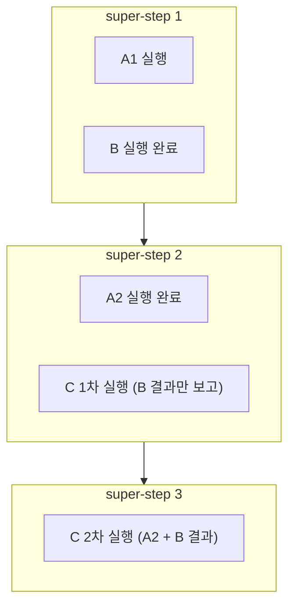

## 문서에 크게 적혀 있지 않은 규칙

4편 말미에 예고한 그날의 이야기다. Planner를 재설계하고 나니 빌더는 두 종류의 그래프를 받게 됐다. Planner가 생성한 그래프, 그리고 사용자가 캔버스에 직접 그린 그래프. 어느 쪽이든 실행기 입장에서는 임의의 DAG다. 그리고 임의의 그래프에는 개발자가 미처 상상하지 못한 위상이 반드시 섞여 들어온다.

발단은 팀 내부의 질문 하나였다. "노드에 edge 두 개가 들어오면, 그 노드는 두 번 실행되나? 아니면 두 상류가 다 끝나고 한 번 실행되나?"

나는 바로 답했다. 저수준 오케스트레이션 런타임으로 쓰고 있는 LangGraph가 barrier를 쳐서 한 번만 실행한다고. 합류(fan-in)라면 당연히 그래야 하니까. 이 답은 일반 지식에서 나온 추론이었고 결론부터 말하면 **틀렸다.** 이번 편은 그 오답을 코드와 공식 소스로 정정해 나간 수사 기록이다.

## 재현: 네 가지 위상, 하나의 범인

말로 다투는 대신 재현 테스트를 만들었다. fan-in이 등장할 수 있는 위상 네 가지를 골라 합류 노드 C의 실행 횟수를 세는 통합 테스트다.

| 위상 | 구조 | C 실행 횟수 |
| --- | --- | --- |
| T1 대칭 병렬 fan-in | A→C, B→C | 1번 |
| **T2 비대칭 병렬 fan-in** | **A1→A2→C, B→C** | **2번** |
| T3 IF 재합류 | IF→A→C, IF→B→C (한 분기만 실행) | 1번 |
| T4 IF 재합류 + 비대칭 | T3에서 한쪽 경로만 깊게 | 1번 |

범인이 특정됐다. IF 분기도 아니고 fan-in 일반도 아니다. **두 갈래가 모두 실행되는 병렬 fan-in에서, 두 경로의 깊이가 다를 때만** 합류 노드가 두 번 실행된다. 경로 길이가 같으면(T1) 멀쩡하다는 점이 이 버그를 오래 숨겨준 위장막이었다. 대칭 그래프로 아무리 테스트해도 재현되지 않는다.

## 원인: super-step이라는 시계

LangGraph의 실행 모델은 Google의 Pregel에서 온 BSP(Bulk Synchronous Parallel)다. 실행은 **super-step**이라는 단위로 진행된다. 각 super-step마다 활성화된 노드들이 병렬로 실행되고 그 결과 state 업데이트가 다음 super-step의 활성화를 결정한다. 그리고 여기에 문서 구석의 한 문장이 있다.

> A node becomes active when it receives a new message (state) on **any** of its incoming edges.

**any**다. all이 아니다. 들어오는 edge 중 하나라도 새 state를 전달하면 노드는 활성화된다. 이 규칙을 T2 위상에 적용하면 두 번 실행은 버그가 아니라 필연이 된다.



짧은 경로의 B는 super-step 1에 끝난다. C는 B의 업데이트를 받았으므로 super-step 2에 활성화되어 실행된다. 이때 A2는 아직 끝나지 않았으니 C는 B의 결과만 보고 돈다. super-step 2에 A2가 끝나면, C는 또 새 업데이트를 받았으므로 super-step 3에 **다시** 활성화된다. 두 번째 실행에서야 두 부모의 결과를 모두 본다.

경로 깊이가 같으면 두 부모가 같은 super-step에 끝나므로 C는 한 번만 활성화된다. T1이 통과한 이유다. 이것은 우리가 밟은 지뢰가 아니라 설계된 동작이다. LangGraph JS 저장소의 이슈에서 동일한 재현이 보고되어 있고 답변도 일관된다. fan-in barrier는 기본이 아니고 원하면 opt-in 하라는 것.

첫 답변이 왜 틀렸는지도 여기서 명확해진다. "합류 노드는 부모가 다 끝나길 기다린다"는 것은 워크플로우 엔진에 대한 상식이지 이 런타임의 규칙이 아니었다. **런타임의 실행 의미론은 상식을 보증하지 않는다.**

## 해법 후보 셋, 그리고 defer

opt-in 수단을 놓고 세 가지를 비교했다.

| 옵션 | 정상 fan-in | IF 재합류 (한 분기 skip) | 적용 단위 |
| --- | --- | --- | --- |
| 1. join-edge `addEdge([A, B], C)` | 해결 | **deadlock** | edge 그룹 |
| 2. deferred node `{ defer: true }` | 해결 | 통과 | 노드 옵션 한 줄 |
| 3. 현행 유지 + reducer 멱등화 | 중복 실행 잔존 | 부분적 | reducer |

옵션 1은 edge를 배열로 묶어 "둘 다 끝나면 C를 실행하라"고 선언하는 방식이다. 정상 fan-in은 고치지만 치명적인 함정이 있다. IF 노드가 한쪽 분기를 skip하면 그 분기의 부모는 영원히 끝나지 않고 C는 오지 않을 부모를 영원히 기다린다. **deadlock이다.** 우리 빌더는 IF 재합류를 1급 시나리오로 지원해야 하므로(T3, T4), 사용자가 그래프를 그리는 순간 터지는 폭탄을 심는 셈이다.

옵션 3은 중복 실행을 인정하고 부작용만 멱등하게 막자는 것인데, fan-in의 의미 자체가 "두 부모의 결과를 합쳐 **한 번** 반영"이므로 의미 위반이다. LLM 노드가 합류 지점이라면 같은 프롬프트가 두 번 호출되고 과금도 두 번 된다.

선택은 옵션 2, `defer: true`다. deferred node는 해당 super-step에 실행할 다른 노드가 남아 있는 한 실행을 미룬다. 즉 도달 가능한 모든 상류가 끝난 뒤에 한 번만 실행된다. 핵심은 skip된 분기를 **기다리지 않는다**는 점이다. IF가 한쪽을 버려도 deadlock 없이 통과한다. 재현 테스트 네 위상을 모두 만족하는 유일한 선택지였다.

적용은 그래프 컴파일 단계에서 한 줄이다. 상류가 둘 이상인 노드만 defer로 등록한다.

```ts
// 그래프 컴파일 단계: 합류 노드는 defer로 등록한다 (개념 코드)
const isFanIn = node.predecessors.length >= 2;
graph.addNode(node.id, runner, isFanIn ? { defer: true } : undefined);
```

상류 목록은 위상 정렬 때 이미 계산해 둔 값이라 추가 비용이 없다. 이 한 줄이 성립하는 전제가 하나 있는데, 출력 state의 reducer가 누적식이라는 점이다. 먼저 도착한 B의 출력이 state에 보존되어 있다가, defer된 C가 마지막에 실행될 때 A2의 출력과 함께 보인다. reducer가 덮어쓰기식이었다면 defer를 켜도 한쪽 부모의 결과가 증발했을 것이다. **실행 시점 제어와 state 병합 규칙은 한 세트다.**

trade-off도 적어둔다. defer는 합류 노드의 시작을 가장 느린 상류에 맞추므로, 짧은 경로의 결과로 먼저 할 수 있던 일이 있었다면 그만큼 늦어진다. 우리 의미론에서는 애초에 "합쳐서 한 번"이 계약이라 손해가 아니지만 부분 결과 스트리밍 같은 요구가 생기면 다시 꺼내야 할 카드다. 또 하나, defer와 다른 기능의 조합에서 보고된 엣지 케이스 이슈들이 Python 구현 쪽에 남아 있다. 우리가 쓰는 JS 구현과 위상 범위에서는 재현되지 않음을 테스트로 확인했지만 위상 표현력을 넓힐 때마다 재검증 목록에 올려뒀다.

검증은 재현 테스트 여섯 케이스 전부 통과(T2가 2회에서 1회로 교정, 나머지 회귀 없음), 워크플로우 통합 테스트 68개와 런타임 유닛 테스트 157개 통과로 마쳤다. 재현 테스트는 그대로 회귀 가드로 남겼다.

## 실행 의미론은 API 목록보다 깊은 곳에 있다

이번 수사의 교훈을 한 문장으로 줄이면 이렇다. **런타임의 실행 의미론은 문서의 API 목록보다 깊은 곳에 있다.** `addNode`와 `addEdge`의 시그니처는 10분이면 읽는다. 그러나 "노드는 언제 활성화되는가", "같은 super-step의 업데이트는 어떻게 병합되는가" 같은 규칙은 문서 구석의 한 문장, 저장소 이슈, 때로는 소스 코드에만 있다. 그리고 시스템이 깨지는 지점은 언제나 API가 아니라 의미론이다.

특히 우리처럼 **사용자가 그리는 임의의 그래프를 받는 시스템**은 이 문제를 피할 수 없다. 개발자가 위상을 통제하는 시스템이라면 비대칭 fan-in을 안 만들면 그만이다. 하지만 빌더는 사용자가 캔버스에 무엇을 그릴지 모른다. 런타임 의미론의 전체 표면이 곧 우리 제품의 공격 표면이다. 그래서 이번에 만든 위상별 재현 테스트는 버그 수정의 부산물이 아니라, 그 표면을 한 칸씩 명시적 계약으로 바꿔가는 지도다.

하나 더. 이 수사의 시작은 "예전에 처리했던 것 같은데"라는 팀원의 희미한 의심이었다. 자신 있게 말한 일반론보다 그 의심이 옳았다. 런타임에 대한 주장은 재현 테스트로 말하는 것이 가장 싸다.

## 다음 편 예고

defer로 중복 실행은 잡았다. 그런데 이번엔 실행이 멈췄다. 에러도 없이, 진행 중 표시만 남긴 채로. 손에 쥔 단서는 Connection closed라는 메시지 하나. 그것을 두고 가설 세 개를 세우고 전부 반증한 수사가 다음 편이다.
