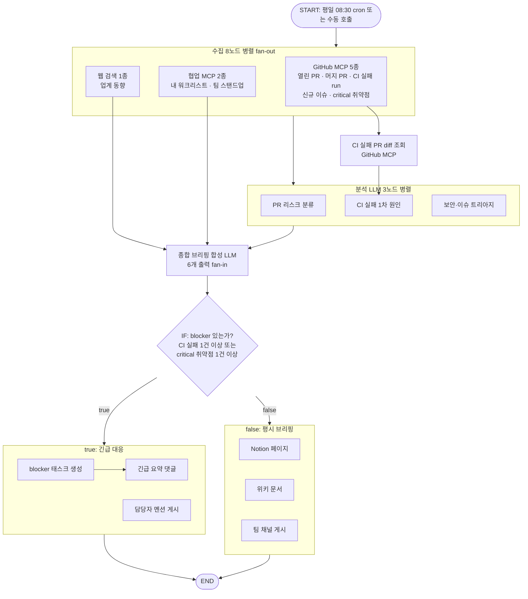

## 단단해진 코드, 남은 질문은 쓸모

7편에서 다중 에이전트 리뷰로 생성부터 실행까지 전 구간을 두드렸다. silent failure를 걷어냈고 저장 검증과 실행 진입점의 어긋남도 확인했다. 코드는 시리즈를 시작할 때보다 확실히 단단해졌다. 그런데 단단한 코드와 쓸모 있는 코드는 다른 문제다. 노드 팔레트와 캔버스와 실행기를 아무리 잘 만들어도 그걸로 실제 업무 하나를 끝까지 자동화해 보이지 못하면 빌더는 데모용 장난감에 머문다.

그래서 완결편은 기능 이야기가 아니라 활용 이야기다. 개발 리드의 아침 루틴을 20개 노드짜리 워크플로우 하나로 대체한 실사례. 이 그래프를 조립하면서 시리즈가 다뤄온 결정들이 실전에서 어떻게 맞물리는지 확인했고 그 확인이 시리즈를 닫는 근거가 됐다.

## 개발 리드의 아침 30분

개발 리드나 시니어 엔지니어가 매일 아침 반복하는 일은 놀랍도록 정형적이다. GitHub를 열어 열린 PR과 어제 머지된 PR, CI가 실패한 run, 새 이슈, critical 등급 보안 알림을 확인한다. 협업 도구를 열어 내 워크리스트와 팀 스탠드업을 훑는다. 머릿속에서 "오늘 막힌 게 있나, 누가 뭘 기다리나"를 종합한다. blocker가 있으면 대응 태스크를 만들어 담당자를 부른다. 평시라면 브리핑을 정리해 Notion과 위키와 팀 채널에 공유한다.

출처가 대여섯 곳으로 흩어져 있고 매일 같은 절차를 밟는다. 마지막은 항상 "어딘가에 적어 공유"로 끝난다. 워크플로우 자동화가 교과서로 삼을 만한 조건을 다 갖췄다. 이 작업의 형태는 빌더의 토폴로지 정책과 정확히 맞았다. 수집은 multi-entry fan-out으로 병렬, 판단은 IF 분기로, 공유는 분기 안의 multi-exit fan-out으로.

20개 노드를 단순화하면 이런 그래프다.

트리거는 평일 08:30 스케줄 등록으로 무인 실행되거나, 채팅에서 "오늘 아침 데일리 돌려줘" 한마디로 수동 실행된다. 어느 쪽이든 같은 그래프다. 평시라면 출근 전에 이미 Notion 페이지와 위키 문서와 팀 채널 3줄 요약이 올라와 있다. CI가 깨졌거나 critical 취약점이 떴다면 blocker 태스크가 생성되고 담당자를 멘션한 게시글과 긴급 요약 댓글이 달려 있다. 30분짜리 탭 순례가 0분이 되고 사람은 판단이 필요한 결과물만 본다.

## 만들며 부딪힌 세 지점

그림은 깔끔하다. 조립 과정은 그렇지 않았다.

**외부 MCP의 도구 이름은 살아 있는 생물이다.** GitHub 공식 MCP 서버는 최근 도구 통합(consolidation)을 거치면서 다수의 도구를 없애고 method 인자로 흡수했다. PR diff를 가져오는 단독 도구는 더 이상 존재하지 않고 PR 읽기 도구에 get_diff 같은 method를 넘기는 방식으로 바뀌었다. 예전 블로그 글이나 LLM의 기억에 의존해 도구 이름을 적으면 그 노드는 컴파일에서 죽는다. 그래서 이 워크플로우에 들어간 모든 도구 이름은 공식 문서에서 검증한 것만 썼다. 검증할 수 없는 공급자는 아예 배제했다. Slack이 대표적이다. 공식 서버가 정확한 도구 ID를 공개하지 않아서 팀 알림은 자사 협업 도구의 게시 도구로 대체했다. [MCP 개발기](/series/flow-mcp)에서 만든 allowlist가 이런 판단의 안전망이 됐다.

**IF의 condition에 LLM 텍스트를 꽂으면 안 된다.** 1편에서 소개한 대로 IF 노드는 condition을 truthy/falsy로 평가하는 게 전부다. 그런데 LLM 호출 노드의 출력은 자유 텍스트뿐이다. "blocker 없음"이라는 답변도 비어 있지 않은 문자열이라 truthy다. 그 순간 모든 아침이 긴급 상황이 된다. 그래서 이 그래프의 분기는 LLM의 판단이 아니라 수집 데이터의 사실에 바인딩했다. CI 실패 run이 1건 이상인가, critical 취약점이 1건 이상인가. 결정론적이고 검증 가능하다. 매일 같은 기준이다. LLM은 브리핑 본문을 쓰는 데만 쓰고 경로 결정에는 손대지 못하게 했다.

마지막은 바인딩 경로다. 문서 말고 실측으로 확정해야 한다. MCP 노드의 출력은 공급자가 무엇을 주는지 알 수 없는 generic 구조라 내부 필드 경로는 실제 서버 응답 스키마에 달려 있다. 응답 형태를 추측해서 경로를 하드코딩하면 서버가 업데이트되는 날 조용히 undefined가 흘러든다. 정공법은 노드를 한 번 실행해 실제 응답을 보고 인스펙터의 참조 선택 UI로 경로를 찍어 확정하는 것이다. 다만 함정이 하나 남는다. 응답이 카운트 필드 없이 배열만 주는 경우, 자바스크립트에서는 빈 배열도 truthy라 "0건"을 falsy로 만들 수 없다. 배열 길이를 boolean으로 바꿔주는 변환 노드가 엔진에 아직 없다. 이 사례가 엔진에 숙제를 하나 남겼다.

## 시리즈가 이 그래프 안에 있다

이 워크플로우를 조립하면서 깨달았다. 시리즈에서 다룬 결정들이 전부 이 그래프 어딘가에서 일하고 있었다.

[1편](/posts/flow-ai/wf-dev-01-architecture)의 3계층과 토폴로지 정책이 뼈대다. 진입점 8개, 종료점 여러 개, fan-out과 fan-in이 뒤섞인 이 위상은 "규칙 안에서는 관대하게"라는 정책 덕에 그릴 수 있었다. NodeSpec 레지스트리 덕에 정적 노드(웹 검색, LLM 호출, IF)와 동적 MCP 노드(GitHub, Notion, 자사 도구)가 한 그래프에서 아무렇지 않게 혼용된다. 4편의 Planner는 이 그래프의 진입 장벽을 낮췄다. "매일 평일 아침, GitHub 현황과 내 업무를 모아서 브리핑하고, 문제 있으면 태스크를 만들어줘"라는 자연어 한 문단이면 Planner가 초안 그래프를 그려주고 사용자는 캔버스에서 다듬기만 하면 된다. 5편의 defer가 없었다면 이 그래프는 조용히 틀렸을 것이다. CI 실패 run에서 diff를 거쳐 오는 가지가 다른 가지보다 한 스텝 길다. 종합 브리핑 노드는 전형적인 비대칭 fan-in이다. defer가 없던 시절이라면 브리핑이 두 번 합성되고 두 번째 실행이 첫 번째를 덮어썼을 것이다.

2편의 콜백 이벤트 전달과 6편에서 보강한 실패 전파는 배관 역할을 한다. 20개 노드가 동시에 뿜는 실행 이벤트를 화면까지 흘려보낸다. 3편의 권한 모델은 이 워크플로우를 개인 실험에서 회사 템플릿으로 승격시키는 통로다. 여덟 편이 각자 다른 문제를 풀었는데 실사례 하나를 놓고 보니 전부 같은 그림의 부분이었다.

## 실행 경로의 결정권을 사용자에게

1편에서 이렇게 썼다. "실행 경로의 결정권이 LLM에서 사용자에게로 넘어온다." 시리즈를 시작할 때 이 문장은 설계 방향이었는데 완결편에 와서 보니 이 실사례가 그 문장의 실체다.

이 그래프에서 LLM은 네 개의 노드 안에 갇혀 있다. 리스크를 분류하고 원인을 추정한다. 트리아지하고 브리핑을 쓴다. 전부 텍스트를 만드는 일이다. 어느 노드가 언제 실행되는지, blocker 판정 기준이 무엇인지, 결과가 어디로 가는지는 전부 사용자가 캔버스에 그려둔 대로다. 에이전트에게 같은 일을 시켰다면 오늘과 내일 다른 경로를 탔을 것이다. 아침 브리핑처럼 매일 같아야 하는 일에는 그 자율성이 독이 된다. 결정권을 사용자에게 돌려준 대가로 얻은 것이 결정론이고, 결정론이 곧 이 자동화의 신뢰다.

여정을 돌아보면 이렇다. 3계층으로 구조를 세웠고(1편), 이벤트 전달을 콜백으로 단순화했다(2편). 권한 모델은 백지에서 다시 그렸고(3편), Planner는 다섯 노드로 재건축했다(4편). super-step의 함정은 defer로 넘었고(5편), 에러 없이 멈춘 실행은 가설 반증으로 수사했다(6편). 다중 에이전트 리뷰로 전 구간을 두드렸고(7편), 그 결과물로 아침 하나를 통째로 자동화했다(8편).

물론 끝난 이야기는 아니다. 노드 retry가 없어 일시적 네트워크 실패에 약하고, loop 노드가 없어 다중 레포 순회는 노드 복제로 때우고 있다. 이 워크플로우를 조직 전체로 확산시키는 일, 그 운영 이야기는 이제 시작이다. 하지만 그건 다음 시리즈의 몫으로 남긴다. 빌더 개발기는 여기서 닫는다.

이 시리즈의 뿌리가 궁금하다면 세 갈래가 있다. 빌더가 노드로 재활용한 도구 자산이 어떻게 만들어졌는지는 [에이전트 개발기](/series/flow-ai-agent)에, GitHub와 Notion 같은 외부 MCP를 안전하게 연동하는 기반은 [MCP 개발기](/series/flow-mcp)에, LLM이 말을 안 들을 때의 대처는 [LLM 트러블슈팅](/series/llm-troubleshooting)에 있다.

여덟 편을 함께 읽어준 분들께, 캔버스에 그린 그림이 그대로 실행되는 순간의 재미가 조금이라도 전해졌기를 바란다.
